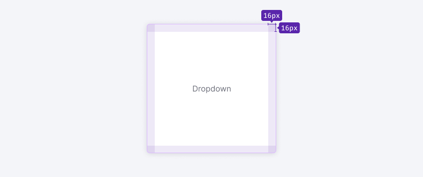
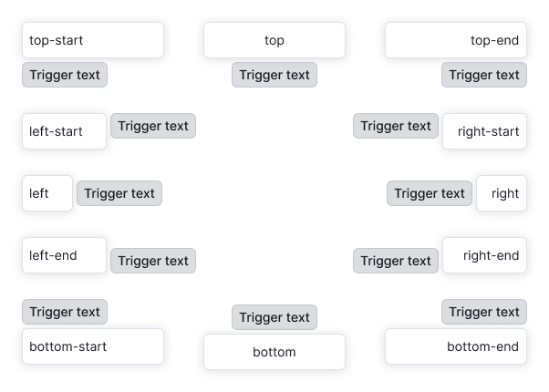
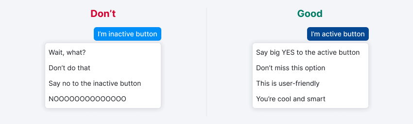

@import playground

> ⚠️ The component has a major beta-version; changes are in the [migration guide](/internal/migration-guide).

@## Description

Dropdown is a component responsible for the area dropping out of a clickable item (trigger). [Select](/components/select/), [Button](/components/button/), [Input](/components/input/) or any other component may be a trigger.

### Composition

- **Container** is the outer limits of the component.
- **Content** is the content area inside a container.

@## Sizes and indents

The component doesn't have any fixed sizes since they are defined by the content inside it.

> 💡 If dropdown implies state change, it's not recommended to change the dropdown size.

### Indents

#### Content

The content area of the component has optional paddings.

@## Trigger

The margin between trigger and dropdown is always 4px.

@## Interaction

### Dropdown is opened

- by clicking on the trigger;
- by typing in the input.

### Dropdown is hidden

- by clicking outside the component area;
- by an action inside the dropdown (for example, by clicking the `Cancel` button);
- by clicking on `Esc`;
- when input-trigger loses the `focus` state.

@## Position
The dropdown from the trigger drops down by default (unless otherwise is required by the context of use). If there is not enough space under the trigger, dropdown drops out in the opposite direction ([this is how popper.js works](https://popper.js.org/)).

Please note that the Select list [always drops down](/components/dropdown-menu/).

> 💡 **Dropdown should not change its position when scrolling a page.** For example, it initially opened upwards, but when a page is scrolled it cannot be at the edge of the browser and move downwards. The dropdown remains in the position it took towards the trigger until it is closed.

@## Usage in UX/UI

It is not recommended to use dropdown inside dropdown.

> 💡 When the dropdown is open, the trigger should be in the `active` state.

@page dropdown-api
@page dropdown-code
@page dropdown-changelog
