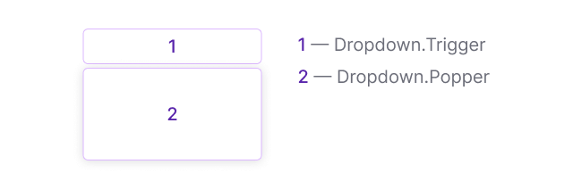
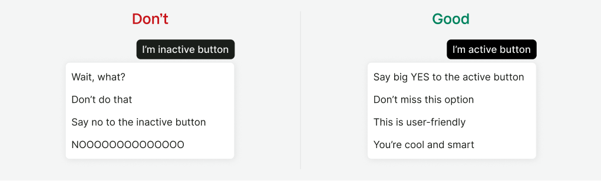

<Playground for="Dropdown" />

## Description

**Dropdown** is a component that displays content, such as a form or message, when triggered by a clickable item. This clickable item, also known as the trigger, can be a [Button](/components/button/button), any type of [BaseTrigger](/components/base-trigger/base-trigger), [FilterTrigger](/components/filter-trigger/filter-trigger), or other component.

### Component composition

Dropdown component consists of `Dropdown.Trigger` and `Dropdown.Popper`.

## Appearance

### Sizes

The component doesn't have any fixed sizes since they're defined by the content inside it.

::: tip
If dropdown changes its state while user interacts with it, don’t change the dropdown size (width and height).
:::

## Position

By default, the Dropdown component drops down from the trigger. However, if there isn't enough space below, it will drop in the opposite direction using [Popper.js](https://popper.js.org/).

::: tip
**The Dropdown component should maintain its position relative to the trigger and not move when the page is scrolled.** For instance, if the dropdown opens upward, it should remain in that position even if the user scrolls down, causing the dropdown to become partially or completely hidden.
:::

## Interaction

**Dropdown opens:**

- by clicking on the trigger
- by pressing `Enter` or `Space` on the trigger
- by typing in the input trigger

**Dropdown is hidden:**

- by clicking outside the dropdown
- by an action inside the dropdown (for example, by clicking the "Cancel" button)
- by pressing `Esc`
- when the input trigger loses `focus`

## Usage in UX/UI

- Don’t open dropdowns from other dropdowns
- When the dropdown is opened, the trigger should get the `active` state

