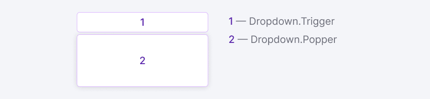

@import playground

@## Description

**Dropdown** is a component for displaying content (form, message, etc.) dropping out of a clickable item (trigger). [Select](/components/select/), [Button](/components/button/), [Input](/components/input/) or any other component can be a trigger for dropdown.

@## Component composition

@## Appearance

### Sizes

The component doesn't have any fixed sizes since they are defined by the content inside it.

> 💡 If dropdown changes its state while user interacts with it, do not change the dropdown size (width and height).

### Indents

The content area of the component has defult paddings of 16px.

### Trigger

Margin between trigger and dropdown is always 4px.

@## Interaction

**Dropdown opens:**

- by clicking on the trigger;
- by typing in the input.

**Dropdown is hidden:**

- by clicking outside the dropdown;
- by an action inside the dropdown (for example, by clicking the "Cancel" button);
- by clicking on `Esc`;
- when input trigger loses `focus`.

@## Position

Dropdown drops to the bottom position from the trigger by default (unless otherwise is required by the context of use). If there is not enough space under the trigger, dropdown drops out in the opposite direction ([this is how popper.js works](https://popper.js.org/)).

> 💡 **Dropdown should not change its position when user scroll a page.** _For example, dropdown was opened upwards, but when user started scrolling the page dropdown cannot be at the edge of the browser and move downwards._

@## Usage in UX/UI

- Do not use dropdown inside dropdown.
- When dropdown is opened, the trigger should get the `active` state.

@page dropdown-a11y
@page dropdown-api
@page dropdown-code
@page dropdown-changelog
