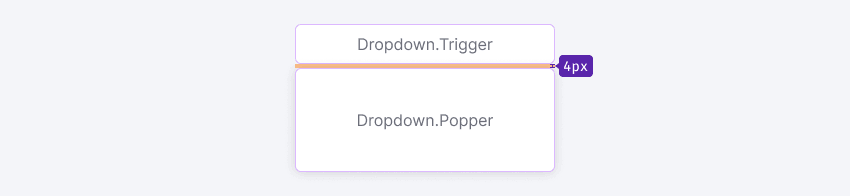
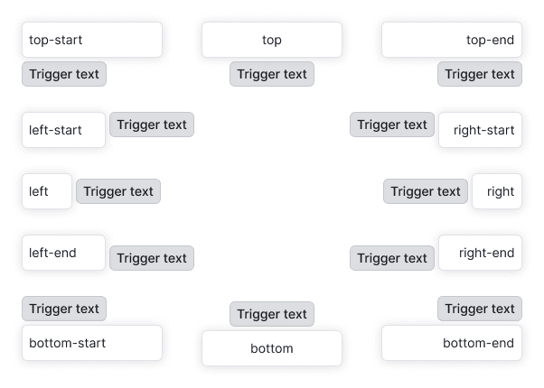

@import playground

@## Description

**Dropdown** is a component that displays content, such as a form or message, when triggered by a clickable item. This clickable item, also known as the trigger, can be a [Select](/components/select/), [Button](/components/button/), [Input](/components/input/), or any other component.

### Component composition

Dropdown component consists of `Dropdown.Trigger` and `Dropdown.Popper`.

@## Appearance

### Sizes

The component doesn't have any fixed sizes since they are defined by the content inside it.

> If dropdown changes its state while user interacts with it, do not change the dropdown size (width and height).

### Trigger

Margin between trigger and dropdown is always 4px.

@## Interaction

**Dropdown opens:**

- by clicking on the trigger;
- by typing in the input.

**Dropdown is hidden:**

- by clicking outside the dropdown;
- by an action inside the dropdown (for example, by clicking the "Cancel" button);
- by clicking `Esc`;
- when input trigger loses `focus`.

@## Position

By default, the Dropdown component drops down from the trigger. However, if there isn't enough space below, it will drop in the opposite direction using [Popper.js](https://popper.js.org/).

> **Dropdown component should maintain its position and not move when a user scrolls the page.** For instance, if the dropdown opens upward, it should stay in that position even if the user scrolls the page.

@## Usage in UX/UI

- Do not use dropdown inside dropdown.
- When dropdown is opened, the trigger should get the `active` state.

@page dropdown-a11y
@page dropdown-api
@page dropdown-code
@page dropdown-changelog
