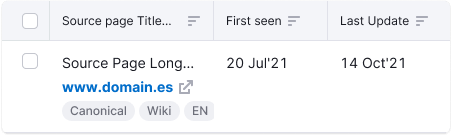
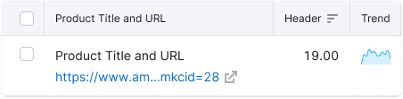
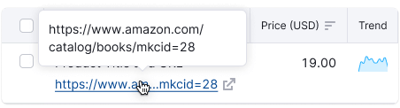
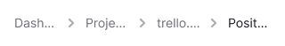

::: react-view

:::

## Description

**Ellipsis** is a component that truncates a single line of text or paragraph with an ellipsis (…).

**Use this component in the following situations:**

- You need to keep the text from wrapping to a new line.
- You need to truncate the text at a certain line.
- The text is user-entered or dynamic and it's difficult to know how much space to allocate, for example, for [InlineInput](/components/inline-input/inline-input) width.

**Avoid the following:**

- Truncating an error or validation message, or other notifications.
- Hiding content when there is enough space for it.
- Using the ellipsis component as a punctuation mark at the end of a sentence.

## Appearance

To include an ellipsis, use `…` (HTML symbol `&hellip;`).

**Shortcuts:**

- OS X: `Opt + ;`
- Win: `alt + 0133`

## Types

Ellipsis has two types of text truncation (`trim` property in API):

Table: Ellipsis types

| Trimming type | Appearance example                                                                                        | Description                                                                                                                                                                                                                                                           |
| ------------- | --------------------------------------------------------------------------------------------------------- | --------------------------------------------------------------------------------------------------------------------------------------------------------------------------------------------------------------------------------------------------------------------- |
| `end`         |            | Truncates the end of the text string. It's the most common case. Use an ellipsis at the end of a text string or paragraph to indicate that there is more content, or to shorten a long text string.                                                                   |
| `middle`      |   | Truncates the middle of the text string. Use when several text strings have different beginnings and/or endings but the exact same middle characters. Can also be used to shorten a phrase or text string when the end of a string can't be truncated by an ellipsis. |

## Tooltip

Add a tooltip on hover to truncated items to show the entire text string, or phrase, unless you're truncating the end of a paragraph.

## Usage in UX/UI

### Long URL links

Usually, long URL links are most common for tables and other widgets. Read the detailed information about long links in [Table controls](/table-group/table-controls/table-controls#long-links-and-text).

### Table head

To show more data in the limited space you can truncate the text in the table head. In this case always show a tooltip on hover to show the entire text string, or phrase.

### Breadcrumbs

When you need to truncate links in Breadcrumbs, collapse them into ellipsis at the end of each string.

### Card titles

To show more data in a limited space you can truncate the [Card](/components/card/card) title. In this case always show a tooltip on hover to show the entire title.

### Paragraphs

To show more data in a limited space you can truncate paragraphs at the end. In this case, a tooltip with the full paragraph on hover is unnecessary.

