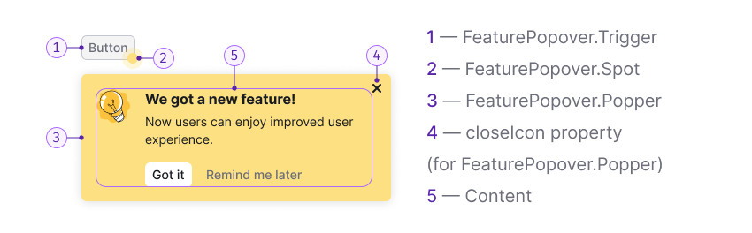

::: react-view

:::

## Description

**FeaturePopover** is a component that helps drawing users’ attention to an interface part or control. _For example, it may point to a new function or suggest the next step to the user._

`FeaturePopover` contains only basic reference/promotional information. The purpose of this component is to point to a specific feature and offer to use it.

**Use it when:**

- It's necessary to draw the user’s attention to an interface part.
- You need to point at the next step for the user.

## Component composition

Component consists of the following:

- `FeaturePopover.Trigger`
- `FeaturePopover.Spot`
- `FeaturePopover.Popper`
- `closeIcon` property (for `FeaturePopover.Popper`)
- Content

## Appearance

### Spot

The animated spot is always located in the lower corner of the element you want to draw attention to.

Try to avoid situations where the control has both [Dot](/components/dot/dot) and FeaturePopover.Spot.

### Title

The title should be brief, contain a call to action, and summarize the main thought of the paragraph.

### Feature description

The feature description should be short and informative. Try using no more than one or two sentences. A paragraph may contain [links](/components/link/link) and formatted text.

### Close button

The **Close** button is always placed in the upper-right corner of the `FeaturePopover` and is used to close it. We recommend always displaying this control and not hiding it from the user.

### Buttons

Two buttons are always placed under the message.

- By clicking the "Got it" button FeaturePopover closes forever.
- By clicking the "Remind me later" button FeaturePopover closes until the next user session.

### Illustration

You can use the default illustration, or your own. The illustration should help the user to understand the basic idea of the feature being advertised. It can also be animated if it makes it easier to understand the feature.

Table: FeaturePopover illustration sizes

| Illustration size       | Illustration example              |
| ----------------------- | --------------------------------- |
| Small, 40px * 40px      |  |
| Medium, 80px * 80px     |      |

### Maximum width

You can use `wMax` property to set the maximum width of the FeaturePopover's popper. But we recommend to set the following widths:

- 350px for FeaturePopover with small illustration.
- 550px for FeaturePopover with medium illustration.

### Content indents

- For the title use 16px font-size (`--fs-300`, `--lh-300` tokens). Margin-bottom is 4px (use `--spacing-1x` token).
- For the paragraph use 14px font-size (`--fs-200`, `--lh-200` tokens).
- The invert `primary` & `tertiary` muted buttons have M size. Top margin for the group of controls is 16px (`--spacing-4x` token).
- Illustration's margin-right is 16px (`--spacing-4x` token).

## Appearing and hiding

Component appears according to the timings you set through the `timeout` property.

`FeaturePopover` hides after using one of its buttons, pressing `Esc`, or using the highlighted interface element.

## Usage in UX/UI

### General recommendations

- Use `FeaturePopover` only to display promotional or onboarding information. The purpose of component is to emphasize a feature and/or explain why it can be useful to the user.
- Mind the user path and the context in which users will encounter the `FeaturePopover`. Show it ad hoc and don’t overload the message with unnecessary information.
- Always allow the user to close the `FeaturePopover`. Don’t force the user to use the advertised feature.
- Write briefly and concisely. Information in `FeaturePopover` shouldn't exceed the minimum required to start using the function. Move additional step-by-step instructions to an [Informer](../../patterns/informer/informer), [DescriptionTooltip](../tooltip/tooltip.md), and so on.
- Make sure that `FeaturePopover` doesn't cover important parts in the interface that the user needs in the context of use.

### Terms of use

- Don’t show more than one `FeaturePopover` at the same time.
- `FeaturePopover` for a new function should be shown for no more than a month.
- `FeaturePopover` should be shown in context, for example, when the user interacts with elements in a certain part of the page, or when the next step in the flow should be the highlighted element. If the user interacts with filters, there is no need to show `FeaturePopover` on the element in the table. Don’t distract the user.
- **Don’t show `FeaturePopover` if the user has already interacted with the advertised item.**
- `FeaturePopover` should be shown only once (except for cases when user clicked "Show later"). If the user has closed `FeaturePopover` or clicked "Got it", don’t show this message to them again.

## Recommendations for copy

### Title

- Describe the main value of a feature for the user in the title. _For example, "Save filters to get data" instead of "Saved filters", or "Work together" instead of "Collaboration"._
- Write briefly. Always use a verb in the title.
- Avoid repeating the control label or the text of the element, to which FeaturePopover points.
- Also, avoid repeating the text of the paragraph.

### Message

- Describe a feature or a tip with one or two sentences.
- Tell not only about the feature itself, but also about how to use it and how it can help the user.

## FeaturePopover as part of onboarding

Show onboarding only to new users who have never seen it. If the user has already seen onboarding once, don’t show it again to them.

