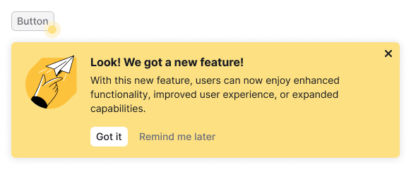
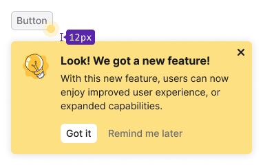

@import playground

@## Description

**FeaturePopover** is a component that draws users’ attention to the interface element. _For example, it may point to a new function or suggest the next step to the user._

> 💡 FeaturePopover contains only simple reference/promotional information. The purpose of this component is to point to a specific feature and offer to use it.

### It is used when

- It is necessary to draw the user’s attention to the interface element.
- It is necessary to point at the next step for the user.

@## Appearance

### The component consists of

All component elements are mandatory.

### Title

The title should be brief, contain a call to action, and summarize the thought of the paragraph. _Example: Save filters._

### Description

The text should not be wrapped around anything, it should always be separated. A paragraph may contain [links](/components/link/) and formatted text.

### Illustration

Illustration depends on the FeaturePopover type (see below). Stylistics of illustrations for advertising notices and blank states is used.

The illustration should help the user to understand the basic idea of the function being advertised. An illustration can be animated if it makes it easier to understand it.

### Closing icon

Closing icon is placed strictly in the upper right corner of the notification. It must close FeaturePopover forever.

> 💡 If you need to use FeaturePopover without a crisscross, please discuss it with the UX and UI team.

### Buttons

Two buttons are always placed under the text of the message.

- By clicking the `Got it` button FeaturePopover is closed forever.
- By clicking the `Remind me later` button FeaturePopover is closed until the next user session.

> 💡 If you want to use FeaturePopover without one of the buttons or without them at all, please discuss it with the UX/UI team.

### Container

The style of the container is unified in order to keep it recognizable.

### Highlighting dot

The animated dot is placed next to the control that you want to draw attention to. Try to avoid situations where the control has both [Dot](/components/dot/) and FeaturePopover. Otherwise, you will have visual mess, namely two dots on the component😎

@## Types

There are two types of the FeaturePopover: basic and extended. **They differ in maximum width and illustration.**

| Type                                                                                                                                | Appearance                                       |
| ----------------------------------------------------------------------------------------------------------------------------------- | ------------------------------------------------ |
| **Basic**. The illustration is the same for all FeaturePopovers of this type. The area to be illustrated is 40x40px.                |  |
| **Extended**. The auxiliary Illustration captures the essence of the message metaphorically. The area to be illustrated is 80x80px. |      |

@## Themes

The FeaturePopover theme is used on both light and dark backgrounds.

| Element   | Styles                                                                     |
| --------- | -------------------------------------------------------------------------- |
| Container | `box-shadow: 0 1px 10px 0 rgba(0, 0, 0, 0.10); background-color: #FFE984;` |
| Spot      | `background-color: #FFD54F;                                                |

@## Sizes and indents

Basic and extended types have maximum width:

- For basic type it is 350px;
- For extended type it is 550px.

### Indents

#### Content

Paddings of the container are 16px.

Recommendations for indents and content sizes:

- The title is 16px (margin-bottom is 4px).
- Text paragraph is 12px.
- The invert `primary` & `tertiary` muted button has the size m (margin-top of the group of controls is 16px).
- The area for the picture is `40px * 40px` or `80px * 80px` (margin-right to the content is 16px).

#### Highlighting dot location

The dot is always located in the lower corner of the control.

@## Appearance and hiding

The element appears according to the timings you prescribe. It is hidden only by clicking on the buttons or the closing icon, or by clicking on the highlighted interface element.

@## Usage in UX/UI

> 💡 Important! Before using FeaturePopover ask yourself whether your new feature is so good that you want to focus on it. 😏

### General recommendations

- Use FeaturePopover only to display promotional or training information. **The purpose of FeaturePopover is to emphasize a function and/or explain why the user needs it, as well as to give reasons to use it.**
- Remember the user path and the context, in which he will see FeaturePopover. Show FeaturePopover ad hoc and do not overload the message with unnecessary information.
- Always allow the user to close FeaturePopover. Do not force the user to use a feature if he does not need it now.
- Write briefly and concisely. The information in FeaturePopover should not exceed the minimum required to start using the function. Move additional step-by-step instructions to `Info` icons, fake links and so on. Yes, your new feature is very cool, but keep your temper in check. 😏
- Make sure that FeaturePopover does not cover important information that the user needs in the context of use.

### Terms of use

- Do not show more than one FeaturePopover on a page at the same time.
- **FeaturePopover for a new function should be shown for not more than a month.**
- FeaturePopover should be shown in context, for example, when the user interacts with elements in a certain part of the page, or when the next step in the flow should be the illuminated element. If the user interacts with filters, there is no need to show FeaturePopover on the element in the table. Do not distract the user!
- **Do not show FeaturePopover if the user has already interacted with the advertised item.**
- FeaturePopover should be shown only once (exception for cases where user clicked **Show later**). If the user has closed FeaturePopover or clicked **Got it**, do not show this message to him again

@## Recommendations for texts

### The title

- Describe the main value of a function for the user in the title. **Save filters to get data** instead of **Saved filters**. Work together instead of Collaboration.
- Write briefly (2-3 words). If necessary, you can increase the length to five words. Always use a verb.
- Avoid repeating the control label or the text of the element, to which FeaturePopover points.
- Also, avoid repeating the text of the paragraph. This is the title, it should not be pointless 😏

### Message

- Describe a feature or a tip with one or two sentences.
- Tell not only about the function itself, but also about how to use it and why the user needs it.

@## FeaturePopover as part of onboarding.

> 💡 **Important!** Show onboarding only to new users who have never seen it. If the user has already seen onboarding once, IT IS NOT NECESSARY to show it again.
>
> _It is important to provide a Help/Product Tour (another name?) link on the report, by clicking on which you can view it again._

@page feature-popover-api
@page feature-popover-code
@page feature-popover-changelog
