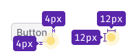
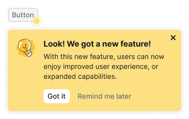

@import playground

@## Description

**FeaturePopover** is a component that helps drawing users’ attention to an interface part or control. _For example, it may point to a new function or suggest the next step to the user._

FeaturePopover contains only simple reference/promotional information. The purpose of this component is to point to a specific feature and offer to use it.

**Use it when:**

- It is necessary to draw the user’s attention to an interface part.
- You need to point at the next step for the user.

@## Appearance

### Component composition

### Spot

The animated spot is always located in the lower corner of the element you want to draw attention to.

Try to avoid situations where the control has both [Dot](/components/dot/) and FeaturePopover.Spot.

### Title

The title should be brief, contain a call to action, and summarize the main thought of the paragraph.

### Description

The feature description should be short and informative. Try using no more than one or two sentences. A paragraph may contain [links](/components/link/) and formatted text.

### Close icon

`Close` icon is always placed in the upper right corner of the component. It closes FeaturePopover. We recommend you to show it always, and not to hide this control from the user.

### Buttons

Two buttons are always placed under the message.

- By clicking the "Got it" button FeaturePopover closes forever.
- By clicking the "Remind me later" button FeaturePopover closes until the next user session.

### Illustration

You can use the default illustration, or your own. The illustration should help the user to understand the basic idea of the feature being advertised. It can also be animated if it makes it easier to understand the feature.

@table-caption FeaturePopover illustration sizes

| Illustration size       | Illustration example              |
| ----------------------- | --------------------------------- |
| Small, 40px * 40px      |  |
| Medium, 80px * 80px     |      |

### Styles

@table-caption FeaturePopover default styles

| Element      | Tokens                                                                              |
| ------------ | ----------------------------------------------------------------------------------- |
| Container    | `--box-shadow-popper` for box-shadow, `--bg-primary-highlight` for background-color |
| Spot         | `--bg-primary-highlight` for background-color                                       |
| `Close` icon | `--icon-non-interactive` for background-color                                       |

### Maximum width

You can use `wMax` property to set the maximum width of the FeaturePopover's popper. But we recommend to set the following widths:

- 350px for FeaturePopover with small illustration.
- 550px for FeaturePopover with medium illustration.

### Content indents

- For title use 16px font-size (`--fs-300`, `--lh-300` tokens). Margin-bottom is 4px (use `--spacing-1x` token).
- For paragraph use 14px font-size (`--fs-200`, `--lh-200` tokens).
- The invert `primary` & `tertiary` muted button has M size. Top margin for the group of controls is 16px (`--spacing-4x` token).
- Illustration's margin-right is 16px (`--spacing-4x` token).

@## Appearance and hiding

Component appears according to the timings you set through the `timeout` property.

FeaturePopover hides only by clicking on the buttons or the `Close` icon, or by clicking on the highlighted interface element.

@## Usage in UX/UI

### General recommendations

- Use FeaturePopover only to display promotional or onboarding information. The purpose of component is to emphasize a feature and/or explain why it can be useful to the user.
- Mind the user path and the context, in which users will see FeaturePopover. Show it ad hoc and do not overload the message with unnecessary information.
- Always allow the user to close FeaturePopover. Do not force the user to use a feature.
- Write briefly and concisely. The information in FeaturePopover should not exceed the minimum required to start using the function. Move additional step-by-step instructions to `Info` icons, hint links and so on.
- Make sure that FeaturePopover does not cover important parts in the interface that the user needs in the context of use.

### Terms of use

- Do not show more than one FeaturePopover on a page at the same time.
- FeaturePopover for a new function should be shown for no more than a month.
- FeaturePopover should be shown in context, for example, when the user interacts with elements in a certain part of the page, or when the next step in the flow should be the highlighted element. If the user interacts with filters, there is no need to show FeaturePopover on the element in the table. Do not distract the user.
- **Do not show FeaturePopover if the user has already interacted with the advertised item.**
- FeaturePopover should be shown only once (exception for cases where user clicked "Show later"). If the user has closed FeaturePopover or clicked "Got it", do not show this message to him again.

@## Recommendations for copy

### Title

- Describe the main value of a feature for the user in the title. _For example, "Save filters to get data" instead of "Saved filters", or "Work together" instead of "Collaboration"._
- Write briefly. Always use a verb in the title.
- Avoid repeating the control label or the text of the element, to which FeaturePopover points.
- Also, avoid repeating the text of the paragraph.

### Message

- Describe a feature or a tip with one or two sentences.
- Tell not only about the feature itself, but also about how to use it and how it can help the user.

@## FeaturePopover as part of onboarding

Show onboarding only to new users who have never seen it. If the user has already seen onboarding once, do not show it again to them.

@page feature-popover-a11y
@page feature-popover-api
@page feature-popover-code
@page feature-popover-changelog
