## Description

**Feedback** component is the form for sending feedback or suggestions about the product. In most cases it opens from the "Send feedback" link or button.

Based on this component, other patterns for collecting feedback are built: [FeedbackRating](/patterns/feedback-rating/feedback-rating) and [FeedbackYesNo](/patterns/feedback-yes-no/feedback-yes-no).

::: tip
When the link that triggers the feedback form is placed in the [ProductHead](/components/product-head/product-head), it should be always the far right. Learn more in the [Links order in ProductHead](/patterns/links-order/links-order).
:::

## Component composition

### Obligatory elements

- Textarea for feedback.
- Buttons for submitting and cancelling the entered message.
- Information on GDPR is obligatory only for European users. Show the following text before the submitting buttons: "We will only use this email to respond to you on your feedback". Don’t forget the link to the Privacy Policy at the end of this text.

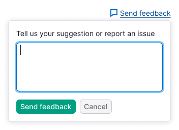

### Optional elements

- `reply-to` input. The input may be made obligatory for submitting.
- Checkbox "I need help, please contact me".
- Message about the alternative way to send feedback with the `mailto` link: "You can also send us an email at comand_name@semrush.com".

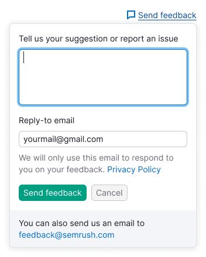

## Appearance

- Dropdown has `padding: var(--spacing-4x)`.
- All inputs in this form has one size – M.
- For bottom message use secondary colored text (`--text-secondary`) with 14px font size (`--fs-200`, `--lh-200` tokens).

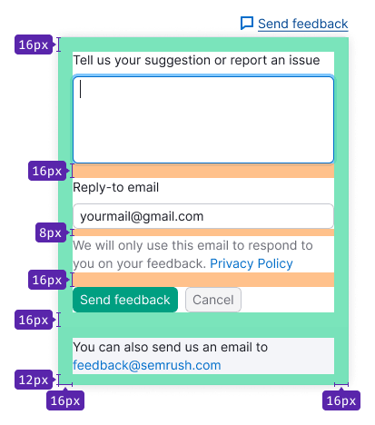

## Placement

In most cases, the feedback form is opened by the **Send feedback** button in the upper right corner of the page, or from a [feedback notice](/patterns/feedback-yes-no/feedback-yes-no).

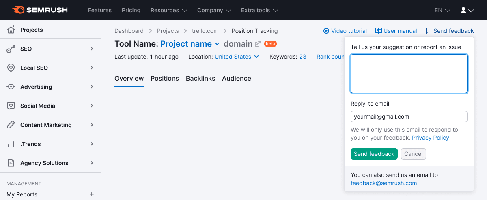

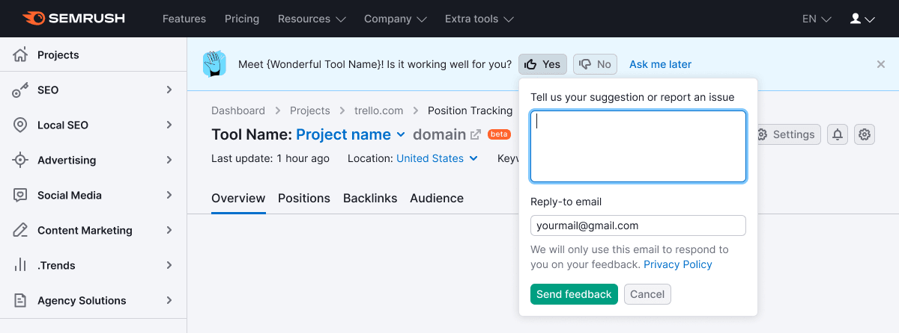

In some cases it may open from the button "Send feedback", placed in the widgets.

## Interaction

::: tip
If the user closes the form and then opens it again, save the content previously entered into the inputs.
:::

### Input's behavior

- After opening the form set the focus on the textarea.
- **There is a limitation for a minimum of 10 symbols and not less than 3 words in this textarea for submitting it.** If the entered message doesn't match these rules, after submitting it user gets an error with the tooltip describing how many symbols/words are required for submitting feedback.
- User can't expand this textarea manually (use `noresize` property). But if the user entered more than 4 lines, the textarea grows in height itself according to the number of the lines entered. After 8 lines scroll appears.

Label this textarea with the text: "Tell us your suggestion or report an issue".

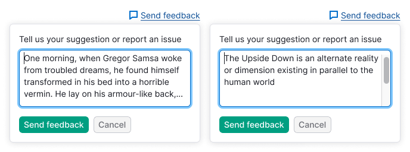

### Checkbox's behavior

If the user checked the checkbox "I need help...", the message should be automatically sent either to the product team, and to the Customer Success team, so they could help the user.

Placeholder for this textarea: "I need help, please contact me".

### Button's behavior

- The form's trigger should get the `active` state if the form is opened.
- After validation of the inputs and submitting the message, show message: "Thank you for your feedback!". After `2500ms` the form smoothly closes with a fade of `500ms`.
- After clicking the `Cancel` button the form closes.

### Message submitting

To show loading state after submitting the form, wrap the form into the [SpinContainer](/components/spin-container/spin-container) with the [XL size Spin](/components/spin/spin).

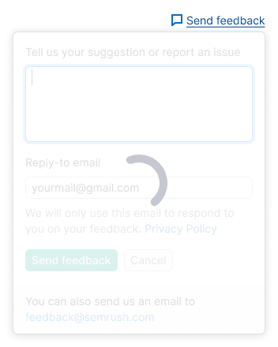

### Success submitting

In case of successful submitting the form, show success message. This status is shown during 3-5 seconds, and then it closes. Also user may close it themself, as any other dropdown (by clicking outside it).

Message text for this case: "Thank you for your feedback!".

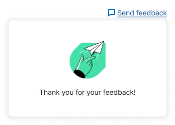

## Validation

### Invalid textarea

Textarea gets `invalid` state when:

- The user entered nothing.
- The user entered less than 10 symbols / 3 words.

Message text for the tooltip: "Your feedback must contain at least 3 words (10 characters)".

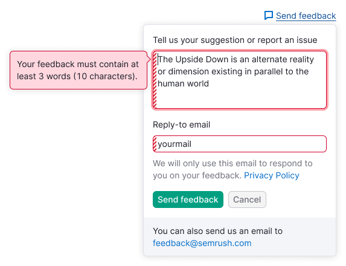

### Invalid email input

- If the email input is empty, show the tooltip with the following message: "Please enter valid email".

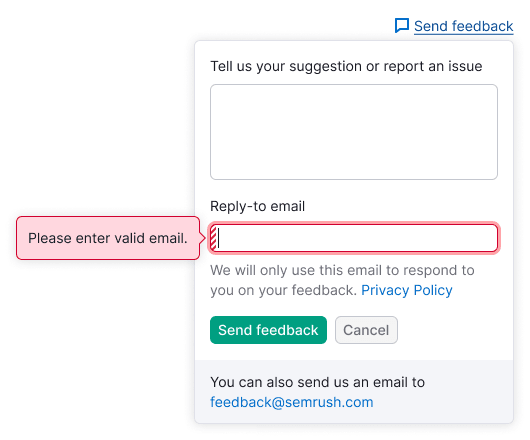

- If the user enters the invalid email, the tooltip should be shown with the request to specify the right one in order we could reply to: "Please provide us with a valid email address so we could reply to you".

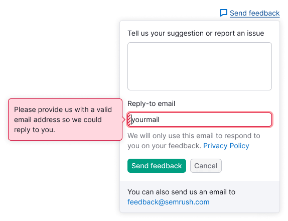

### Backend error

- If an error occurred after submitting the form, show the message instead of the message with `mailto` link under the submitting button.
- If `mailto` link already exists, change its color into red and replace the message text.

Message text for this case: "Your message hasn’t been sent. Please try again or contact us at at {mail address}".

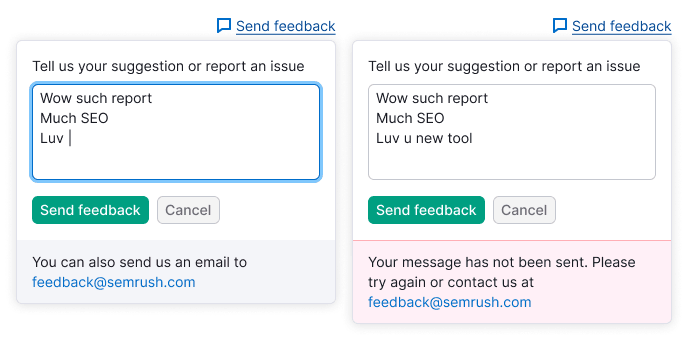

