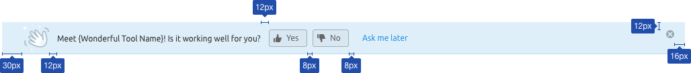

@## Description

**Feedback collection block** is an information [notice](/components/notice/) describing the feature and containing a simple question on its work. _For example, “Meet our new Dashboard! Is it working well for you?”._

@## Component appearing

### Two variants are possible for the notice appearing

1. The notice is shown simultaneously with the tool or report loading.
2. The notice is shown for the first time in the second session (recommended). Further it is shown until closing or clicking the `Ask me later` button.

> 💡 The session concept is determined by the PO or UX. It may be a time interval, the next loading of the page or an update of the company data.

It is allowed to show the feedback collection block to the new users immediately upon the consent of the PO and UX.

@## Location

This component is always located near the top border of the report or tool.

Upon that, if there is the global search line, the notice for feedback collection is located under it.

@## Appearance

- Height of the notice — 52px (the grey place under the selector in the left menu has the same height).
- We show the image, represented in the style of images for notices, in front of the text. The image size is 40px х 40px.
- The button `Ask me later` is a `tertiary info button`. Not a link.
- Optionally you may add a cross icon for closing the plate — `CloseAlt` icon, S size, `$mist` colour. Upon hover the cross icon changes its colour into `$wall`.

@## Form behaviour

See the detailed description of behaviour of the dropdown with feedback in [Feedback](/components/feedback/).

@## Buttons behaviour

### Clicking Yes or No

- the pressed button becomes `active`;
- the dropdown with the feedback form drops down from the pressed button during `500ms`;
- focus is at once on the text field, the text inside it is as follows: `Please tell us your suggestion or report an issue`.

### Clicking Send feedback in the feedback dropdown

- the button from which the dropdown drops for sending a message is still `active`;
- after validation of the fields and sending of the message we show the `MailSentL` icon of L size and the text `Thank you for your feedback!` in the dropdown;
- after `2500ms` the dropdown is smoothly closed with a fade of `500ms`; after `500ms` more the plate with buttons is also closed, dragging the whole page content up during `500ms`.

### Clicking Cancel in the feedback dropdown

- the pressed button `Yes` or `No` switches to normal status;
- the notice is not hidden.

@## Closing and appearing of the notice

### Button "Ask me later"

1. It is always on the plate, after the `Yes` и `No` buttons.
2. By clicking this button the notice is closed;
3. During `500ms` the report/tool content is dragged to the place of the notice;
4. The notice appears in the next session of the user or in another interval agreed upon by the UX and PO.

### Close icon

> 💡 It is an optional element.

It is on the plate only if the report or tool has an alternative form for sending feedback (`Send Feedback` link next to the settings).

- The first variant: it is always on the plate.
- The second variant (**recommended**): when you click on `Ask me later`, the cross appears upon opening in the second session (may appear in the second or the third or the n-session).

1. We use the `CloseAlt` icon, S size, colour `$mist`. Upon hover the cross icon changes its colour into `$wall`.
2. Upon clicking the icon the notice is closed, dragging the whole page content up during 500.
3. The content is dragged to the place of the plate simultaneously with closing.

@## States memorizing

1. If the user sent the feedback, **the block is not shown to him/her anymore**.
2. It is recommended to store this status in `user`. In order not to be obtrusive.
3. It is allowed to store the statuses of closing and showing in `local storage`.

@## Events arrangement

| Description                                                         | Action        | Label               | Value       |
| ------------------------------------------------------------------- | ------------- | ------------------- | ----------- |
| Clicked the button `Yes`                                            | FeedbackYesNo | Click Yes           |             |
| Feedback sending                                                    | FeedbackYesNo | Send Feedback       | `yes_click` |
| Feedback sending                                                    | FeedbackYesNo | Send Feedback       | `no_click`  |
| Clicked the button `No`                                             | FeedbackYesNo | Click No            |             |
| Clicked `Сancel` button in the dropdown                             | FeedbackYesNo | Click Cancel        |             |
| Block showing                                                       | FeedbackYesNo | Show                |             |
| Closing by clicking the `Close` icon                                | FeedbackYesNo | Close               |             |
| Clicked `Ask me later`                                              | FeedbackYesNo | Click Ask           |             |
| Appearance of an error in the input for the comment text            | FeedbackYesNo | No valid Comment    |             |
| Appearance of an error in the input for the email                   | FeedbackYesNo | No valid Email      |             |
| Error of empty email                                                | FeedbackYesNo | Empty Email         |             |
| Error of empty comment                                              | FeedbackYesNo | Empty Comment       |             |
| Appearance of the [red notice](components/notice/) on wrong sending | FeedbackYesNo | Error Send          |             |
| Click email for communication `You can also send us an email...`    | FeedbackYesNo | Click Email Support |             |

@page feedback-yes-no-a11y
@page feedback-yes-no-code
