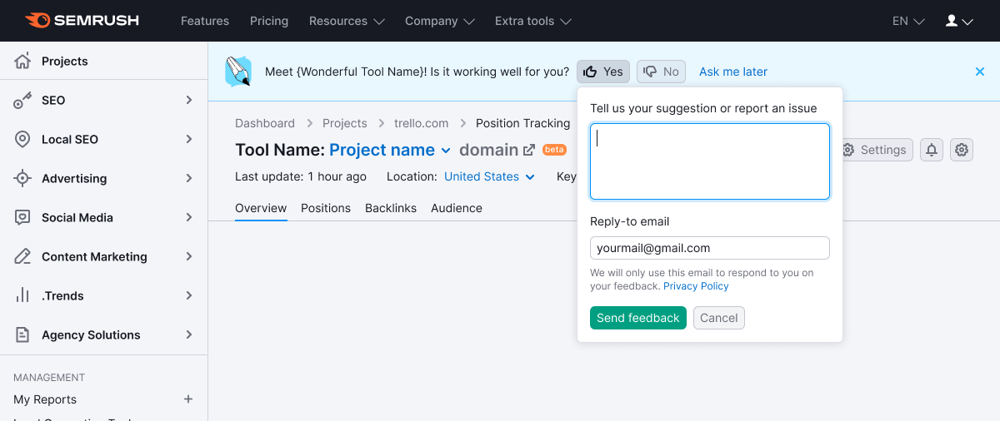

@## Description

**Feedback collection notice** is a pattern that consists of [Notice](/components/notice/) and [Feedback form](/components/feedback/). It helps to introduce the feature to the user and contains a simple question on its work. _For example, “Meet our new Dashboard! Is it working well for you?”._

@## Component appearing

### Two variants are possible for the notice appearing

1. The notice is shown simultaneously with the product or report loading.
2. The notice is shown for the first time in the second session (recommended). Further it is shown until closing or clicking the "Ask me later" button.

> The session time is determined by the PO or UX of the product. It may be a time interval, the next loading of the page or an update of the company data.

@## Location

This component is always located on the top of the report or product.

@## Styles

- Height of the notice — 72px.
- Before the text place the [image](static/feedback.svg). The image size is 40px х 40px.
- The button "Ask me later" is a button with `use="tertiary"`and `theme="info"`. Not a link.

@## Margins and paddings

@## Form behavior

See the detailed description of behavior of the feedback dropdown in [Feedback](/components/feedback/).

@## Buttons behavior

### "Yes" and "No" buttons

- the pressed button becomes `active`;
- the dropdown with the feedback form drops down from the pressed button during `500ms`;
- focus is at the textarea. Placeholder says: `Please tell us your suggestion or report an issue`.

### "Send feedback" button

- the button from which the dropdown drops for sending a message is still `active`;
- after validation of the fields and sending of the message we show the illustration and the text `Thank you for your feedback!` in the dropdown;
- after `2500ms` the dropdown is smoothly closed with a fade of `500ms`; after `500ms` more the dropdown with buttons is also closed, dragging the whole page content up during `500ms`.

### "Cancel" button

- the pressed button `Yes` or `No` switches to normal status;
- the notice is not hidden.

@## Closing and appearing of the notice

### "Ask me later" button

1. It is always in the notice, after the `Yes` и `No` buttons.
2. By clicking this button the notice will close;
3. During `500ms` the product/report content is dragged up;
4. The notice appears in the next user session.

### Close icon

> It's an optional element.

Show this element if the report or product has an alternative form for sending feedback (`Send Feedback` link next to the settings).

- The first variant: it is always in the notice.
- The second variant (**recommended**): when you click on `Ask me later`, the Close icon appears upon opening in the second session (may appear in the second or the third or the n-session).

1. We use the Close icon with M size and `--blue-400` color. While hovering it changes its color to `--blue-500`.
2. After clicking the icon the notice will close.

@## Remembering states

1. If the user sent the feedback, **the notice is not shown to him/her anymore**.
2. It's recommended to store this status in `user`. In order not to be obtrusive.
3. It's allowed to store the statuses of closing and showing in `local storage`.

@## Events arrangement

| Description                                                          | Action        | Label               | Value       |
| -------------------------------------------------------------------- | ------------- | ------------------- | ----------- |
| Clicked the button `Yes`                                             | FeedbackYesNo | Click `Yes`         |             |
| Feedback sending                                                     | FeedbackYesNo | Send `Feedback`     | `yes_click` |
| Feedback sending                                                     | FeedbackYesNo | Send `Feedback`     | `no_click`  |
| Clicked the button `No`                                              | FeedbackYesNo | Click `No`          |             |
| Clicked `Сancel` button in the dropdown                              | FeedbackYesNo | Click `Cancel`      |             |
| Block showing                                                        | FeedbackYesNo | Show                |             |
| Closing by clicking the `Close` icon                                 | FeedbackYesNo | Close               |             |
| Clicked `Ask me later`                                               | FeedbackYesNo | Click Ask           |             |
| Appearance of an error in the input for the comment text             | FeedbackYesNo | No valid Comment    |             |
| Appearance of an error in the input for the email                    | FeedbackYesNo | No valid Email      |             |
| Error of empty email                                                 | FeedbackYesNo | Empty Email         |             |
| Error of empty comment                                               | FeedbackYesNo | Empty Comment       |             |
| Appearance of the [red notice](/components/notice/) on wrong sending | FeedbackYesNo | Error Send          |             |
| Click email for communication `You can also send us an email...`     | FeedbackYesNo | Click Email Support |             |

@page feedback-yes-no-a11y
@page feedback-yes-no-code
