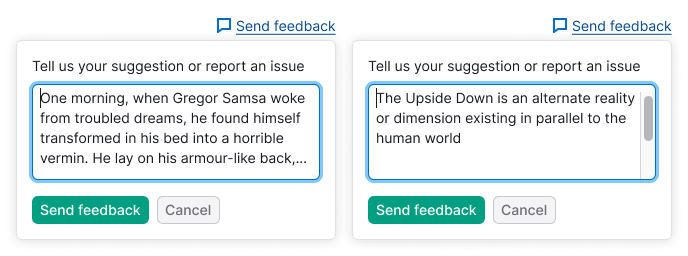
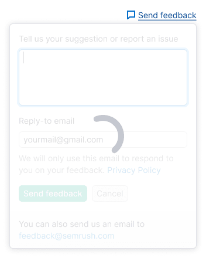
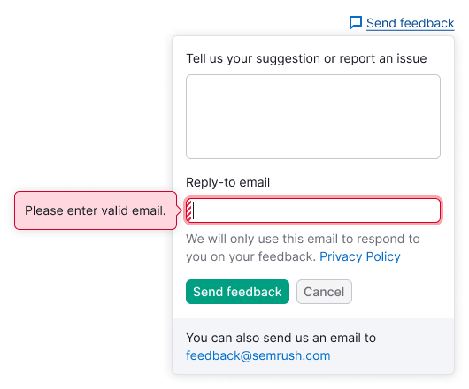
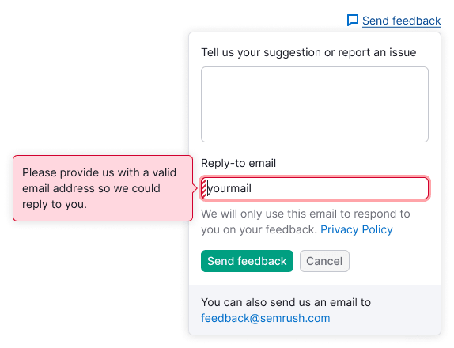

@## Description

**Feedback form** is the form for sending feedback/suggestions in reports. In most cases it drops from the `Send feedback` link at the upper right of the page.

> When the link for feedback is in the [ProductHead](/components/product-head/), it should be always the far right. Learn more in the [Links order in ProductHead](/patterns/links-order/).

@## Appearance

### Obligatory elements

- text field for feedback;
- buttons for sending/cancelling.

### Optional elements

- `reply-to` input (there should be an entry about the confidentiality policy etc. under it). **Fill in this input by default**;
- information on GDPR: "We will only use this email to respond to you on your feedback". And the link to Privacy Policy. **This information is obligatory for the users from Europe**;
- checkbox: `I need help, please contact me`;
- text with the `mailto` link.

@## Styles and paddings

- All the paddings inside the dropdown should be 4px-fold.
- The trigger for the feedback form may be both a link with an icon and a button.
- Inputs and buttons of M size and `checkbox of S size` are used in the feedback.
- The colour of the block with the link is `$gray94`, text - 12px.

@## Location

In most cases the feedback form drops from the link `Send feedback` at the upper right of the page or from the buttons of notice for feedback collection.

In some cases it may drop from the button `Send feedback`, located in the block.

| Variant of the form location                                       | Example                                               |
| ------------------------------------------------------------------ | ----------------------------------------------------- |
| The basic variant of the form location                             |         |
| Variant of the form location in the notice for feedback collection |  |

@## Interaction

1. You may move between the inputs using `Tab`.
2. You may send a message using `Cmd`+`Enter` (`Ctrl`+`Enter` in Windows).
3. You may also close the form by pressing `Esc`.
4. If the user closes the form and then opens it again, the content entered into the inputs should be saved.

### Inputs behaviour

#### Textarea for feedback inputting

- Upon opening of the form the focus is already on the textarea.
- **There should be a limitation for a minimum of 10 symbols and not less than 3 words in this textarea.** if this rule is not executed, upon clicking the button `Send feedback` there appears the tooltip describing how many symbols/words are required for sending feedback.
- You cannot expand this textarea manually (`noresize` and correspondingly there is no resize icon in the bottom right corner of the field), but if the user inputs more than 4 lines, the textarea grows in height itself according to the number of the lines inputted. **After 8 lines the textarea does not grow in height, scroll appears.**

Label for this textarea: **"Tell us your suggestion or report an issue"**.

#### Input for specifying the email (optional element)

- The field may be both obligatory and optional for completing.
- We do not put up the email automatically.

#### Information on GDPR

For the users from Europe we should show the following text in front of the buttons for message sending: **"We will only use this email to respond to you on your feedback"**. The link to the **Privacy Policy** should be at the end of this text.

#### Checkbox (optional element)

If the user checked the checkbox `I need help...`, the message is automatically sent not only to the development team, but also to the Customer Success team, in order they could help the user.

Placeholder for this text area: `I need help, please contact me`.

#### Text with the mailto link (optional element)

If you wish, you may use the block with the appeal to write a message to the team’s email.

Placeholder for this text area: "You can also send us an email at comand_name@semrush.com".

### Buttons behaviour

- The trigger of the dropdown should be in the `active` state if the dropdown is opened.
- After validation of the fields and sending of the message we show the `MailSentL` icon and the text `Thank you for your feedback!` in the dropdown. After `2500ms` the dropdown is smoothly closed with a fade of `500ms`.
- After clicking the `Cancel` button the dropdown is closed. You may also close the form by pressing `Esc`.

@## Form states

#### Message sending

Above the filled inputs and buttons the [SpinContainer](/components/spin-container/) with the XL spinner is placed.

#### Error in the text field / Empty field sending

Such error appears when:

- The user did not enter anything.
- The user entered less than 10 symbols (3 words).

The text for the tooltip with a message: `Your feedback must contain at least 3 words (10 characters)`.

> The dot should obligatorily be at the end of the text in the tooltip.

#### Error in the email field

- If the email input is empty, show the tooltip with the following message: `Please enter valid email`.

- If the user enters the invalid email, the tooltip should be shown with the request to specify the right one in order we could reply to him/her: `Please provide us with a valid email address so we could reply to you`.

#### Error at backend

- If the error occurred upon sending, we show the message instead of the block with `mailto`.
- If `mailto` already exists, we change its colour into red and replace the message text.

Text for the notice in such case: `Your message hasn’t been sent. Try again or contact us by email at {mail address}`.

#### The message is sent

In case of successful sending we show “success”. This status is shown during 3-5 seconds, and then it is closed. Also you may close it yourself, as any other dropdown (by clicking outside it).

The text for this status: `Thank you for your feedback!`.

@page feedback-form-a11y
@page feedback-form-api
@page feedback-form-code
@page feedback-form-changelog
