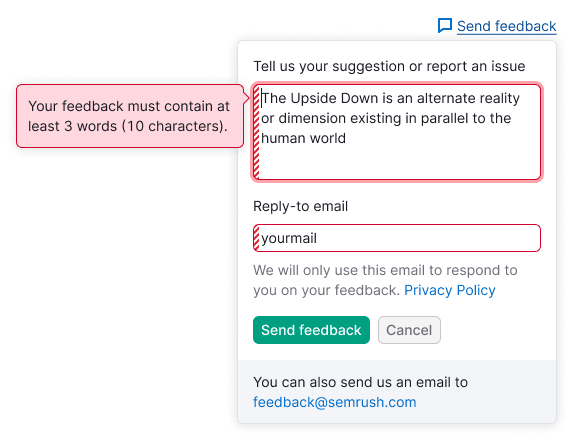

@## Description

**Feedback form** is the form for sending feedback or suggestions to the product team. In most cases it drops from the "Send feedback" link at the upper right of the page.

> When the link for feedback is in the [ProductHead](/components/product-head/), it should be always the far right. Learn more in the [Links order in ProductHead](/patterns/links-order/).

@## Сomponent composition

### Obligatory elements

- Textarea for feedback;
- Buttons for submitting/cancelling.

### Optional elements

- `reply-to` input (there should be an entry about the confidentiality policy etc. under it). **Fill in this input by default**;
- information on GDPR: "We will only use this email to respond to you on your feedback". And the link to Privacy Policy. **This information is obligatory for the users from Europe**;
- checkbox "I need help, please contact me";
- message about the alternative way to send feedback with the `mailto` link.

@## Styles

- Dropdown has 4px paddings.
- All inputs in this form has one size — M.
- For bottom message use secondary colored text (`--gray-500`) with 14px size (`--fs-200`, `--lh-200`).

@## Placement

In most cases the feedback form drops from the link "Send feedback" at the upper right of the page or from the buttons of notice for feedback collection.

In some cases it may drop from the button "Send feedback", located in the report's widget or widgets.

| Variant of the form location                                       | Example                                               |
| ------------------------------------------------------------------ | ----------------------------------------------------- |
| The basic variant of the form location                             |         |
| Variant of the form location in the notice for feedback collection |  |

@## Interaction

> If the user closes the form and then opens it again, the content previously entered into the inputs should be saved.

### Inputs behaviour

#### Feedback textarea

- After opening the form set the focus on the textarea.
- **There is a limitation for a minimum of 10 symbols and not less than 3 words in this textarea for submitting it.** If the entered message doesn't match these rules, after submitting it user gets an error with the tooltip describing how many symbols/words are required for submitting feedback.
- User cannot expand this textarea manually (use `noresize`). But if the user entered more than 4 lines, the textarea grows in height itself according to the number of the lines entered. **After 8 lines the textarea doesn't grow in height, scroll appears.**

Label for this textarea: "Tell us your suggestion or report an issue".

#### Email input (optional element)

- The inout may be both obligatory and optional for submitting.
- We do not set the email automatically.

#### Information on GDPR

For the users from Europe we show the following text in front of the buttons for message sending: "We will only use this email to respond to you on your feedback". The link to the Privacy Policy should be at the end of this text.

#### Checkbox (optional element)

If the user checked the checkbox "I need help...", the message is automatically sent not only to the product team, but also to the Customer Success team, in order they could help the user.

Placeholder for this textarea: "I need help, please contact me".

#### Mailto link (optional element)

You may add a message about the alternative way to send feedback with the `mailto` link: "You can also send us an email at comand_name@semrush.com".

### Buttons behaviour

- The trigger of the dropdown should be in the `active` state if the dropdown is opened.
- After validation of the inputs and sending of the message show the success illustration and the text "Thank you for your feedback!". After `2500ms` the dropdown is smoothly closed with a fade of `500ms`.
- After clicking the `Cancel` button the dropdown is closed.

@## Keyboard navigation

1. `Tab` moves focus between the inputs.
2. `Cmd`+`Enter` (`Ctrl`+`Enter` in Windows) submit a message.
3. `Esc` closes form.

@## Message sending

Wrap all form into [SpinContainer](/components/spin-container/) with the [XL size Spin](/components/spin/).

@## Invalid inputs

#### Invalid textarea

This error appears after submitting when:

- The user did not entered anything.
- The user entered less than 10 symbols (3 words).

The text for a message in the tooltip: "Your feedback must contain at least 3 words (10 characters)".

> Add dot at the end of the text in the tooltip.

#### Invalid email input

- If the email input is empty, show the tooltip with the following message: "Please enter valid email".

- If the user enters the invalid email, the tooltip should be shown with the request to specify the right one in order we could reply to: "Please provide us with a valid email address so we could reply to you".

@## Error at backend

- If an error occurred after submitting the form, show the message instead of the message with `mailto` link.
- If `mailto` link already exists, change its color into red and replace the message text.

Message text for this case: "Your message has not been sent. Please try again or contact us at at {mail address}".

@## Success submitting

In case of successful submitting the form show success message. This status is shown during 3-5 seconds, and then it is closed. Also you may close it yourself, as any other dropdown (by clicking outside it).

Message text for this status: "Thank you for your feedback!".

@page feedback-form-a11y
@page feedback-form-api
@page feedback-form-code
@page feedback-form-changelog
