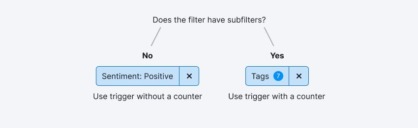
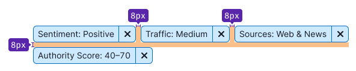
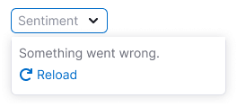
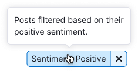
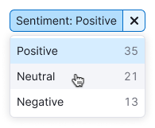

@## Description

**FilterTrigger** is a component we use as a trigger in filters above tables or any other data.

> 💡 The component is used exclusively as a filter. It is not used anywhere else in the interface.
>
> [Selecting a date](/components/date-picker/) usually refers to global report settings, so you should not use FilterTrigger for it.

It is important for filters:

- **To quickly understand what is selected and what is not**. - The user puts the filters himself, so what is the point of additional highlighting? - Not always, sometimes the user comes by a direct link and the filters are already selected.
- **To quickly reset and change filters.**

@## Appearance

The filter button has three sizes. In the inactive state, the filter is similar to a select; in the active state, it is a highlighted split-button.

> 💡 Please note that all sizes use `CloseXS` and `ChevronDownXS` icons.

In the active filter, the selected value/values are completely displayed or hidden in the ellipsis.

**The counter of the active filter** is shown only for **Advanced filters** and filters that have a lot of other additional filters inside. The counter in the trigger respectively indicates the number of additional filters applied.

| Sizes    | Inactive filter                                      | Active filter                                      | Active filter with the counter                             |
| -------- | ---------------------------------------------------- | -------------------------------------------------- | ---------------------------------------------------------- |
| M, L, XL |  |  |  |

@## Margins between filter triggers

The indents duplicate the [indents between the buttons](/components/button/).

| Sizes     | Margins between controls                       |
| --------- | ---------------------------------------------- |
| XL (42px) |  |
| L (32px)  |   |
| M (26px)  |   |

@## States and interaction

### Filter trigger with value

> 💡 There were doubts that if there is no chevron in the active state of the filter, the user will not understand how to change the filter. However, **corridor tests** and user’s work with the filter at the production did not confirm the doubts.

| State                                    | Description                                                                                                                                                                                                                                                                                                                                                                                                                            | Appearance example                  |
| ---------------------------------------- | -------------------------------------------------------------------------------------------------------------------------------------------------------------------------------------------------------------------------------------------------------------------------------------------------------------------------------------------------------------------------------------------------------------------------------------- | ----------------------------------- |
| Placeholder                              | Default state of the filter. It always has a placeholder that reflects the essence of the filter.                                                                                                                                                                                                                                                                                                                                      |   |
| Placeholder hover                        | A tooltip describing the filter’s operation may be displayed when hovering over an inactive filter.                                                                                                                                                                                                                                                                                                                                    |   |
|                                          | Trigger has a tooltip with an explanation.                                                                                                                                                                                                                                                                                                                                                                                             |   |
| Loading                                  | If the system needs some time to load all the filter options, we show a dropdown with **“Loading”** text and a spinner.                                                                                                                                                                                                                                                                                                                |   |
| Something went wrong (very extreme case) | If for some reason it was not possible to show all the filter options, we show “**Something went wrong”** in dropdown with the **Reload** link, which sends the request again.                                                                                                                                                                                                                                                         |   |
| Placeholder (open trigger)               | The open trigger must always be in the `active` state. Dropdown is closed by clicking on a select or any other area of the site.                                                                                                                                                                                                                                                                                                       |   |
| Default (filled trigger)                 | The trigger size is adjusted to the selected value/values. **If only one value can be selected, it is recommended to show a tooltip explaining what exactly is selected when hovering over the active filter.** If it is possible to select several values in the filter, it is not necessary to show all selected values in the tooltip when hovering over the active filter. It is possible to show description of filter operation. |   |
|                                          | Trigger has a tooltip with an explanation.                                                                                                                                                                                                                                                                                                                                                                                             |   |
|                                          | If the filter is a [multi-select](/components/select/) and you can select more than two values, then reduce them in the trigger to the `N selected` construction.                                                                                                                                                                                                                                                                      |  |
| Hover (with the selected item)           | Clicking the button with the `CloseXS` icon clears the value in the trigger and returns the trigger to the state with the placeholder.                                                                                                                                                                                                                                                                                                 |  |
|                                          | Please put a tooltip with **“Reset filter”** to the button with a crisscross and increase the display delay from default value of 100 to 150.                                                                                                                                                                                                                                                                                          |  |
| Hover (with the selected item)           | Clicking on the trigger opens a dropdown with an option to change the selected value. The dropdown is closed by clicking on a select or any other area of the site.                                                                                                                                                                                                                                                                    |  |

### Trigger of the filter with the counter

| State                          | Description                                                                                                                                                         | Appearance example                  |
| ------------------------------ | ------------------------------------------------------------------------------------------------------------------------------------------------------------------- | ----------------------------------- |
| Placeholder                    | Default state of the filter. It always has a placeholder that reflects the essence of the filter.                                                                   |  |
| Placeholder hover              |                                                                                                                                  |
| Placeholder (open trigger)     | The open trigger must always be in the `active` state. Dropdown is closed by clicking on a select or any other area of the site.                                    |  |
| Default (completed trigger)    | The trigger size is adjusted to the selected number of additional filters.                                                                                          |  |
| Hover (with the selected item) | Clicking the button with the `CloseXS` icon clears the value in the trigger and returns the trigger to the state with the placeholder.                              |  |
|                                | Please put a tooltip with **“Reset filter”** to the button with a crisscross and increase the display delay from default value of 100 to 150.                       |  |
| Hover (with the selected item) | Clicking on the trigger opens a dropdown with an option to change the selected value. The dropdown is closed by clicking on a select or any other area of the site. |  |

@## Usage in UX/UI

### Filter label

- **In most cases, the label is not placed next to the filter.** It is placed inside. However, if the label is long (more than two words), it is better to sign the filter with the label on the outside. This way the accent on the selected values in the filter will not be lost.
- It is recommended to write a label in singular.

### Value in the trigger

In the filter trigger it is important to show the applied value in human-readable form, e.g. `Lost in Top 100`, or `{Filter Name}:{value}`.

If the value is complicated, it is possible to display only `{Filter Name}` to make it clear which type of filter is applied.

### Dropdown width

- The drop-down filter cannot be smaller than the total width of the trigger.
- The dropdown may be larger than the total width of the trigger.

### Writing numbers, periods and so on

You can see more details about writing numbers and periods in English in the [text guide provided by Larisa](https://docs.google.com/document/d/1HZHNKEW-5k0PqvgDaIWBgu8NWyRr3rM4xCm-725PoUU/edit#heading=h.iue5c2168b0n).

@page filter-trigger-a11y
@page filter-trigger-api
@page filter-trigger-code
@page filter-trigger-changelog
