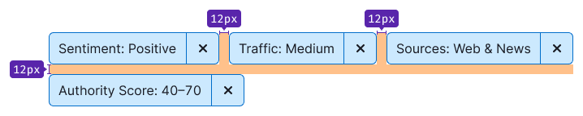
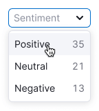
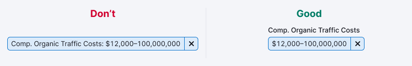

@## Description

**FilterTrigger** is a component for using as an active state of a filter. Commonly it's placed above the data it filters.

This component helps users to:

- quickly understand what filters are selected and what are not;
- reset and change filters.

@## Appearance

FilterTrigger has two sizes. Note that all sizes use `Close` and `ChevronDown` icons with M size.

| Size (height in px) | Default state         | Active filter                                      | Active filter with counter                             |
| ----- | ---------------------------------------------------- | -------------------------------------------------- | ---------------------------------------------------------- |
| M (28px)  |  |  |  |
| L (40px)  |  |  |  |

Show [counter](/components/counter) only for **Advanced filters** and filters that have several additional filters inside. The counter in the FilterTrigger respectively indicates the number of additional filters applied.

@## Margins between FilterTriggers

Use the same margins as other inputs and [buttons](/components/button/#margins_between_buttons) have.

| Size (height in px)  | Margins between controls   |
| -------------------- | -------------------------- |
| M (28px)             |     |
| L (40px)             |     |

@## States and interaction

### Default FilterTrigger

<!-- > There were doubts that if there is no chevron in the active state of the filter, the user will not understand how to change the filter. However, **corridor tests** and user’s work with the filter at the production did not confirm the doubts. -->

| State                                    | Description                                                                                                                                                                                                                                                                                                                                                                                                                            | Appearance example                  |
| ---------------------------------------- | -------------------------------------------------------------------------------------------------------------------------------------------------------------------------------------------------------------------------------------------------------------------------------------------------------------------------------------------------------------------------------------------------------------------------------------- | ----------------------------------- |
| Placeholder                              | Default state of the filter. It should always have a placeholder that represents what the filter is about.                                                                                                                                                                                                                                                                                                                                      |   |
| Placeholder (hover)                        | When user hovers over an inactive filter, you can show a tooltip with small description of how the filter works.                                                                                                                                                                                                                                                                                                                                    |    |
| Loading                                  | If the system needs some time to load all the filter options, show a dropdown with **“Loading”** text.                                                                                                                                                                                                                                                                                                                              |   |
| Something went wrong | If for some reason it was not possible to show all the filter options, show “**Something went wrong”** text in the dropdown. You can add **Reload** link, which sends the request again.  |   |
| Placeholder (active trigger)               | The opened trigger should always get the `active` state. Dropdown may be closed by clicking on an option or outside the dropdown.                                                                                                                                                                                                                                                                                                       |   |
| Active filter               | The trigger size changes according to the selected value or values. **If only one value can be chosen, it's suggested to display a tooltip that explains the specific selection when hovering over the active filter.** If multiple values can be selected, there's no need to show all of them in the tooltip. Instead, the tooltip can provide a description of how the filter works. |    |
|                                          | If the filter allows [selecting more than two values](/components/select/), simplify the display by showing **"N selected"** in the trigger, indicating the number of selected values. |  |
| Active filter (hover)           | When user clicks the button with the `Close` icon, it removes the value in the trigger and restores it to the default state with the placeholder. |  |
|                                          | Add a tooltip to the button with the `Close` icon saying **"Reset filter"** and increase the display delay from the default value of 100 to 150.  |  |
|  | When user clicks on the trigger, a dropdown opens up, allowing user to change the selected value. The dropdown closes when user clicks on an option or outside the dropdown. |  |

### FilterTrigger with counter

| State                          | Description                                                                                                                                                         | Appearance example                  |
| ------------------------------ | ------------------------------------------------------------------------------------------------------------------------------------------------------------------- | ----------------------------------- |
| Placeholder                    | Default state of the filter. It should always have a placeholder that represents what the filter is about. |  |
| Placeholder (hover) |   |      |
| Placeholder (active trigger)     | The opened trigger should always get the `active` state. Dropdown may be closed by clicking on a "Submit" button or outside the dropdown. |  |
| Active filter    | The trigger size changes according to the selected value or values.  |  |
| Active filter (hover) | When user clicks the button with the `Close` icon, it removes the value in the trigger and restores it to the default state with the placeholder.  |  |
|                                | Add a tooltip to the button with the `Close` icon saying **"Clear advanced filters"** and increase the display delay from the default value of 100 to 150.  |  |
|  | When user clicks on the trigger, a dropdown opens up, allowing user to change the selected values. The dropdown closes when user clicks on a "Submit" button or outside the dropdown. |  |

@## Usage in UX/UI

### Filter text label

Usually, the label is positioned inside the filter instead of next to it. However, if the label is long (more than two words), it is recommended to place it outside the filter. This ensures that the emphasis on the selected values in the filter is maintained.

### Value in the trigger

In the filter trigger, it is essential to show the applied value in a way that is easy to understand for users. For example, it can be shown as **"Lost in Top 100"** or as **"{Filter Name}: {value}"**.

If the value is complex, it is acceptable to display only the **{Filter Name}** to make it clear which type of filter is being applied.

### Dropdown width

- The dropdown cannot be narrower than the width of the trigger.
- The dropdown can be wider than the width of the trigger.

### Writing numbers, periods, etc

You can find more details on writing numbers and periods in English in the [text guide provided by UX writers](https://docs.google.com/document/d/1HZHNKEW-5k0PqvgDaIWBgu8NWyRr3rM4xCm-725PoUU/edit#heading=h.iue5c2168b0n) (it is available for Semrush employees only).

@page filter-trigger-a11y
@page filter-trigger-api
@page filter-trigger-code
@page filter-trigger-changelog
