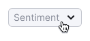
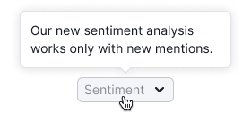
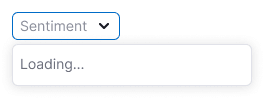
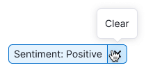

## Description

**FilterTrigger** is one of the [BaseTrigger](/components/base-trigger/base-trigger) types for using as an active state of a filter. Commonly it's placed before the data it filters.

This component helps users to:

- quickly understand what filters are selected and what aren't;
- reset and change filters.

## Appearance

### Sizes

FilterTrigger has two sizes. Note that all sizes use `Close` and `ChevronDown` icons with M size.

Table: FilterTrigger sizes

| Size (height in px) | Default state         | Active filter                                      | Active filter with counter                             |
| ----- | ---------------------------------------------------- | -------------------------------------------------- | ---------------------------------------------------------- |
| M (28px)  |  |  |  |
| L (40px)  |  |  |  |

## Grouped filters

Use the same margins as other inputs and [buttons](/components/button/button#grouped-buttons) have.

Table: Grouped filters

| Size (height in px)  | Margins between controls   |
| -------------------- | -------------------------- |
| M (28px)             |     |
| L (40px)             |     |

## Counter

Show [counter](/components/counter/counter) only for **Advanced filters** and filters that have several additional filters inside. The counter in the FilterTrigger respectively indicates the number of additional filters applied.

## Interaction

<!-- > There were doubts that if there is no chevron in the active state of the filter, the user will not understand how to change the filter. However, **corridor tests** and user’s work with the filter at the production did not confirm the doubts. -->

Table: Default FilterTrigger states

| State                           | Description                                                                                                        |
| ------------------------------- | ------------------------------------------------------------------------------------------------------------------ |
| Placeholder                     | Default state of the filter. It should always have a placeholder that represents what the filter is about.  |
| Placeholder (hover)             | When user hovers over an inactive filter, you can show a tooltip with small description of how the filter works.    |
| Loading                         | If the system needs some time to load all the filter options, show a dropdown with **“Loading”** text.            |
| Something went wrong            | If for some reason it wasn't possible to show all the filter options, show “**Something went wrong”** text in the dropdown. You can add **Reload** link, which sends the request again.   |
| Placeholder (active trigger)    | The opened trigger should always get the `active` state. Dropdown may be closed by clicking on an option or outside the dropdown.   |
| Active filter                   | The trigger size changes according to the selected value or values. **If only one value can be chosen, it's suggested to display a tooltip that explains the specific selection when hovering over the active filter.** If multiple values can be selected, there's no need to show all of them in the tooltip. Instead, the tooltip can provide a description of how the filter works.    |
| Several values selected         | If the filter allows [selecting more than two values](/components/select/select), simplify the display by showing **"N selected"** in the trigger, indicating the number of selected values.  |
| Advanced filters with counter   | For advanced filters, show a counter to indicate how many filters are applied. Read more in [Advanced filters](../../filter-group/advanced-filters/advanced-filters.md).  |
| Active filter (hover and click) | When user clicks on the trigger, a dropdown opens up, allowing user to change the selected value. The dropdown closes when user clicks on an option or outside the dropdown.   |
| Clear value                     | **Clear** button removes the value in the trigger and restores the default state with the placeholder.  |

## Usage in UX/UI

### Filter text label

Usually, the label is positioned inside the filter instead of next to it. However, if the label is long (more than two words), it's recommended to place it outside the filter. This ensures that the emphasis on the selected values in the filter is maintained.

### Value in trigger

In the filter trigger, it's essential to show the applied value in a way that is clear for users. For example, it can be shown as **"Lost in Top 100"** or as **"{Filter Name}: {value}"**.

### Dropdown width

- The dropdown can't be narrower than the width of the trigger.
- The dropdown can be wider than the width of the trigger.

### Writing numbers, periods, etc

You can find more details on writing numbers and periods in English in the [Content guide](../../content/numbers/numbers.md).

