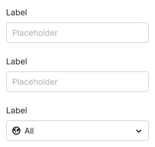
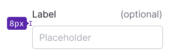
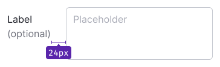
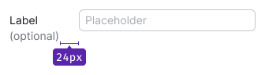
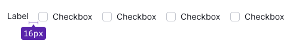
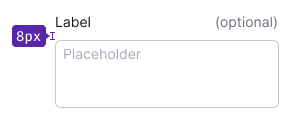
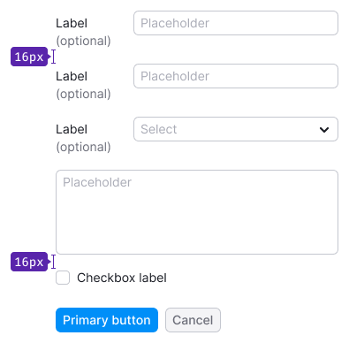
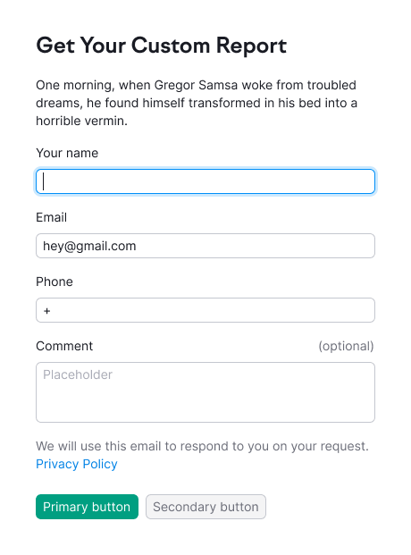
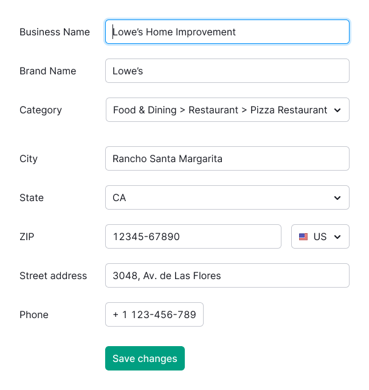

@## Description

**Form** is a component which allows collecting and sending data to the system 🤖. In most cases it consists of different types of inputs and other controls.

> 💡 Use one size of inputs and controls in the form.

@## Positioning

Place the controls in the form vertically or on one line. Upon that place the labels to inputs next to the inputs at the left or at the top.

|            | Example                                                          |
| ---------- | ---------------------------------------------------------------- |
| horizontal |  |
| vertical   |      |
| inline     |                    |

@## Input labels

Annotate the input with a text label. It is necessary when it may be not obvious what the user should enter into the input.

> 💡 Do not use a colon after the text label.

**Font style may be both Regular and Bold, when you need to highlight the input name.**

If it is clear from the context what should be entered into the input, you can use only the text placeholder inside.

The input may be marked as optional for completing.

| Input size | Vertical label. The name is attached at the left, optional - at the right of the input. | Horizontal label. The name is centered in the input, optional - always under the name. | Font size                            |
| ---------- | --------------------------------------------------------------------------------------- | -------------------------------------------------------------------------------------- | ------------------------------------ |
| XL (42px)  |                              |                      | `font-size: 16px; line-height: 1.5;` |
|            |                        |                |                                      |
|            |                        |                |                                      |
| L          |                               |                       | `font-size: 14px; line-height: 1.4;` |
|            |                         |                 |                                      |
|            |                         |                 |                                      |
| M          |                               |                       | `font-size: 12px; line-height: 1.5;` |
|            |                         |                 |                                      |
|            |                         |                 |                                      |

In some cases, when the form is centered on the page, input labels are recommended to be right-aligned.

@## Placeholders

Placeholders are required in the form inputs in order to prompt the user what should be entered, if it is not clear from the input label.

> 💡 **Key points**
>
> - Do not use only placeholders for inputs in the form. When completed, such form becomes poorly readable - the user will have to guess which information is placed in each field.
> - Do not put a specific value as a placeholder. The user may think that the input has already been filled.

Leave only the name of the input only in the following cases:

- the input’s purpose is obvious:
- it is important to save space in the interface.

Upon entering symbols into the input the placeholder disappears, except for the cases when a mask with format is used as a placeholder. _For example, as in [InputMask](/components/input-mask/)._

@## Inputs

> 💡 Upon opening the form the first input is recommended to be put in the status `focus`.

The form may contain any controls and inputs from our design system.

Below there are recommendations with regard to the paddings between the inputs in the form. You may use other ones, 4-fold, paddings, if necessary.

| XL (42px)                                          | L (32px)                                          | M (26px)                                          |
| -------------------------------------------------- | ------------------------------------------------- | ------------------------------------------------- |
|  |  |  |

@## Form validation

See more details about form validation in [Validation](/patterns/validation-form/).

@## Use in UX/UI

### Labels over inputs vs labels next to inputs

Depending on your aims, you may place labels over the inputs or next to them.

Briefly:

- labels over inputs are good for short simple forms and forms for mobile screens;
- labels next to inputs are suitable for complex forms, where you should slow the user down in order he/she did not make mistakes.

### Label over input

**When to use?**

- The form is small and simple, the user can quickly scan it with his/her eyes.
- “Price of the mistake” upon completing the form is not large.

**Advantages**

- They are quicker to be completed (see the [research](https://www.uxmatters.com/mt/archives/2006/07/label-placement-in-forms.php)).
- They are simpler to be scanned with eyes.
- They are ideal for multilingual interfaces.

**Disadvantages**

- They may be very long (take more vertical space).
- They are not an ideal solution for large long forms (and the complex ones).

### Label next to input, left alignment

**When to use?**

The form is large and/or complex, and you need to slow the user down in order he/she did not make mistakes upon completion.

In this case the “price of the mistake” upon such form completion may be significant.

**Advantages**

- They may be compact (take less vertical space, unlike the forms with labels over inputs).
- They claim more user’s attention upon completion.

**Disadvantages**

- They may be very broad (take more horizontal space).
- They are slower to be completed (see the [research](https://www.uxmatters.com/mt/archives/2006/07/label-placement-in-forms.php)).
- They are less suitable for multilingual interfaces.

### Label next to input, right alignment

**When to use?**

The form is large and/or complex, and you need to slow the user down in order he/she did not make mistakes upon completion.

Right alignment of labels visually better connects labels with inputs, in comparison with left alignment.

**Advantages**

- In view of visual connection between the label and the input this variant is better than the previous one.
- Higher results of filling rate, in comparison with the previous one (see the [research](https://www.uxmatters.com/mt/archives/2006/07/label-placement-in-forms.php)).
- They may be more compact in comparison with the forms having labels over inputs.

**Disadvantages**

- Such forms are more difficult to be scanned and read (labels are right aligned, your brain should be strained a little more in order to find the beginning of the following line).
- They are less suitable for multilingual interfaces.

@page form-code
