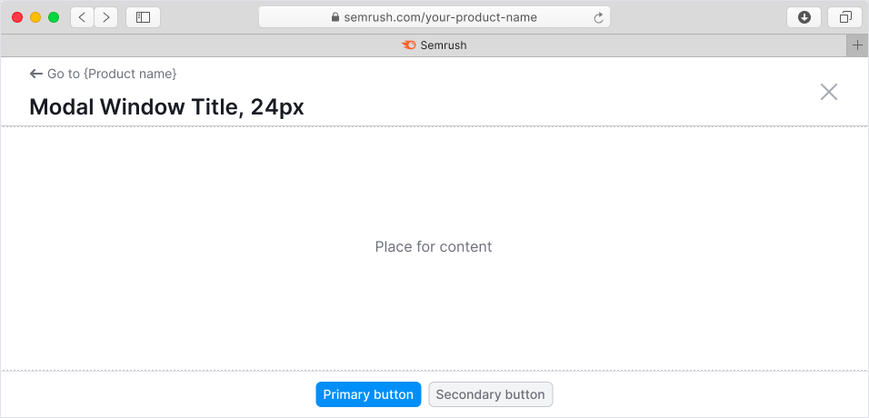
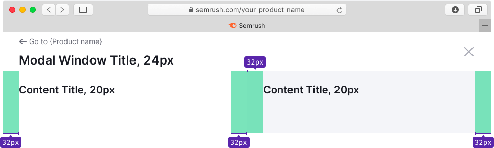
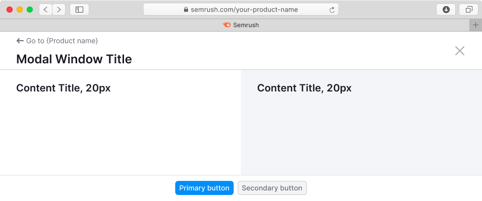

@## Description

**Fullscreen modal** is a modal window, which opens on top of the webpage. **It blocks all functions of the parent page and has a separate URL.**

**We use fullscreen modal component when:**

- it is necessary to fill in / edit / analyze a large amount of information with full focus on the task;
- it is necessary to show a large amount of additional data for the report and get a response from the user on what to do with these data;
- it is necessary to show a large amount of additional data for the report, but you don’t need to move it to a separate page;
- the screen size is less than 768px.

@## Appearance

Fullscreen modal window consists of:

- fixed header with title and buttons for returning to the product page and closing.
- content;
- fixed footer with submit and other controls (optional).



@## Header

For the header of the fullscreen window use the following styles:

- for title use text with 24px size (`--fs-500`, `--lh-500`) and bold font-weight;
- for additional information next to the title use text with 12px size (`--fs-100`, `--lh-100`) and `--gray-500` color.
- for return button use button with M size.
- for window closing icon use Close icon with M size.

> 💡 Fix the header, while user scrolls the content of the window.

### Sizes, margins and paddings

```css
height: 78px;
padding: 40px 72px 8px 32px;
border-bottom: 1px solid var(--gray-200);
```


### Long title

If the title of the window is very long and it does not fit into the space, collapse it to `ellipsis`.

The Close icon has `margin-left: 12px;`.


@## Content

- For content title use text less than 20px (`--fs-500`) to maintain hierarchy in the content.
- You can divide content area into several areas. To visually separate them, use `--gray-50` as a background color for one of them.

| Single-zone modal window                           | Dual-zone modal window                             |
| -------------------------------------------------- | -------------------------------------------------- |
|  |  |

### Paddings

`padding: 24px 40px 40px;`

| Single-zone modal window                 | Dual-zone modal window                     |
| ---------------------------------------- | ------------------------------------------ |
|  |  |

### Content alignment

- If there are two columns / zones for content in the modal window, the content inside them is placed with `align: left`.
- If there is only one zone for content in the modal window, it is necessary to center the content with `align:center` horizontally. **We recommend you to consider an ordinary modal window in this case** 😏

| Single-zone modal window                  | Dual-zone modal window                    |
| ----------------------------------------- | ----------------------------------------- |
|  |  |

@## Footer

```css
height: 52px;
padding: 40px 72px 8px 32px;
border-top: 1px solid var(--gray-200);
```


@## CTA buttons

Use buttons with M size.

> 💡 Note that the example below shows a default composition of the content. For example, buttons may not be center aligned.



@## Interaction

You can close the fullscreen modal window:

- By clicking on the "Close" button;
- By clicking on "CTA" or "Cancel" button;
- With the "Esc" button;
- With the back button in the browser (nothing changes on the parent page in this case).

> 💡 When the fullscreen modal window is closed, focus returns to its trigger.

@## Changing the browser window size

The header and footer of the modal window should be straightened to the full width of the browser window. If necessary, the content may have a fixed width (minimum or maximum).


@## Corner cases

### Loading

When loading and reloading the content of the window, use [Spin](/components/spin) with XL size.


### Error

If an error occurred during data loading, show the error message with the "Reload" button.

For error messages use component from [Widget empty state](/components/widget-empty/).

### Limit


@page fullscreen-modal-a11y
@page fullscreen-modal-api
@page fullscreen-modal-code
@page fullscreen-modal-changelog
