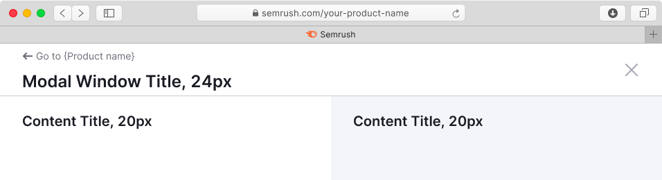
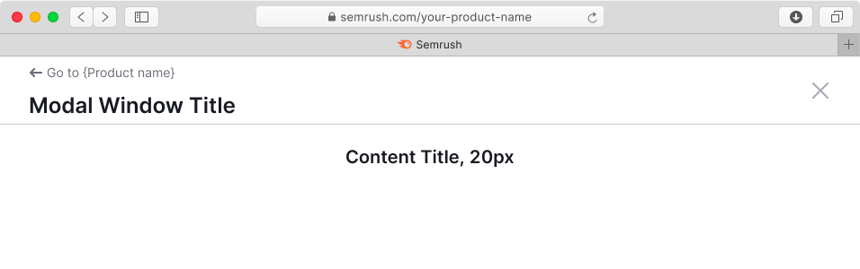

@## Description

**Fullscreen modal** is a modal window that opens on top of the webpage. It blocks all functions of the parent page and has its own separate URL.

**Use fullscreen modal component when:**

- You need to focus user fully on a task that involves filling in, editing, or analyzing a large amount of information.
- You need to display a substantial amount of additional data for a report and require user input on what to do with that data.
- You need to show additional data for a report, but you don’t want to move it to a separate page.
- The screen size is smaller than 768px.

@## Appearance

The fullscreen modal window includes:

- Fixed header with a title and buttons for going back to the product page and closing the modal.
- Content area.
- Fixed footer with submit and other optional controls.

### Header and footer width

The header and footer of the modal window should be straightened to the full width of the browser window. If necessary, the content may have a fixed width (minimum or maximum).

@## Header styles

For the header of the fullscreen window use the following styles:

- for title use text with 24px size (`--fs-500`, `--lh-500`) and `bold` font-weight;
- for additional information next to the title use text with 12px size (`--fs-100`, `--lh-100`) and `--text-secondary` token for text color.
- for return button use button with M size.
- for window closing icon use `Close` icon with M size.

> Fix the header, while user scrolls the content of the window.

### Sizes, margins and paddings

### Long title

If the title of the window is too long, and does not fit into the space, collapse it into `ellipsis`.

`Close` icon has `margin-left: var(--spacing-3x)`.

@## Content styles

- For content title use text less than 20px (`--fs-500`) to maintain hierarchy in the content.
- You can divide content area into several areas. To visually separate them, use `--bg-secondary-neutral` token as a background color for one of them.

@table-caption Content styles for single-zone and dual-zone modal windows

| Single-zone modal window           | Dual-zone modal window             |
| ---------------------------------- | ---------------------------------- |
|  |  |

### Paddings

@table-caption Paddings for single-zone and dual-zone modal windows

| Single-zone modal window | Dual-zone modal window     |
| ------------------------ | -------------------------- |
|  |  |

### Content alignment

- If there are two columns / zones for content in the modal window, the content inside them should be placed with `align: left`.
- If there is only one zone for content in the modal window, it is necessary to center the content with `align:center` horizontally. We also recommend you to use a [default modal window](/components/modal) in this case instead.

@table-caption Content alignment for single-zone and dual-zone modal windows

| Single-zone modal window  | Dual-zone modal window    |
| ------------------------- | ------------------------- |
|  |  |

@## Footer styles

Footer has the same paddings as the header has.

@## CTA buttons

You can use buttons either M or L size depending on the context of the problem you are solving in such a modal window.

> Note that the example below shows a default composition of the content. For example, buttons may not be center aligned.

@## Interaction

Fullscreen modal window can be closed:

- By clicking on the "Close" button;
- By clicking on "CTA" or "Cancel" button;
- With the `Esc` button;
- With the back button in the browser (nothing changes on the parent page in this case).

> When the fullscreen modal window is closed, focus always returns to its trigger.

@## Edge cases

### Loading

When loading and reloading the content of the window, use [Spin](/components/spin) with XL size.

### Error

If an error occurred during data loading, show the error message with the "Reload" button.

For error messages use [Widget empty state](/components/widget-empty/) component.

### Limit

@page fullscreen-modal-a11y
@page fullscreen-modal-api
@page fullscreen-modal-code
@page fullscreen-modal-changelog
