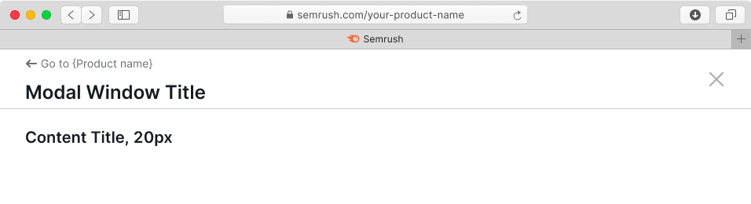
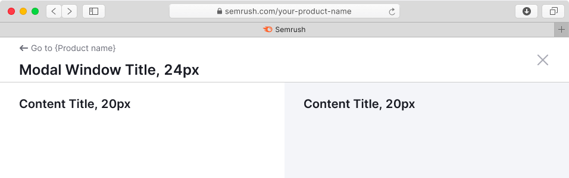
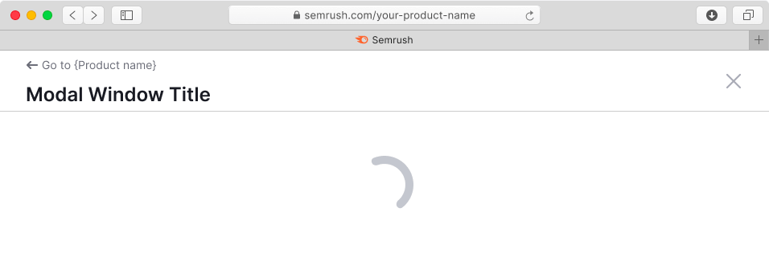

## Description

**Fullscreen modal** is a modal dialog that opens on top of the webpage. It blocks all functions of the parent page and has its own separate URL.

**Use fullscreen modal component when:**

- You need to focus user fully on a task that involves filling in, editing, or analyzing a large amount of information.
- You need to display a substantial amount of additional data for a report and require user input on what to do with that data.
- You need to show additional data for a report, but you don’t want to move it to a separate page.
- The screen size is smaller than 768px.

## Appearance

The fullscreen modal dialog includes:

- Fixed header with a title and buttons for going back to the product page and closing the modal.
- Content area.
- Fixed footer with submit and other optional controls.

### Content styles

- Use 20px (`--fs-500`) or smaller text sizes for headings in the content area to ensure correct hierarchy with the modal header.
- You can divide content area into several areas. To visually separate them, use `--bg-secondary-neutral` token as a background color for one of them.

Table: Content styles for single-zone and dual-zone modal windows

| Single-zone modal window           | Dual-zone modal window             |
| ---------------------------------- | ---------------------------------- |
|  |  |

#### Paddings

Table: Paddings for single-zone and dual-zone modal windows

| Single-zone modal window | Dual-zone modal window     |
| ------------------------ | -------------------------- |
|  |  |

#### Content alignment

- If there are two columns / zones for content in the modal window, the content inside them should be placed with `align: left`.
- If there is only one zone for content in the modal window, it is necessary to center the content with `align: center` horizontally. We also recommend you to use the default [Modal](/components/modal/modal) component in this case instead.

Table: Content alignment for single-zone and dual-zone modal windows

| Single-zone modal window  | Dual-zone modal window    |
| ------------------------- | ------------------------- |
|  |  |

## CTA buttons

You can use either size M or size L buttons, depending on your case.

::: tip
The example below shows the default composition of the content, but depending on your case buttons can have different alignment.
:::

## Interaction

Fullscreen modal window can be closed:

- Using the **Close** button in the header
- Using the **CTA** or the **Cancel** button
- By pressing the `Esc` key
- With the browser's **Back** button (nothing changes on the parent page in this case).

::: tip
When the fullscreen modal window is closed, focus always returns to its trigger.
:::

### States

#### Loading

When loading and reloading the content of the window, use [SpinContainer](../spin-container/spin-container) with XXL size.

#### Error

If an error occurred during data loading, show an error message with the **Reload** button.

For error messages use [Widget empty state](/components/widget-empty/widget-empty) component.

#### Limit

