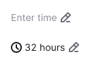
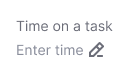
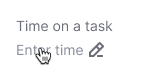
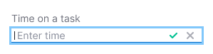
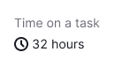
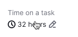
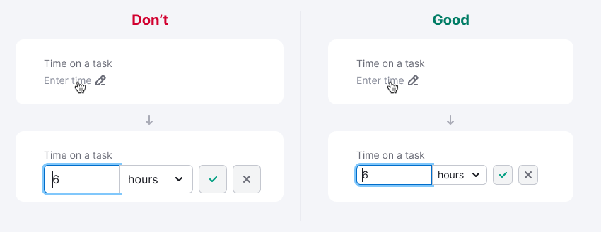

@import playground

@## Description

**InlineEdit** is a wrapper component for switching between viewing and editing data.

**Use this component when:**

- you need to switch between view-only and text editing without reloading the page (for example, edit the title, description or tag);
- data in the interface is placed tightly, you need to save space;
- transferring data to the system is not the main task of the interface (for example, additional information and notes in cards).

@## Appearance

The component consists of:

- wrapper over an input;
- trigger (it can be any necessary component - text or tag, for example);
- input of any type.

> Note that the example below is just an example. It's not a default variant. Any control component can be used as a trigger - a [button](/components/button/), an [icon](/style/icon/), text with an icon.

| Appearance example                            | Styles example                                                                                                    |
| --------------------------------------------- | ----------------------------------------------------------------------------------------------------------------- |
|  | The color of the placeholder is the same as a regular input has - `--gray-300`. Text and icon has one hover zone. |

@## Interaction

- The user has clicked a trigger that opens an Input.
- Input immediately receives focus.
- The user enters data. Either saves the data, or using the cancel button / `Esc` key returns from edit mode to view mode.
- When focus is lost (for example, the user is distracted by another screen), `onBlur` saves the entered value.

Below you can see an example of how such a component works with one of the possible triggers.

| State                   | Appearance example                              | Styles                                                                                                                                                                                                                      |
| ----------------------- | ----------------------------------------------- | --------------------------------------------------------------------------------------------------------------------------------------------------------------------------------------------------------------------------- |
| Normal                  |         | The color of the placeholder is the same as a regular input has - `--gray-300`.                                                                                                                                             |
| Hover                   |          | Cursor changes to `pointer`. The icon changes color to `--gray-400`.                                                                                                                                                        |
| Focus                   |         | Show the input you need for data entry ([normal](/components/input/), [textarea]/components/textarea/), [select]/components/select), [color-picker]/components/color-picker), [time-picker]/components/time-picker), etc.). |
| Entered data            |        | Text color is `--gray-800`.                                                                                                                                                                                                 |
| Entered data with hover |  | Cursor changes to `pointer`. The interactive trailing addon changes color to `--gray-400`.                                                                                                                                  |

@## Animation

The transition between the wrapped trigger and the input can be done with an `ease-in-out` of `50ms`.

@## UX/UI use

In view-mode, set the text size to the same size as the edit input you selected.

_For example, if the heading you need to edit has 24px font-size, then it should also be 24px when you enter edit mode._

@page inline-edit-example
