<Playground for="InlineInput" />

## Description

**InlineInput** is a single-line text field for input and edit. In edit mode, it always has buttons to save or cancel entered value.

**Use this component when:**

- you need to switch between view-only and text editing without reloading the page (for example, edit the title, description or tag);
- data in the interface is placed tightly, you need to save space;
- transferring data to the system isn’t the main task of the interface (for example, additional information and notes in cards).

::: tip
Don’t use such an input in a [form](/patterns/form/form) along with regular inputs (see the example in the UX/UI use section below).
:::

## Appearance

### Sizes

InlineInput itself doesn't have a set sizes. You can set its height and font size that suit your use case.

## Addons

Addons are slots inside the input to the left or right of the text for additional visual or interactive elements.

### Leading addon

In the left addon, you can only put a non-clickable icon/flag/avatar/etc.

Table: Leading addon styles

| Font size                                                          | Appearance example                  | Icon size and color                            |
| ------------------------------------------------------------------ | ----------------------------------- | ---------------------------------------------- |
| For components with font size less than 24px (including this size) | 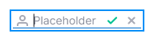 | M size, `color: var(--icon-secondary-neutral)` |
| For components with font size larger than 24px                     | 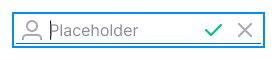   | L size, `color: var(--icon-secondary-neutral)` |

### Label

Through the addon, you can add a label.

_It's needed so that the user understands what data they need to enter. For example, tag name, project name, etc._

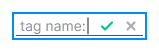

The color of the placeholder is the same as a regular input has - `--text-placeholder`.

### Trailing addon

Trailing addons use the [ButtonLink](/components/button/button-code#button-looking-like-link) component to save, cancel, or return to view mode.

Table: Trailing addon styles

| Font size                                                          | Appearance example                         | Icon size |
| ------------------------------------------------------------------ | ------------------------------------------ | --------- |
| For components with font size less than 24px (including this size) | 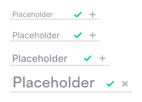 | M         |
| For components with font size larger than 24px                     | 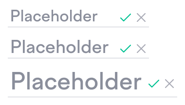   | L         |

### Tooltip

For save and cancel button icons on hover, it's important to show a tooltip that tells a user what they're doing.

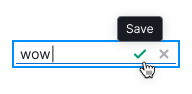

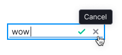

### Save and Cancel actions

In some cases, where space allows and there is a need to show regular buttons, you can hide control icons.

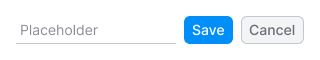

## Interaction

InlineInput can take on the same states as a [normal input](/components/input/input), except for the normal, read-only, and disabled states.

- The user has activated a trigger that opens an InlineInput.
- InlineInput immediately receives focus.
- The user enters data. Either saves the data, or using the cancel button / `Esc` key returns from edit mode to view mode.
- When focus is lost (for example, the user is distracted by another screen), `onBlur` saves the entered value.

## Usage in UX/UI

### Font size

For InlineInput, set the same text size as in view-mode.

_For example, if the heading you need to edit has 24px font-size, then it should also be 24px when you enter edit mode._

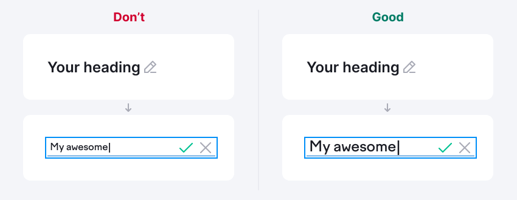

### Using InlineInput in form

Use inputs as intended. We don’t recommend mixing the normal and inline inputs in the form for sending data to the system.

_An InlineInput is convenient when you need to add a note, an additional description, set your name, category, etc._

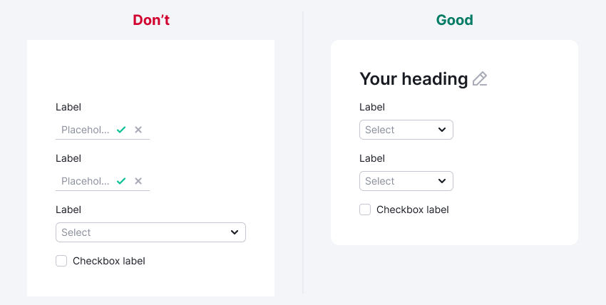

### Using InlineInput with Tag

For a tag that adds another tag, use InlineInput instead of [normal input](/components/input/input). A regular input doesn't have the ability to change the height of the input to fit it into a compact table.

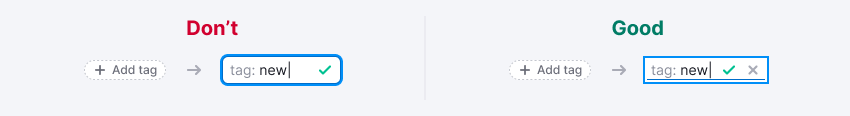
