<!-- @import playground -->

@## Description

**InlineInput** is a single-line text field for input and edit. In edit mode, it always has buttons to save or cancel entered value.

**Use this component when:**

- you need to switch between view-only and text editing without reloading the page (for example, edit the title, description or tag);
- data in the interface is placed tightly, you need to save space;
- transferring data to the system is not the main task of the interface (for example, additional information and notes in cards).

> Do not use such an input in a [form](/components/form/) along with regular inputs (see the example in the UX/UI use section below).

@## Appearance

### Sizes

You can set height and font size for the InlineInput component. So the component itself does not have a set sizes.

### Styles

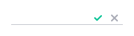

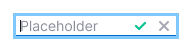

`align-items: center; vertical-align: middle; line-height: 1.1; padding: 0 4px; border-bottom: 1px solid var(--gray-200); background-color: white;`

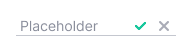

The color of the placeholder is the same as a regular input has - `--gray-300`.

### Paddings

@## Addons

Addons are slots inside the input to the left or right of the text for additional visual or interactive elements.

### Leading addon

- In the left addon, you can only put a non-clickable icon/flag/avatar/etc.
- Icon has `--gray-300` color, no hover, normal cursor.
- **Notice the leading addon is underlined too**.

|                                                               | Appearance example                               | Margins                                                | Icon size and color               |
| ------------------------------------------------------------- | ------------------------------------------------ | ------------------------------------------------------ | --------------------------------- |
| For components with text less than 24px (including that size) | 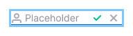 | 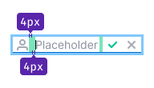     | M size, `color: var(--gray-300);` |
| For components with text larger than 24px                     | 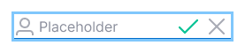   | 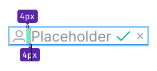 | L size, `color: var(--gray-300);` |

### Permanent placeholder

Through the addon, you can add a permanent placeholder.

_It's needed so that the user understands what data he needs to enter. For example, tag name, project name, etc._

| Appearance example                                         | Styles                                                                          |
| ---------------------------------------------------------- | ------------------------------------------------------------------------------- |
| 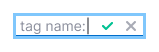 | The color of the placeholder is the same as a regular input has - `--gray-300`. |

### Trailing addon

Trailing addons are clickable icons to save input and cancel and return to view mode.
The save icon is always `--green-300`, the cancel icon is `--gray-300`.

|                                                               | Appearance example                                       | Margins                              | Icon size |
| ------------------------------------------------------------- | -------------------------------------------------------- | ------------------------------------ | --------- |
| For components with text less than 24px (including that size) |      | 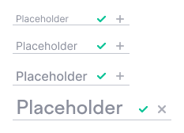 | M         |
| For components with text larger than 24px                     |  | 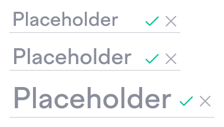     | L         |

@## Tooltip

For save and cancel button icons on hover, it's important to show a tooltip that tells a user what they're doing.

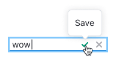

@## Save and Cancel buttons

In some cases, where space allows and there is a need to show regular buttons, you can hide control icons.

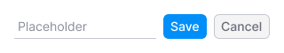

@## Interaction

InlineInput can take on the same states as a [normal input](/components/input/), except for the normal, read-only, and disabled states.

- The user has clicked a trigger that opens an InlineInput.
- InlineInput immediately receives focus.
- The user enters data. Either saves the data, or using the cancel button / `Esc` key returns from edit mode to view mode.
- When focus is lost (for example, the user is distracted by another screen), `onBlur` saves the entered value.

| State         | Appearance example                       | Styles                                                                                                                     |
| ------------- | ---------------------------------------- | -------------------------------------------------------------------------------------------------------------------------- |
| Normal        |        | `border-bottom: 1px solid var(--gray-200);`                                                                                |
| Focus         |          | `border-bottom: 1px solid var(--blue-400); box-shadow: 0px 0px 0px 3px rgba(0, 143, 248, 0.2);`                            |
| Invalid       |      | `border-bottom: 1px solid var(--red-200);`                                                                                 |
| Invalid focus |  | `border-bottom: 1px solid var(--red-400); box-shadow: 0px 0px 0px 3px rgba(255, 73, 83, 0.2);`                             |
| Valid         | 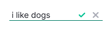         | `border-bottom: 1px solid var(--green-200);`                                                                               |
| Valid focus   |    | `border-bottom: 1px solid var(--green-400); box-shadow: 0px 0px 0px 3px rgba(0, 159, 129, 0.2);`                           |
| Loading       | 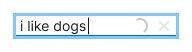     | Spin with XS size. The cancel button gets the disabled state while the input is loading (variable — `--disabled-opacity`). |

@## Save и Cancel icon buttons

On hover, the icons change color to the next one in the palette:

- `--green-300` to `--green-400`;
- `--gray-300` to `--gray-400`.

@## Use in UX/UI

### Font size

For InlineInput, set the same text size as in view-mode.

_For example, if the heading you need to edit has 24px font-size, then it should also be 24px when you enter edit mode._

### Using InlineInput in form

Use inputs as intended. We do not recommend mixing the normal and inline inputs in the form for sending data to the system.

_An InlineInput is convenient when you need to add a note, an additional description, set your name, category, etc._

### Using InlineInput with Tag

For a tag that adds another tag, use InlineInput instead of [normal input](/components/input/). A regular input does not have the ability to change the height of the input to fit it into a compact table.

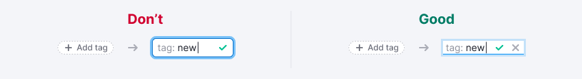

@page inline-input-api
@page inline-input-example
@page inline-input-changelog
