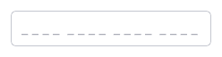
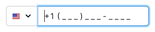
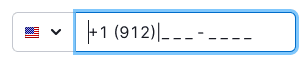
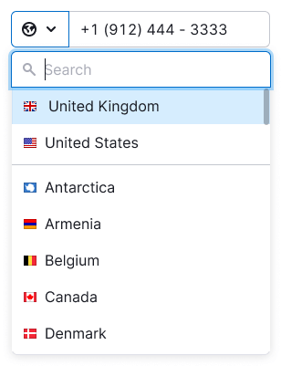

@import playground

@## Description

**InputMask** is the input with a mask that tells the user the number and format of the characters to enter.

> 💡 Important. The input mask is not equal to the input placeholder.

The mask helps the user not to make mistakes when entering the required number of characters and automatically formats the entered value.

**Use the input with a mask when:**

- the format in which you need to enter data is known;
- you need to enter a certain (usually large) number of characters.

> 💡 Important. Remove/hide the mask if you don't know the exact format for the data.

@## Appearance

The symbol that reserves space for entering data, — `_`.

> The mask has the color of the main text, so it is important to add a placeholder. It can reduplicate the mask. Placeholders help the user navigate the form and see which inputs are already filled in.

Example of using a mask in the [input field to enter a phone number](/components/input-phone/input-phone-code).

|             | Appearance examples                                | Styles                      |
| ----------- | -------------------------------------------------- | --------------------------- |
| Placeholder |  | Placeholder color `$gray70` |
| Mask        |         | Mask color `$gray20`        |

@## Interaction

You can limit the characters you enter. If the user enters an invalid character (for example, `/`), the input will cut it.

Example of the mask behavior in the [input field for entering a phone number](/components/input-phone/input-phone-code).

| Placeholder                                        | Focus with mask                                    | Filled                                            |
| -------------------------------------------------- | -------------------------------------------------- | ------------------------------------------------- |
|  |  |  |

@page input-mask-api
@page input-mask-code
@page input-mask-changelog
