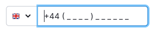

@import playground

@## Description

**InputMask** is the input with a mask. Mask gives user the cue about the number and format of the data that needs to be entered.

> 💡 InputMask is not equal to the input placeholder.

The mask helps user to avoid mistakes when entering the required number of characters and automatically formats the entered value.

**Use InputMask when:**

- the format for the data is known;
- user needs to enter a certain (usually large) number of characters.

**Do not use InputMask if you don't know the exact format for the data.**

@## Appearance

The symbol that reserves space for character, — `_`.

> The mask has the color of the text, so it is important to add a placeholder to the input. It can reduplicate the mask. Placeholders help the user navigate the form and see which inputs are already filled in.

Example of using a mask in the [input field to enter a phone number](/components/input-phone/input-phone-code).

|             | Appearance examples                                | Styles                         |
| ----------- | -------------------------------------------------- | ------------------------------ |
| Placeholder |  | Placeholder color `--gray-300` |
| Mask        |         | Mask color `--gray-800`        |

@## Interaction

You can validate the characters user enters. If the user enters an invalid character (for example, `/`), the InputMask will cut it.

Example of the mask behavior in the [input field for entering a phone number](/components/input-phone/input-phone-code).

| Placeholder                                        | Focus with mask                                    | Filled                                            |
| -------------------------------------------------- | -------------------------------------------------- | ------------------------------------------------- |
|  |  |  |

@page input-mask-a11y
@page input-mask-api
@page input-mask-code
@page input-mask-changelog
