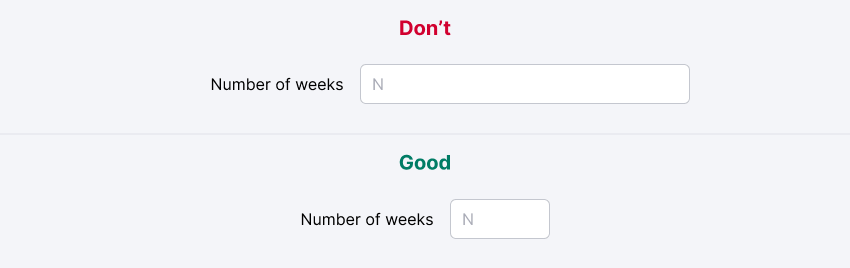
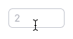
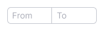
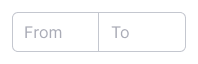

::: react-view

:::

## Description

**InputNumber** is a numeric input field that accepts numeric values only.

### Usage recommendations

**Use this type of input in the following cases:**

- When it's beneficial for the user to increment/decrement the value using stepper buttons.
- When the value shouldn't contain non-numeric characters such as letters, slashes, or other symbols.

**InputNumber shouldn't be used for every numeric value.**

Numeric values can represent quantities of something, such as:

- Number of keywords or links.
- Price.
- Age.

Dates and various codes (for example, pin codes) are also examples of numeric values.

**InputNumber offers the following features:**

- By default, it only allows numeric characters, including numbers, periods, commas, and minus sign. Other non-numeric characters cannot be entered.
- You can enable or disable the stepper buttons.
- You can set minimum and maximum values that the user can enter.
- You can define a step for the value, which determines how much the value increases or decreases when using the stepper buttons (`Up Arrow` and `Down Arrow`), or with the combination of `Shift` + `Up Arrow` or `Down Arrow`.

::: tip
**HTML specifications don’t recommend using InputNumber for numeric values that contain non-numeric characters (for example, slash, letter, hyphen, etc.)**, as this input field removes all non-numeric characters by default.

For numbers with non-numeric characters, it is recommended to use a standard input with `inputmode="numeric"` and the corresponding pattern attribute.
:::

## Input width

The width of the input shouldn't exceed the maximum number that can be entered. Using an excessively long input, such as for the number of days in a week, can confuse the user and add unnecessary complexity to the interface.

## Interaction

Stepper buttons are enabled when the InputNumber field receives focus. The target area for the steppers is larger than their visual size.

Table: InputNumber's stepper button sizes

| Input size (height in px) | Appearance example      |
| ------------------------- | ----------------------- |
| M (28px)                  |  |
| L (40px)                  |  |

::: tip
**Interesting fact**

Number inputs have little stepper buttons, which let users increase or decrease the input’s value by a constant amount. Luke Wroblewski’s usability testing shows that users prefer them to dropdown menus:

_When testing mobile flight booking forms, we found people preferred steppers for selecting the number of passengers. No dropdown menu required, especially since there’s a maximum of 8 travelers allowed and the vast majority select 1–2 travelers._

The only downside is that the browser-provided spinners are tiny, which make them difficult to use. And some browsers don’t show them at all. We can solve this problem by creating our own custom stepper component.

_from [Form Design Patterns](https://www.smashingmagazine.com/printed-books/form-design-patterns/)_
:::

If needed, you can utilize a number as a placeholder within this type of input.

Table: InputNumbers states

| State         | L (40px)                      | M (28px)                      | Styles                                                             |
| ------------- | ----------------------------- | ----------------------------- | ------------------------------------------------------------------ |
| Default       |  |  |                                                                    |
| Hover         |        |        |                                                                    |
| Focus         |        |        | Icon use `--icon-secondary-neutral` token for color.               |
| Stepper hover |   |   | Icon changes its color to the darker one with CSS filters. |

## Validation

Like any input field, InputNumber can be set as a required field. For general recommendations on form and input validation, refer to the [general validation guide](/patterns/validation-form/validation-form).

To assist users in entering correct and valid data, you can:

- Set minimum and maximum values for InputNumber.
- Define a step for the numeric value, allowing it to increment or decrement using the stepper buttons.

## InputRange

To input a range of numbers, you can use two InputNumbers grouped together.

::: tip
Placeholders such as "From" and "To" can be used in these inputs.
:::

Table: InputRange states

| Size (height in px) | Default                         | Focus                   |
| ------------------- | ------------------------------- | ----------------------- |
| M (28px)            |  |  |
| L (40px)            |  |  |

### Validation for a range of numbers

If the value in the right input is less than the value in the left input, the values will switch when **both** inputs lose focus (`onBlur`).

Table: Validation case for InputRange

| The right value is less than the left value | After submitting, inputs will switch their values |
| ------------------------------------------- | ------------------------------------------------- |
|                      |                            |

## Appearance customization

In certain cases, when you need to display the steppers as buttons with `Plus` and `Minus` icons, you can utilize an alternative view of this component. Refer to the [Example tab](/components/input-number/input-number-code#appearance-customization).

## Edge cases

### Invalid values

If the user enters an invalid value (below the minimum or above the maximum), the value will be reset to the minimum or maximum value, respectively, when input loses the focus (`onBlur`).

If the input doesn't have a defined range of acceptable values, no validation will be applied, and the entered value will be retained.

### Fractional numbers

You can use a dot to enter a fractional value in the input.

::: tip
The dot and comma are interchangeable characters depending on the locale.
:::

For instance, if the user enters a value with a dot and the locale uses commas for fractional values, the originally entered dot should be changed to a comma, and vice versa.

### Negative value

If the input only allows positive values, the user will not be able to enter a negative value.

### Zero value

Treat the zero value like any other number:

- If 0 is a valid value, the input will retain this entered value.
- If 0 is less than the minimum value, the input will reset the value to the minimum.

::: tip
If the input is already set to 0, when the input receives focus, the user can enter a value after the 0. Upon onBlur, the entire value in the input is formatted, and the leading 0 will be removed. For example, `001` is formatted to `1`.
:::

