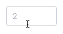

@import playground

@## Description

**InputNumber** is an [input](/components/input/) in which you can enter only numeric values.

**Use this type of input in the cases when:**

- its better for the user to decrease/increase the entered value using the stepper buttons;
- the value does not contain letters, slashes, or other non-numeric values.

**InputNumber has several features:**

- By default, you can enter the following numeric characters: numbers, period, comma, minus (all other non-numeric values such as slash, dash/hyphen, letters, etc. cannot be entered).
- You can enable/disable stepper buttons.
- You can set the minimum and maximum values that the user can enter.
- You can also set the change step for the value using the stepper buttons / keyboard arrows / `Shift` + keyboard arrows `Up`, `Down`.

@## Input size

The input size should not be longer than the largest number that can be entered in it. Too long input field, for example, for the number of days in a week can confuse the user and add unnecessary meanings.

@## Interaction

When InputNumber gets focus stepper buttons (steppers, spinbox interface) enables. The click zone for the steppers is larger than their size.

| Input size (height in px) | Appearance                          |
| ------------------------- | ----------------------------------- |
| M (28px)                  |  |
| L (40px)                  |  |

> **Interesting fact**
>
> Number inputs have little stepper buttons, which let users increase or decrease the input’s value by a constant amount. Luke Wroblewski’s usability testing shows that users prefer them to dropdown menus:
>
> _When testing mobile flight booking forms, we found people preferred steppers for selecting the number of passengers. No dropdown menu required, especially since there’s a maximum of 8 travelers allowed and the vast majority select 1–2 travelers._
>
> The only downside is that the browser-provided spinners are tiny, which make them difficult to use. And some brows- ers don’t show them at all. We can solve this problem by creating our own custom stepper component.
>
> _from [Form Design Patterns](https://www.smashingmagazine.com/printed-books/form-design-patterns/)_

If necessary, you can use a number as a placeholder inside this type of input.

| State      | L (40px)                                     | M (28px)                                     | Styles                                                             |
| ---------- | -------------------------------------------- | -------------------------------------------- | ------------------------------------------------------------------ |
| Default    |    |    |                                                                    |
| Hover      |            |            |                                                                    |
| Focus      |            |            | Icon use `--icon-secondary-neutral` token for color.               |
| Icon hover |  |  | Icon changes its color to `--icon-secondary-neutral-hover-active`. |

@## Validation

InputNumber, like any input, can be required. General recommendations for validating forms and inputs you can find in [Validation](/patterns/validation-form/).

To help the user with entering the correct data and passing validation, you can:

- set the minimum and maximum values for InputNumber;
- set the step for the entered numeric value to decrease/increase when using the stepper buttons.

@## InputRange

To enter a range of numbers, you need two InputNumbers grouped together.

> You can use **"From"** and **"To"** as placeholders in such inputs.

| Size (height in px) | Default                                                  | Focus                                              |
| ------------------- | -------------------------------------------------------- | -------------------------------------------------- |
| M (28px)            |  |  |
| L (40px)            |  |  |

### Validation for a range of numbers

If user enters a value in the right input that is less than the value in the left input, these inputs will switch their values when the focus is lost (`onBlur`).

| The right value is less than the left value | After submitting, inputs will switch their values |
| ------------------------------------------- | ------------------------------------------------- |
|           |                 |

@## Alternative view

In cases when you need to show steppers as buttons with `Plus` and `Minus` icons, you can use the alternative view of this component. See the example [in the Example tab](/components/input-number/input-number-code/#a22257).

@## Corner cases

### Invalid values

If user enters an invalid value (less than minimum, more than maximum), such value will be reset to `min/max`, respectively. The value is reset when the focus is lost (`onBlur`). If the input does not have a defined range of acceptable values, then there should be no validation – the entered value will be applied.

### Fractional numbers

You can use a dot to enter a fractional value in the input.

> **The dot and comma are interchangeable characters depending on the locale**. For example, if user entered a value with a dot, and fractional values are used with a comma in the respective locale, then the originally entered dot should be changed to the comma. And vice versa.

### Negative value

If only positive values are allowed in the input, then user cannot be able to enter a minus.

### Zero value

Treat zero value like any other number:

- if 0 is a valid value, then input will keep this entered value;
- if 0 is less than the minimum value, input will reset the value to the minimum value.

> **If the input is already set to 0**, then when the input gets the focus, user enters the value after 0. By `onBlur`, the entire value in the input is formatted, and 0, which was before the number, will be removed. For example, `001` is formatted to `1`.

@## Usage in UX/UI

**InputNumber should not be used for the every numeric value.**

A numeric value can represent the quantity of something:

- number of keywords or links, etc., for example;
- price;
- age.

Dates and various codes (for example, pin codes, etc.) are also numeric values.

**HTML specifications do not recommend using InputNumber for numeric values that contain non-numeric characters (for example, slash, letter, dash/hyphen, etc.)**. Since this input removes all characters that are not numeric values by default.

For numbers with non-numeric characters (slash, letter, etc.), it is recommend to use a standard input with `inputmode="numeric"` and the corresponding pattern attribute.

@page input-number-a11y
@page input-number-api
@page input-number-code
@page input-number-changelog
