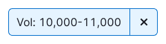
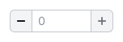

@import playground

@## Description

**InputNumber** is an [input](/components/input/) where you can enter only numeric values.

**Use this component when:**

- it is reasoned to decrease/increase the entered value using the stepper buttons;
- the value does not contain letters, slashes, or other non-numeric values;
- the value is not very large.

### InputNumber has several features

- by default, you can enter the following numeric characters: numbers, period, comma, minus (all other non-numeric values such as slash, dash/hyphen, letters, etc. can not be entered);
- in the input, you can enable the constant display of stepper buttons to change the value up or down;
- in this input, you can set the minimum and maximum values that the user can enter;
- you can also set the change step for the value using the stepper buttons/keyboard arrows/Shift + keyboard arrows `up`, `down`.

@## Interaction

When you hover near such input the stepper buttons (steppers, spinbox interface) shall appear. These buttons can be used to change the value up or down.

The click zone for steppers is slightly larger than their size.

### Working with the keyboard

To change the value in InputNumber, use:

- stepper buttons (steppers) which appear by hover/focus in the input;
- keys `Up`, `Down` on the keyboard;
- `Shift` + `Up`, `Down` keys.

> 💡 **Interesting fact**
>
> Number inputs have little stepper buttons, which let users increase or decrease the input’s value by a constant amount. Luke Wroblewski’s usability testing shows that users prefer them to dropdown menus:
>
> _When testing mobile flight booking forms, we found people preferred steppers for selecting the number of passengers. No dropdown menu required, especially since there’s a maximum of 8 travelers allowed and the vast majority select 1–2 travelers._
>
> The only downside is that the browser-provided spinners are tiny, which make them difficult to use. And some brows- ers don’t show them at all. We can solve this problem by creating our own custom stepper component.
>
> _from [Form Design Patterns](https://www.smashingmagazine.com/printed-books/form-design-patterns/)_

|           | Appearance                            |
| --------- | ------------------------------------- |
| XL (42px) |  |
| L (32px)  |    |
| M (26px)  |    |

> 💡 If necessary, you can use a number as a placeholder inside this kind of input.

| State      | Xl (42px)                                     | L (32px)                                     | M (26px)                                     | Styles                                                                |
| ---------- | --------------------------------------------- | -------------------------------------------- | -------------------------------------------- | --------------------------------------------------------------------- |
| default    |    |    |    |                                                                       |
| hover      |            |            |            | `icon color: $stone;`                                                 |
| Icon hover |  |  |  | When hovering the cursor over, the color of the icon is darker by 8%. |
| focus      |            |            |            |                                                                       |

@## Input size

The input size shall not be longer than the largest number that can be entered in it. Too long input field, for example, for the number of days in a week can confuse the user and add unnecessary meanings.

@## Validation

InputNumber, like any input, can be made mandatory. General rules for validating forms and inputs can be found in [Validation](http://i.semrush.com/patterns/validation-form/).

In order for the user to enter the correct data and pass validation, in InputNumber you can:

- set the minimum and maximum values for input;
- set the step for the entered numeric value to decrease/increase when using the stepper buttons.

@## Range of values

To enter a range of numbers, we need two Inputnumber grouped together, and a bit of magic ✨

> 💡 You can use **"from"** and **"to"** as placeholders in such inputs.

| State   | Xl (42px)                                                 | L (32px)                                                 | M (26px)                                                 |
| ------- | --------------------------------------------------------- | -------------------------------------------------------- | -------------------------------------------------------- |
| default |  |  |  |
| focus   |      |          |          |

### Validation when entering a range of numbers

If the user entered a value in the right input that is less than the value in the left input, they should switch places when the focus is lost (`onBlur`).

| The right value is less than the left value | When submitting, we change the values in places |
| ------------------------------------------- | ----------------------------------------------- |
|           |               |

@## Alternative view

In some cases you need to show steppers for values as specific buttons with "-"/"+", so you can use the alternative view of this component. See the example [in the Code tab](/components/input-number/input-number-code/#a22257).

@## Corner cases

### Invalid values

If the user enters an invalid value (less than min, more than max), such value will be reset to `min/max`, respectively. The value is reset when the focus is lost (`onBlur`). If the input does not have a defined range of acceptable values, then there is no validation – just apply the entered value.

### Fractional number

You can use a dot to enter a fractional value in the input.

> 💡 **The dot and comma are interchangeable characters depending on the locale**. For example, if the user entered a value with a dot, and fractional values are used with a comma in the respective locale, then the originally entered dot shall be changed to the comma. And vice versa.

### Negative value

If only positive values are allowed in the input, then you can not be able to enter a minus.

### Zero value

We treat a zero value like any other number:

- if 0 is a valid value, then we will keep this entered value;
- if 0 is less than the minimum value, we reset the input value to the minimum value.

> 💡 **If the input is already set to 0**, then when the focus is in the field, the user enters the value after 0. By `onBlur`, the entire value in the input is formatted, and 0, which was before the number entered by the user, is removed. For example, `001` is formatted to `1`.

@## Use in UX/UI

### When used

> 💡 **InputNumber is not used for every numeric value.**

A numeric value can represent the quantity of something:

- number of keywords or links, etc., for example;
- price;
- age.

Dates and various codes (for example, pin codes, etc.) are also numeric values.

**HTML specifications do not recommend using InputNumber for numeric values that contain non-numeric characters (for example, slash, letter, dash/hyphen, etc.)**. Since this input removes all characters that are not numeric values by default.

For numbers with non-numeric characters (slash, letter, etc.), it is recommend to use a standard input with `inputmode="numeric"` and the corresponding pattern attribute.

@page input-number-api
@page input-number-code
@page input-number-changelog
