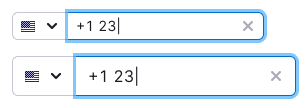
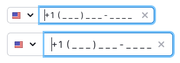

@## Description

**Input** for entering a phone number is an input field for easy entering a phone number using a [mask](/components/input-mask/). This input should help the user enter information correctly without any hesitation about the phone number format.

### In such an input, we recommend

- use preset values for the phone code (country code, or the flag along with the country code for clarity);
- use the mask to display the number dialing format (so that the user does not have to type brackets, hyphens, and other characters).

> In its testing [Baymard Research](https://baymard.com/blog/input-masking-form-field) stated the following about the masks:
>
> Our large-scale Checkout usability testing reveals that 89% of users are likely to enter numerical inputs in several different ways – evenwhen formatting examples are provided that display the site’s desired input format. Furthermore, during testing, a proportion of test subjects hesitated before they entered their data, as they worried that they would type it in a format the site wouldn’t validate – even on sites that accepted all formatting.

@## Appearance

The input for entering the phone number has several display options depending on:

- user's country and/or number format,
- whether we need phone numbers of users from the same country.

| Case | Appearance example  |
| ------------------------------------------------------------------ | ------------------- |
| We don't know the country and/or phone number format               |  |
| We know the country, but we don't know the phone number format     |  |
| We know the country and phone number format                        |  |

When we know the user's country, it is important to display flag of the country in the input – this helps us visually navigate through the entered data faster. _For example, in [Form](/patterns/form/) guide._

> Be sure to add the `Phone number` label to the input if it doesn't have any visual indication of the mask type, country code, or format.

For actual examples of inputs for entering a phone number, see the [Example tab](/components/input-phone/input-phone-code).

@## Help instructions

We recommend you to provide visible text instructions for inputs with constraints, such as a specific format for data.

| Size (height in px) | Text size for the hint | Appearance example                  | Margins                                   |
| ------------------- | ------------------- | ----------------------------------- | ----------------------------------------- |
| M (28px)            | 12px (use `--fs-100`, `--lh-100` tokens) |  |  |
| L (40px)            | 14px (use `--fs-200`, `--lh-200` tokens) |  |  |

@## Interaction

> If the input contains some entered characters, the icon for the "clear all" operation appears.

### Important points for cases when we can determine the user's country and phone format

- **Only numeric characters can be entered to this field**. All other characters are truncated when entering and pasting from the clipboard.
- If, when inserting a number with a country code, the code does not automatically correspond to a certain country, the country changes to the one the inserted number code belongs to.
- **The user shall have an opportunity to change the country** (and the code respectively). This is necessary if you want to enter your phone number while staying in some other country, etc.
- In a dropdown, a country name shall be associated with a respective country code.
- **When we know the phone format, the input must have a mask for it, depending on the country**. if you DON't know the format, [it is recommend removing the format mask altogether](https://baymard.com/blog/input-masking-form-field) (leave only the + country code at the beginning of the input).
- The country code, if it is known, shall represent a value preset in the input. The user can delete it.

> In its testing [Baymard Research](https://baymard.com/blog/input-masking-form-field) stated the following about the masks:
>
> If not absolutely sure of the correct regional formatting, or if the target audience for the input mask is deemed to simply be too small, then the input mask should be disabled completely for all users in unverified or unsupported countries, and a traditional form field without any input restrictions should instead be the default.

### We don't know the country and/or phone number format

| Normal                                           | Focus                                                  | filled                                                  |
| ------------------------------------------------ | ------------------------------------------------------ | ------------------------------------------------------- |
|  |  |  |

### We know the country, but we don't know the phone number format

|                       | Normal                                             | Focus                                                    | filled                                                    |
| --------------------- | -------------------------------------------------- | -------------------------------------------------------- | --------------------------------------------------------- |
| One country           |    |    |    |
| More than one country |  |  |  |

### We know the country and phone number format

This option is most suitable when you collect phones from users from one or a limited number of countries.

|                       | Normal                                             | Focus                                                    | filled                                                    |
| --------------------- | -------------------------------------------------- | -------------------------------------------------------- | --------------------------------------------------------- |
| One country           |    |    |    |
| More than one country |  |  |  |

@## Usage in UX/UI

It is recommended that the width of the input field for entering the phone number to be as clear as possible for the user to know how much information they need to enter. Most often, this width does not exceed 160px-250px for all input sizes.

@page input-phone-a11y
@page input-phone-code
