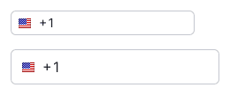
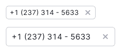
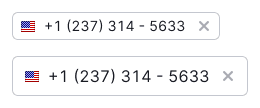
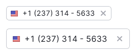
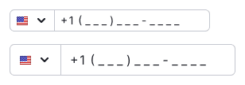

## Description

**InputPhone** is a pattern designed to facilitate the entry of phone numbers. This input ensures that users can enter their phone numbers correctly without any uncertainty about the format.

### Usage recommendations

- Provide preset values for the phone code, such as the country code or a flag along with the country code for clarity.
- Utilize a mask to display the number in the desired format, eliminating the need for users to type brackets, hyphens, and other formatting characters.

::: tip
In a [study conducted by Baymard Research](https://baymard.com/blog/input-masking-form-field), it was found that even with formatting examples provided, 89% of users entered numerical inputs in various formats. Some users hesitated before entering their data, fearing that the format they used wouldn't be validated, even on sites that accepted all formatting.
:::

## Appearance

The appearance of the InputPhone can vary based on:

- User's country and/or number format
- Whether phone numbers from the same country are required

Table: InputPhone variants

| Case                                          | Appearance example            |
| --------------------------------------------- | ----------------------------- |
| Unknown country and/or phone number format    |  |
| Known country but unknown phone number format |  |
| Known country and phone number format         |  |

When the user's country is known, it's important to display the flag of the country in the input. This helps users navigate through the entered data more easily, as seen in the [Form guide](/patterns/form/form).

::: tip
Be sure to add the label "Phone number" to the input. Especially if there are no visual indications of the mask type, country code, or format,
:::

For actual examples of phone number inputs, refer to the [Example tab](/components/input-phone/input-phone-code).

## Text instructions

It is recommended to provide visible text instructions for inputs with specific data formats.

Table: Sizes of InputPhone's hint text

| Size (height in px) | Hint text size                           | Appearance example                     | Margins                                       |
| ------------------- | ---------------------------------------- | -------------------------------------- | --------------------------------------------- |
| M (28px)            | 12px (use `--fs-100`, `--lh-100` tokens) |  |  |
| L (40px)            | 14px (use `--fs-200`, `--lh-200` tokens) |  |  |

## Interaction

### Important points for cases when the user's country and phone format can be determined

- **Only numeric characters can be entered in this field.** All other characters are removed when entered or pasted from the clipboard.
- If a number with a country code is inserted, and the code doesn't correspond to a specific country, the country changes to the one associated with the inserted code.
- **The user should have the option to change the country and the corresponding code.** This is useful when entering a phone number while being in a different country, for example.
- In the dropdown, each country name should be associated with the respective country code.
- When the phone format is known, the input should have a mask specific to the country. If the format is unknown, it is recommended to remove the format mask altogether, as mentioned in [Baymard Research](https://baymard.com/blog/input-masking-form-field) (only leave the + country code at the beginning of the input).
- If the country code is known, it should be pre-filled in the input. The user can delete it if necessary.

::: tip
According to [Baymard Research](https://baymard.com/blog/input-masking-form-field), if you are not certain about the correct regional formatting, or if the target audience is deemed to be too small, it is best to disable the input mask for all users in unverified or unsupported countries and use a traditional form field without any input restrictions.
:::

### Unknown country and/or phone number format

Table: States for the case when country and/or phone number format are unknown

| Normal                        | Focus                               | Filled                               |
| ----------------------------- | ----------------------------------- | ------------------------------------ |
|  |  |  |

### Known country but unknown phone number format

Table: States for the case when only country is known, while phone number format is unknown

| Countries number      | Normal                          | Focus                                 | Filled                                 |
| --------------------- | ------------------------------- | ------------------------------------- | -------------------------------------- |
| One country           |    |    |    |
| More than one country |  |  |  |

### Known country and phone number format

This option is most suitable when collecting phone numbers from users in one or a limited number of countries.

Table: States for the case when both country and phone number format are known

| Countries number      | Normal                          | Focus                                 | Filled                                 |
| --------------------- | ------------------------------- | ------------------------------------- | -------------------------------------- |
| One country           |    |    |    |
| More than one country |  |  |  |

## Usage in UX/UI

To ensure user clarity about how much information they need to enter, it is recommended to keep the width of the InputPhone as clear as possible. Typically, the width doesn't exceed 160px-250px for the input sizes.

