<Playground for="InputTags" />

## Description

**InputTags** is an input field that wraps entered information into tags. It's commonly used alongside the [Combobox](/patterns/auto-suggest/auto-suggest).

This input field is useful for entering a large amount of similar information in a single field, such as keywords or employee emails.

## Appearance

When there are too many tags to fit within the input, the input field's height increases by one line of text.

Table: InputTags sizes

| Size                           | Appearance                                      | Margins                      |
| ------------------------------ | ----------------------------------------------- | ---------------------------- |
| M input is used with the M tag | 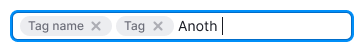 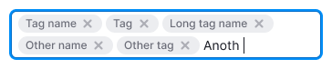 | 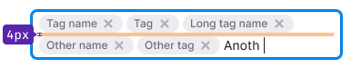 |
| L input is used with the L tag | 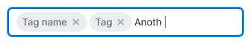 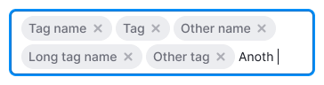 | 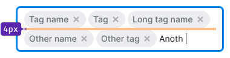 |

## Tag colors

::: tip
To learn more about tags, refer to [Tag](/components/tag/tag).
:::

In most cases, we recommend using tags with the `primary` theme and the `gray-500` color for entering homogeneous information in these inputs. It isn’t recommended to use tags with the `secondary` theme inside inputs as the border adds unnecessary visual noise.

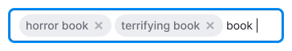

When validating the input, highlight tags with invalid values with the `red-500` color. **Remember to provide clear error messages in tooltips.**

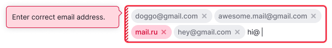

You can use colored tags to represent different categories, if needed.

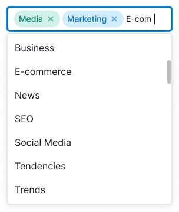

## Interaction

Tags can be added either by selecting options from the menu, or by [entering data manually](#turning-text-into-tags). You can also combine both options.

Table: Interaction with InputTags

| Data from the combobox     | User-entered data          | Data from the combobox and user-entered data |
| -------------------------- | -------------------------- | -------------------------------------------- |
| 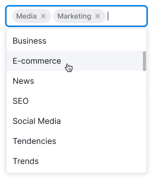 | 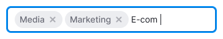 |                    |

When you focus on the input field, if there are preset options available (such as a database of minion addresses or previously entered keywords), a [combobox menu](/patterns/auto-suggest/auto-suggest) will open. Pressing `Enter` or clicking on a list item will insert its value into the input field and wrap it in a tag.

### Turning text into tags

Text entered by the user is automatically converted into a tag inside InputTags in the following cases:

- the input loses focus (for example, by pressing `Tab` or clicking on another element)
- user presses `Enter`, `Tab` or `Shift + Tab`
- a punctuation separator is entered (`,`, `;`, `|`)
- user enters `Space` twice

::: tip
Leading and trailing spaces are trimmed when creating tags.
:::

### Pasting text

After pasting copied data, the text is converted into tags and split based on punctuation separators like commas, semicolons and vertical bars ("|").

### Editing and deleting tags

There are several ways to edit a tag:

- press `Enter` or `Space` on a focused tag
- press `Backspace` in the input without any text to edit the last tag

Deleting a tag can be done with the tag's **Delete** button, or by clearing all text while editing the tag.

## Long text in tag

::: tip
Note that this behavior isn’t recommended due to poor accessibility. Web page content should be responsive and adaptable to small viewport widths, increased text size, and changes in text spacing.
:::

You can set a maximum width for tags, although it isn’t necessary in all cases. If the tag text exceeds the specified width, truncate it with an [Ellipsis](../../utils/ellipsis/ellipsis.md). Hovering over the tag will display a `Hint` with the full text of the tag.

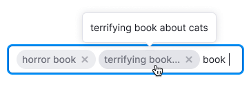
