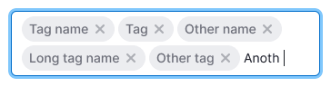
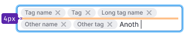
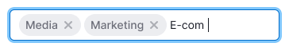

@import playground

@## Description

**InputTags** is the input that wraps the entered information into tags. Often used together with the [Combobox](/components/auto-tips/).

This input is usually used for entering a large amount of homogeneous information in a single field. _For example, keywords or employee emails._

@## Appearance

When tags overflow, the input increases in height by 1 text line.

| Sizes                           | Appearance                     |                                  | Indents                                  |
| ------------------------------- | ------------------------------ | -------------------------------- | ---------------------------------------- |
| XL input is used with the L tag |  |  |  |
| L input is used with the M tag  |    |    |    |
| M input is used with the S tag  |    |    |    |

@## Tag colors

> 💡 You can read more about tags in [Tag](/components/tag).

In most cases, we recommend using a tag with the `primary` type and the `muted` theme to enter homogeneous information in such inputs. We don't recommend using the [Secondary tag](/components/tag/) inside the input since it creates more visual noise due to the presence of `border`.

When validating this input, we may highlight inappropriate data in orange. **Please do not forget about the clear text in the tooltip with the error.**

In some cases, you can use color tags if, for example, they are linked to different categories.

@## Interaction

In the input with tags, you can substitute either preset data from the combobox, or enter your own data (they are wrapped in tags if they have punctuation separators), or combine the first two input options.

| Data only from the combobox                  | User data                                | Data from the combobox and user data       |
| -------------------------------------------- | ---------------------------------------- | ------------------------------------------ |
|  |  |  |

When you focus on such an input, it opens a [Combobox](/components/auto-tips/) if there are pre-set data (for example, a database of addresses of minions or previously entered keywords). When you click on a line in the combobox, the data from this line is inserted into the input and wrapped in a tag.

If such an input does not have pre-set data and the user can enter any data, this data is wrapped in a tag after punctuation separators as described below.

@## Working with the keyboard

The text entered by the user is wrapped in a tag inside InputTags:

- when you lose focus (for example, by taboo);
- when you press `Enter`;
- when entering a punctuation separator (“,”; “;”; “|”)
- with a double space;
- if there is a tab (when inserting data).

> 💡 When wrapping, spaces before and after are cut.

@## Text insertion

After insertion, the text is broken by punctuation separators – comma, semicolon,“|”, `Tab` key.

@## Deleting and editing a tag

If there is a tag in front of the cursor, when you press the delete key, the tag turns into plain text and you can edit and delete it.

@## Long text in the tag

You can set the maximum width for a tag. This is optional, as it is not necessary in all cases of using the component.

In this case, if the tag text is larger than the specified width, it will collapse into an ellipsis. When hovering over it, a tooltip with the full text of the tag shall appear.

@page input-tags-api
@page input-tags-code
@page input-tags-changelog
