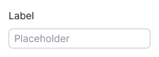
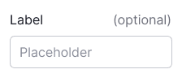

@import playground

@## Description

**Input** is a single-line text field. It's one of the basic components for all kinds of forms, search fields, etc.

Other input types for entering certain data:

- [InputMask](/components/input-mask/)
- [InputNumber](/components/input-number/)
- [InputPhone](/components/input-phone/)
- [InputTags](/components/input-tags/)
- [DatePicker](/components/date-picker)
- [TimePicker](/components/time-picker)
- [ColorPicker](/components/color-picker)
- [Checkbox](/components/checkbox)
- [Radio](/components/radio)

@## Sizes

The input has two sizes.

@table-caption Input sizes

| Size (height in px) | Appearance example      |
| ------------------- | ----------------------- |
| M (28px)            |  |
| L (40px)            |  |

@## Label

We recommend adding a visible text label to the input wherever possible. If the input is not required, be sure to mark it with the "optional" text label.

@table-caption Input text label sizes

| Size (height in px) | Text size | Appearance example            | Margins                              |
| ------------------- | --------- | ----------------------------- | ------------------------------------ |
| M (28px)            | 14px (use `--fs-200`, `--lh-200` tokens) |   |  |
| L (40px)            | 16px (use `--fs-300`, `--lh-300` tokens) |   |  |

@## Addons

**Addon** is a slot inside the input field – to the left and right of the text – for placing icons, badges, counters, etc. Addon can be non-clickable and clickable.

- When adding an icon before the text (leading addon), use a non-clickable icon. This icon is usually colored to match the text or a different color based on the purpose it serves.
- When adding an addon after the text (trailing addon), you have various options such as a clickable icon, a counter, a badge, a spinner, an icon button, or a link. The clickable icon should have the `--icon-secondary-neutral` color. When hovering over it, the color should change to `--icon-secondary-neutral-hover-active`, and the cursor should change to a pointer.

@table-caption Input addon indents and sizes

| Input size | Icon size   | Addon's indents      | Addon's minimum width       |
| ---------- | ----------- | -------------------- | --------------------------- |
| M    | M size  |  |  |
| L    | M size  |  |  |

> When two addons are stacked together, their indents will be divided in half. This ensures that there is a sufficient clickable zone (touch target) around each addon.

@## Interaction

> Use `read-only` state for component that cannot be interacted with, except for copy its value. Also use it for links which might be copied.
>
> Use `disabled` state if you need to show affect of one component to another.

@table-caption Input states

| State   | Normal        | Focus                 | Disabled       | Read-only     |
| ------- | ------------- | --------------------- | -------------- | ------------- |
| Normal  |    |    |    |  |
| Valid   |      |      |      |                                                        |
| Invalid |  |  |  |                                                    |

@## Input types

For live examples of the input types, refer to [Example tab](/components/input/input-code).

@## Search input

The search input can have a non-clickable icon before the text and the icon for clearing the value after the text.

@## Input with a counter

You can place [Counter](/components/counter/) inside the input or next to its label. Counter usually shows the number of available characters, limits, etc. The counter is usually non-clickable.

> Please do not use the [Tag](/components/tag/) component for the counter. It has a different purpose and functionality.

@table-caption Input with counter

| Size (height in px) | Counter next to the input's label  | Counter inside the input     |
| ------------------- | ---------------------------------- | ---------------------------- |
| M (28px)            |           |  |
| L (40px)            |           |  |

@## Usage in UX/UI

1. Use input fields only for single-line information. If you need to enter a lot of data, use a [Textarea](/components/textarea/) instead.
2. Label the inputs clearly, so users can quickly understand what data needs to be entered.
3. Select an appropriate width for the input field based on the content to be entered. For example, if it's for a phone number, the input width shouldn't be wider than what is expected for a phone number.

@page input-a11y
@page input-api
@page input-code
@page input-changelog
