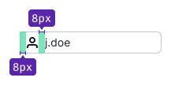
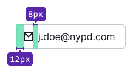
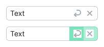
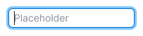

@import playground

@## Description

**Input** is a single-line text input field. It's one of the basic components for all kinds of forms, search fields, etc.

Other input types for entering certain data:

- [InputMask](/components/input-mask/)
- [InputNumber](/components/input-number/)
- [InputPhone](/components/input-phone/)
- [InputTags](/components/input-tags/)

@## Sizes

Our input has two sizes.

| Size (height in px) | Appearance example                       |
| ------------------- | ---------------------------------------- |
| M (28px)            |  |
| L (40px)            |  |

@## Content and addons

**Addon** is a position inside the input field – to the left and right of the text – for placing icons, badges, counters, etc. Addon can be non-clickable and clickable.

- For addon before the text you can set a non-clickable icon only. Such an icon usually has the color of the text or it is colored in other color according to the problem you are solving. _For example, you can color Check icon before the text into `--green-300` to accent the status of the input._
- For addon after the text you can set a clickable icon, a counter, a badge, a spinner, an icon button or link. The clickable icon should have `--gray-300` color. While hovering it should change its color to `--gray-400` and the cursor to the `pointer`.

| Size | Icon size                                            | Addon's indents                                  | Addon's minimum width                          |
| ---- | ---------------------------------------------------- | ------------------------------------------------ | ---------------------------------------------- |
| M    | M size  |  |  |
| L    | M size  |  |  |

> 💡 If two addons are stacked together, their indents will divide in half to maintain the good clickable zone around them.

@## Interaction

| State   | Normal                                               | Focus                                                            | Disabled                                                               | Read-only                                              |
| ------- | ---------------------------------------------------- | ---------------------------------------------------------------- | ---------------------------------------------------------------------- | ------------------------------------------------------ |
| normal  |    |    |    |  |
| valid   |      |      |      |                                                        |
| invalid |  |  |  |                                                        |

> 💡 Use `read-only` state for component that cannot be interacted with, except for copy its value. Also use it for links which might be copied.
>
> Use `disabled` state if you need to show affect of one component to another.

@## Input types

For code examples of the input types, see [Code tab](/components/input/input-code).

@## Search input

The search input has a non-clickable icon before the text and the icon for clearing the value after the text.

@## Input with a counter

You can place [Counter](/components/counter/) inside the input or next to its label. Counter usually shows the number of available characters, limits, etc. The counter is non-clickable.

> 💡 Please do not use the [Tag](/components/tag/) component for the counter. It has a different purpose and functionality.

| Size (height in px) | Counter next to the input's label           | Counter inside the input                       |
| ------------------- | ------------------------------------------- | ---------------------------------------------- |
| M (28px)            |  |  |
| L (40px)            |  |  |

@## Use in UX/UI

1. Use input only for single-line fields. If you need to enter a large amount of data use [Textarea](/components/textarea/).
2. Label the inputs so user can understand at a glance what data needs to be entered.
3. Choose the input's width relevant to the content that should be entered in the input field. _For example, if you have an input for a phone number, the input width should not be more than the expected width of the phone number._

@page input-a11y
@page input-api
@page input-code
@page input-changelog
