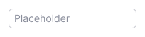
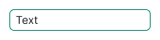
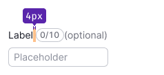

::: react-view

:::

## Description

**Input** is a single-line text field. It's one of the basic components for all kinds of forms, search fields, etc.

## Appearance

### Sizes

The input has two sizes.

Table: Input sizes

| Size (height in px) | Appearance example      |
| ------------------- | ----------------------- |
| M (28px)            |  |
| L (40px)            |  |

### Label

We recommend adding a visible text label to the input wherever possible. If the input isn’t required, be sure to mark it with the "optional" text label.

Table: Input text label sizes

| Size (height in px) | Text size | Appearance example            | Margins                              |
| ------------------- | --------- | ----------------------------- | ------------------------------------ |
| M (28px)            | 14px (use `--fs-200`, `--lh-200` tokens) |   |  |
| L (40px)            | 16px (use `--fs-300`, `--lh-300` tokens) |   |  |

## Addons

**Addon** is a slot inside the input field — to the left and right of the text — for placing buttons, icons, badges, counters, etc. Addon can be non-clickable and clickable.

- When adding an icon before the text (leading addon), use a non-clickable icon. This icon is usually colored to match the text or a different color based on the purpose it serves.
- When adding an addon after the text (trailing addon), you have various options such as a counter, a badge, a spinner, an icon button, or a link. Use [ButtonLink](../button/button.md#button-with-link-styles) without text as an icon button for native semantics and better accessibility.

Table: Input addon indents and sizes

| Input size | Icon size   | Addon's indents      | Addon's minimum width       |
| ---------- | ----------- | -------------------- | --------------------------- |
| M    | M size  |  |  |
| L    | M size  |  |  |

::: tip
When two addons are stacked together, their indents will be divided in half. This ensures that there is a sufficient clickable zone (touch target) around each addon.
:::

## Interaction

::: tip
Use the `read-only` state for component that can't be interacted with, except for copy its value. Also use it for links which might be copied.

Use the `disabled` state if the input availability depends on the value of another element.
:::

Table: Input states

| State   | Normal        | Focus                 | Disabled       | Read-only     |
| ------- | ------------- | --------------------- | -------------- | ------------- |
| Normal  |    |    |    |  |
| Valid   |      |      |      |                                                        |
| Invalid |  |  |  |                                                    |

## Input types

For live examples of the input types, refer to [Example tab](/components/input/input-code).

## Search input

The search input can have a non-clickable icon before the text and a button for clearing the value after the text.

## Input with counter

You can place [Counter](/components/counter/counter) inside the input or next to its label. Counter usually shows the number of available characters, limits, etc. The counter is usually non-clickable.

::: tip
Don’t use the [Tag](/components/tag/tag) component as a counter. It has a different purpose and functionality.
:::

Table: Input with counter

| Size (height in px) | Counter next to the input's label  | Counter inside the input     |
| ------------------- | ---------------------------------- | ---------------------------- |
| M (28px)            |           |  |
| L (40px)            |           |  |

## Usage in UX/UI

1. Use input fields only for single-line information. If you need to enter a lot of data, use a [Textarea](/components/textarea/textarea) instead.
2. Label the inputs clearly, so users can quickly understand what data needs to be entered.
3. Select an appropriate width for the input field based on the content to be entered. For example, if it's for a phone number, the input width shouldn't be wider than what's expected for a phone number.

