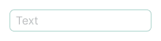

@import playground

@## Description

**Input** is a single-line text input field. Basic component of search fields, also used for the selection of values, ranges and fields for password, email, etc.

There are also inputs for entering certain data:

- [InputMask](/components/input-mask/)
- [InputNumber](/components/input-number/)
- [InputPhone](/components/input-phone/)
- [InputTags](/components/input-tags/)

@## Appearance

### Sizes

We implement 4 input sizes in our interfaces.

|                 XL (42px)                  |                 L (32px)                 |                 M (26px)                 |                 S (18px)                 |
| :----------------------------------------: | :--------------------------------------: | :--------------------------------------: | :--------------------------------------: |
|  |  |  |  |

@## Content

**Addons** are the positions inside the input field – to the left and right of the text – for placing icons/badges/counters, etc.

In the left addon, we add a non-clickable icon only. This helps us visually identify the small form inputs. _For example, the login form._ The icon has the color `$gray40`, an it does not have a `hover`, and the cursor is `default`.

The addon on the right can be a clickable icon, a counter, a badge, a spinner, or a button link. The clickable icon has the color `$stone`, and the cursor changes to the `pointer`.

| Size | Icon size                                     | Indents                                          | Min-width                                      |
| ---- | --------------------------------------------- | ------------------------------------------------ | ---------------------------------------------- |
| L    |  |  |  |
| M    |  |  |  |

> 💡 If you need to stack two addons, the indents of neighboring addons shall be divided in half to maintain the normal clickable area around them.

@## Interaction

| State   | normal                                               | focus                                                            | disabled                                                               | read-only                                              |
| ------- | ---------------------------------------------------- | ---------------------------------------------------------------- | ---------------------------------------------------------------------- | ------------------------------------------------------ |
| normal  |    |    |    |  |
| valid   |      |      |      |                                                        |
| invalid |  |  |  |                                                        |

@## Input types

For living/actual examples of the input types used in our interface, see the [Code tab](/components/input/input-code).

@## Search input

The search input has a non-clickable search icon on the left. It can also have a clear icon on the right.

@## Input with a counter

There may be a [counter](/components/counter/) inside the input or next to its name that shows the number of available characters, limits, etc. The counter is non-clickable.

> 💡 Please do not use the [Tag](/components/tag/) component for the counter. It has a different purpose.

|           | Input with a label                           | Input without a label                           |
| --------- | -------------------------------------------- | ----------------------------------------------- |
| XL (42px) |  |  |
| L (32px)  |   |   |
| M (26px)  |   |   |

@## Use in UX/UI

- Use the inputs as intended. Use the [textarea](/components/textarea/) if you need to enter a large amount of data.
- Name the inputs so that the user can see at a glance what data needs to be entered.
- Choose the input width so that it is relevant to the content that should be in the input field. _For example, if you have an input for entering a phone number, the input width should not be more than the expected width of the phone number._

@page input-a11y
@page input-api
@page input-code
@page input-changelog
