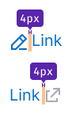
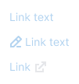
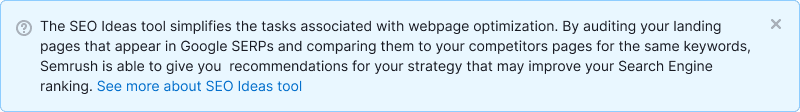
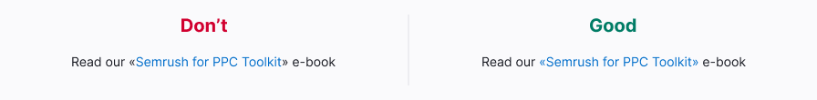
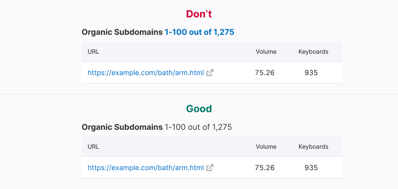

@import playground

@## Description

**Link** is a component used to create clickable links that lead to other web pages or elements. Links can be internal (within the same website) or external. It is a "quiet request" (visually subtle) control according to the [Visual loudness scale](/core-principles/visual-loudness-scale) guide.

@## Appearance

- **Default link:** An accent control that links to another web page.
- **Custom link:** A link with customized functionality and visual appearance. When creating custom links, follow the basic rules of default links. Avoid excessive use of custom links in your interface.

@## Sizes and margins

You can add addons before and after the link text. Addons always have a 4px margin from the link text.

- The icon should represent the action that will be performed by the link.
- If clicking the link with an icon triggers a time-consuming process, you can replace the icon with the [Spin](/components/spin/) component.

@table-caption Link text and addon sizes and margins

| Text size                               | Appearance example     | Icon size |
| --------------------------------------- | ---------------------- | --------- |
| 12-16px (`--fs-100`-`--fs-300` tokens)  |  | M         |
| 20px and bigger (from `--fs-400` token) |  | L         |

@## Interaction

@table-caption Default link states

| State         | Appearance    | Description     | Cursor    |
| ------------- | ------------- | --------------- | --------- |
| Normal        |                      | The link uses the `--text-link` token for color without underline.  | `pointer` |
| Active/hover  |                  | The link changes its color to `--text-link-hover-active` and displays a solid underline on hover. If the link includes an icon, the icon's color changes alongside the text as they share the same active zone. | `pointer` |
| Disabled      |                   | The component's transparency decreases from 100% to 30% to indicate the disabled state. Use this state sparingly and provide a tooltip with a message for the disabled link.   | `default` |
| Visited       |             | The link uses the `--text-link-visited` token for color. This state is optional. | `pointer` |
| Visited (hover) |  | The link uses the `--text-link-visited` token for color and displays a solid underline on hover. This state is optional. | `pointer` |

<!--
Hided this section because it's for the dark theme.

### Link invert

| State         | Appearance                                               | Description                                                                                                                                                                                   | Cursor    |
| ------------- | -------------------------------------------------------- | --------------------------------------------------------------------------------------------------------------------------------------------------------------------------------------------- | --------- |
| Normal        |                      | Link has `--blue-200` color, without underline.                                                                                                                                               | `pointer` |
| Active/hover  |                  | Link changes its color to `--blue-300`. A solid underline appears. If the link is used together with the icon, then the icon changes its color with the text – they have the same active zone. | `pointer` |
| Disabled      |                      | he component changes its transparency from 100% to 30%. Use this state as a last resort and be sure to add tooltip with a message to the `disabled` link.                                     | `pointer` |
| visited       |             | Link has `--purple-500` color. This state is an optional.                                                                                                                                     | `pointer` |
| visited hover |  | Link has `--purple-500` color with a solid underline. This state is optional.                                                                                                                 | `pointer` | -->

@## Links on a dark and colored background

Default links can be used on a colored background within a [Notice](/components/notice/) component.

@## Link text and target zone

> _Link sizes should be generous. Large link sizes make it easier for users with low coordination or on mobile devices to activate links. Link size consideration is most important for links that are not contained within blocks or paragraphs of text, such as call to action links. Links should be at least 44px wide and 22px tall._
>
> _Links should not be too large on mobile. Very large links that take up much of the viewport can be accidentally activated, such as when a user touches the screen to scroll up or down._
>
> [Yale University article about the accessible links](https://usability.yale.edu/web-accessibility/articles/links#other-design-considerations)

When clicking on a link that leads to another page or opens a modal window, the link text should clearly indicate the type of page or modal window it will be. Use an infinitive form ("What should be done?") for the link text.

Avoid using very short link names as they can be difficult to click. If the link is still very short, increase its target area.

Always put quotation marks inside the link.

If a sentence ends with an email, URL, or domain that is a link, do not include a period at the end of the sentence as users often copy the address and may accidentally include the period.

Avoid putting punctuation marks in link text, except when the entire sentence is a link.

In lists, it is recommended to make the entire line a link to reduce visual clutter and improve click ability.

If a link spans two lines, ensure that the cursor remains consistent throughout the interline area by using `display: block`.

@## Margin between links

For links placed in one line, maintain a margin between them that is a multiple of 4px:

- 20px for sufficient space
- 12px for limited space

@## Default link or Hint link?

> Find detailed information on the hint link in the [Typography guide](/style/typography/#hints_hint_links).

- Default link is suitable for internal and external transitions, reloading the page, updating data in a small block/widget, and clickable email.
- Hint link is recommended for updating data in a table row, opening a modal window, opening a dropdown, opening an accordion, opening the full text on the same page, and tooltip on click/hover.

@table-caption How to choose what type of link you should use

| Action on the page   | Default link       | Hint link |
| -------------------- | ------------------ | --------- |
| Internal transition                    | ✅                                   | ❌        |
| External transition                    | ✅                                   | ❌        |
| Reloading the page                     | ✅                                   | ❌        |
| Updating data in a small block/widget  | ✅                                   | ❌        |
| Clickable email                        | ✅                                   | ❌        |
| Updating data in a table row           | Allowed if it is an important action | ✅        |
| Opening a modal window                 | Allowed if it is an important action | ✅        |
| Opening a dropdown                     | Allowed if it is an important action | ✅        |
| Opening of an accordion                | Allowed if it is an important action | ✅        |
| Opening the full text on the same page | ❌                                   | ✅        |
| Tooltip on click/hover                 | ❌                                   | ✅        |

@## Links in tables

- If there is limited space in the interface, use links instead of buttons in tables. If there is sufficient space, prefer using [tertiary buttons](/components/button/).
- In table rows, use 14px links. If the link is a URL leading to an external page, include the `LinkExternal` icon with M size and `--icon-secondary-neutral` color next to it. Ensure it has a `margin-left: var(--spacing-1x)`.

@## External links

> External links always open in a new tab.

@table-caption Cases for appearance of external links

| Case description     | Transition inside product | Transition to external resource | Appearance example     |
| ---- | ------------------------------------------------ | ---------------------- | --------------------------------------------- |
| If the link leads to a page within the product. In this case, you don't need to add the `LinkExternal` icon to the link.      | ✅         | ❌                                            |  |
| If the link leads to an external resource without any transition inside the product, add the `LinkExternal` icon to the link.          | ❌                                               | ✅                                            |                                                                            |
| If the link leads within the product but has an icon next to it for opening an external resource, add the `LinkExternal` icon. | ✅                                               | ✅                                            |                                                                            |

### Styles

- Use the `LinkExternal` icon with M size and `--icon-secondary-neutral` color to indicate the transition to an external resource.
- The icon should always have a `margin-left: var(--spacing-1x)`.
- When hovering over the icon, it should change color to `--icon-secondary-neutral-hover-active`.
- If necessary, you can use link styles to highlight the external resource icon.

@## Usage in UX/UI

Avoid using the link component for text that doesn't lead to another page or perform an action to prevent misleading users.

@page link-a11y
@page link-api
@page link-code
@page link-changelog
