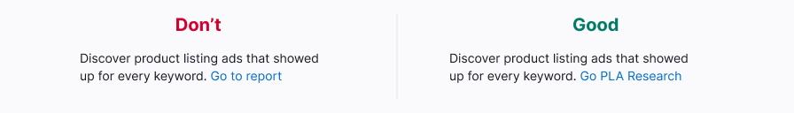
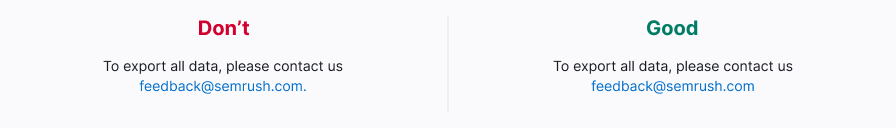
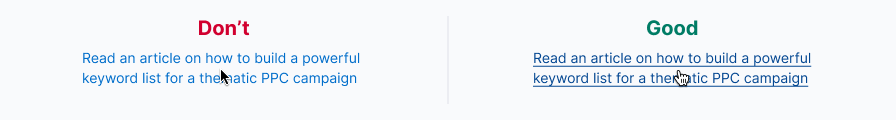

@import playground

@## Description

> 💡 Please note that we simplified the [Link](/components/link/link-changelog) component and moved Hint link and its description to [Typography](/style/typography/#afbfef/).

**Link** is a control that links to another web page or element. Links can be internal or external. It is the easiest control on the [visual loudness scale](/patterns/visual-loudness-scale) guide.

@## Appearance

### Link types

**Default link (standard link)** is an accent control that links to another web page. Often used to perform an action on the current page (when the button doesn't fit).

**Custom link** is a link the functionality and visual appearance of which may differ from the default one. _For example, these are clickable link-numbers that are not underlined by hover and may have a different color from our palette of base colors in accordance with the chart that they present._ When creating a custom link, use the rules for default links as basic rules. **Don't use too many custom links.**

@## Dimensions and indents

The icon is placed to the left of the test. The indent from the link text to the icon is 4px in all cases.

- The icon shall match the meaning of the action that will be performed when clicked.
- In some cases, if a click on a link with an icon causes a long download, the icon may turn into [Spin](/components/spin/) for the duration of the download.

| Size | Text size | Appearance                         | Icon size |
| ---- | --------- | ---------------------------------- | --------- |
| XL   | 16px      |  | XS        |
| L    | 14px      |    | XS        |
| M    | 12px      |    | XS        |

@## Interaction

### Default link

| State         | Appearance                                 | Description                                                                                                                                                                                                                              | Cursor    |
| ------------- | ------------------------------------------ | ---------------------------------------------------------------------------------------------------------------------------------------------------------------------------------------------------------------------------------------- | --------- |
| normal        |               | Text color `$denim-blue`, without underline.                                                                                                                                                                                             | `pointer` |
| active/hover  |           | The link color is 12% darker than `normal`. The absolute color is `#0063A5`. A solid underline appears. If the link is used together with the icon, then the icon will change color along with the text — they have the same hover area. | `pointer` |
| disabled      |    | The component transparency changes by 30%. Use this state as a last resort and be sure to add an explanatory tooltip to `disabled` link.                                                                                                 | `default` |
| visited       |      | Text in the `$violet` color. This state is an option.                                                                                                                                                                                    | `pointer` |
| visited hover |  | Text in the `$violet` color with an underlining. This state is an option as it is not suitable for all cases when the link is used in the interface.                                                                                     | `pointer` |

### Link invert

| State         | Appearance                                        | Description                                                                                                                                                                                                | Cursor    |
| ------------- | ------------------------------------------------- | ---------------------------------------------------------------------------------------------------------------------------------------------------------------------------------------------------------- | --------- |
| normal        |               | Text color `$neon-blue`, without underline.                                                                                                                                                                | `pointer` |
| active/hover  |          | Text color `#18b2f3` with underline. The link color is set to 12% darker. If the link is used together with the icon, then the icon will change color along with the text — they have the same hover area. | `pointer` |
| visited       |      | Text in the `$violet` color. This state is an option.                                                                                                                                                      | `pointer` |
| visited hover |  | Text in the `$violet` color with an underlining. This state is an option as it is not suitable for all cases when the link is used in the interface.                                                       | `pointer` |

@## Links on a dark/colored background

**Default link** can be used on a colored notification background.

A click on the link will send the user to another page:

@## Use in UX/UI

Don't use link styles for the text that doesn't lead to another page or perform an action. Do not mislead users.

@## Link name and click zone

If a click on a link should lead the user from the page — transition to another page, a modal window, then the name of the link should make it clearly indicate the page or modal window.

If an action should occur when clicking on a link (delete, update, display something), then the link name shall be an infinitive (What should be done?).

The name of the link should not be very short as it will be difficult to click on it. If the link is still very short, its click area shall be increased.

Always add quotation marks inside the link.

> 💡 If a sentence ends with an email, URL, or domain that is a link, then we do not put a dot at the end of the sentence. Users often copy the address and may accidentally copy the dot as well.

Also do not add punctuation marks to the link. The only exception is a link where the entire sentence is a link.

In the lists, it is recommended make the entire line a link as it contains less unnecessary information and it is easier to click on it.

If the link takes up two lines, the cursor should not change to `default` in the line spacing. To do this, use `display: block`.

@## Margins between icons

If you want to place links in one line, the distance between them must be a multiple of 4px:

- 12px — if there is very little space
- 20px — if there is enough space

@## Default link or Hint link?

> 💡 Please note that we simplified the [Link](/components/link/link-changelog) component and moved Hint link and its description to [Typography](/style/typography/#afbfef/).

| Action on the page                     | Default link                         | Hint link |
| -------------------------------------- | ------------------------------------ | --------- |
| Internal transition                    | Yes                                  | No        |
| External transition                    | Yes                                  | No        |
| Reloading the page                     | Yes                                  | No        |
| Updating data in a small block/widget  | Yes                                  | No        |
| Clickable email                        | Yes                                  | No        |
| Updating data in a table row           | Allowed if it is an important action | Yes       |
| Opening a modal window                 | Allowed if it is an important action | Yes       |
| Opening a dropdown                     | Allowed if it is an important action | Yes       |
| Opening of an accordion                | Allowed if it is an important action | Yes       |
| Opening the full text on the same page | No                                   | Yes       |
| Tooltip on click/hover                 | No                                   | Yes       |

@## Links in tables

- If there is very little space, we recommend using a link/link with an icon instead of buttons in the table. If there is enough space in the table, you can use [invisible buttons of muted or primary colors](/components/button/).
- Use 14px links in table rows. If the link is a URL with a link to an external page, then be sure to put the `LinkExternal` icon next to it, size `XS`, color `$stone`. It should always have a 4 px left intend.

@## External links

The use of external links shall reduced to minimum so as not to lead users away from our tools.

> 💡 External links always open in a new tab.

|                                                                                                                   | Transitions inside the report are also possible | There is a transition to an external resource | Appearance example                                                                                                    |
| ----------------------------------------------------------------------------------------------------------------- | ----------------------------------------------- | --------------------------------------------- | --------------------------------------------------------------------------------------------------------------------- |
| If the link is a URL that leads only inside the report.                                                           | ✅                                              | ❌                                            | In this case, you don't need to put `LinkExternal` icon next to the link. .  |
| If the link is a URL that leads entirely to an resource. However, there is no transition inside the report.       | ❌                                              | ✅                                            |                                                                              |
| If the link is an URL that leads inside the report, and has an icon next to it for going to an external resource. | ✅                                              | ✅                                            |                                                                              |

### Styles

- To indicate the transition to an external resource, use `LinkExternal`, size `XS`, color `var(--stone)`.
- It should always have a 4 px left intend.
- When hovering over the icon it shall darken by 8% (use the `interactive` property for the icon color) 😏
- Use the link styles if you need to select an icon for going to an external resource.

@page link-api
@page link-code
@page link-changelog
