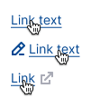
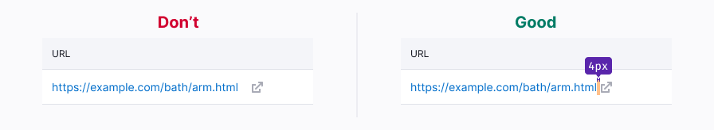

@import playground

@## Description

**Link** is a control that links to another web page or element. Links can be internal or external. It is one of the "quietest" control in the [visual loudness scale](/core-principles/visual-loudness-scale) guide.

@## Appearance

**Default link** is an accent control that links to another web page.

**Custom link** is a link the functionality and visual appearance of which may differ from the default one. _For example, these are clickable link-numbers that are not underlined by hover and may have a different color from our palette in accordance with the chart that they present._ When creating a custom link, use the rules for default links as basic rules. **Don't use too many custom links in your interface.**

@## Sizes and indents

You can add addons before and after the link text. Addons have 4px margin from the link text.

- The icon shall match the meaning of the action that will be performed after clicking the link.
- In some cases, if a click on a link with an icon causes a time consuming process, you can change the icon to [Spin](/components/spin/).

| Text size       | Appearance                       | Icon size |
| --------------- | -------------------------------- | --------- |
| 12-16px         |  | M         |
| 20px and larger |  | L         |

@## Interaction

### Default link

| State         | Appearance                                        | Description                                                                                                                                                                                                     | Cursor    |
| ------------- | ------------------------------------------------- | --------------------------------------------------------------------------------------------------------------------------------------------------------------------------------------------------------------- | --------- |
| normal        |                      | Link use `--text-link` token for color, without underline.                                                                                                                                                      | `pointer` |
| active/hover  |                  | Link changes its color to `--text-link-hover-active`. A solid underline appears. If the link is used together with the icon, then the icon will change its color with the text — they have the same hover zone. | `pointer` |
| disabled      |                   | The component changes its transparency from 100% to 30%. Use this state as a last resort and be sure to add tooltip with a message to the `disabled` link.                                                      | `default` |
| visited       |             | Link use `--text-link-visited` token for color. This state is an optional.                                                                                                                                      | `pointer` |
| visited hover |  | Link use `--text-link-visited` token for color with a solid underline. This state is optional.                                                                                                                  | `pointer` |

<!--
Hided this section because it's for the dark theme.

### Link invert

| State         | Appearance                                               | Description                                                                                                                                                                                   | Cursor    |
| ------------- | -------------------------------------------------------- | --------------------------------------------------------------------------------------------------------------------------------------------------------------------------------------------- | --------- |
| normal        |                      | Link has `--blue-200` color, without underline.                                                                                                                                               | `pointer` |
| active/hover  |                  | Link changes its color to `--blue-300`. A solid underline appears. If the link is used together with the icon, then the icon changes its color with the text — they have the same hover zone. | `pointer` |
| disabled      |                      | he component changes its transparency from 100% to 30%. Use this state as a last resort and be sure to add tooltip with a message to the `disabled` link.                                     | `pointer` |
| visited       |             | Link has `--purple-500` color. This state is an optional.                                                                                                                                     | `pointer` |
| visited hover |  | Link has `--purple-500` color with a solid underline. This state is optional.                                                                                                                 | `pointer` | -->

@## Links on a dark/colored background

**Default link** can be used on a colored notification background.

@## Use in UX/UI

Don't use link component for the text that doesn't lead to another page or perform an action. Do not mislead users.

@## Link text and click zone

> _Link sizes should be generous. Large link sizes make it easier for users with low coordination or on mobile devices to activate links. Link size consideration is most important for links that are not contained within blocks or paragraphs of text, such as call to action links. Links should be at least 44px wide and 22px tall._
>
> _Links should not be too large on mobile. Very large links that take up much of the viewport can be accidentally activated, such as when a user touches the screen to scroll up or down._
>
> [Yale University article about the accessible links](https://usability.yale.edu/web-accessibility/articles/links#other-design-considerations)

If clicking on a link takes the user away from the page or opens a modal window, then it should be clear from the name of the link what kind of page / modal window it will be. Use an infinitive ("What should be done?") for the link name.

The name of the link should not be very short as it will be difficult to click on it. If the link is still very short, increase its click area.

Always add quotation marks inside the link.

If the sentence ends with email, URL, domain, which is a link, then do not put a period at the end of the sentence - users often copy the address and may accidentally capture the period as well.

Do not add punctuation marks to the link text. The only exception is where the entire sentence is a link.

In lists, we recommend making the entire line a link - this way there is less noise and it is easier to click on it.

If the link spans two lines, the cursor should not change in the interline area to default. To do this, use `display: block`.

@## Margins between icons

If you want to place links in one line, the margin between them must be a multiple of 4px:

- 12px — if there is very little space
- 20px — if there is enough space

@## Default link or Hint link?

> You can find Hint link in the [Typography guide](/style/typography/#hints_hint_links).

| Action on the page                     | Default link                         | Hint link |
| -------------------------------------- | ------------------------------------ | --------- |
| Internal transition                    | ✅                                   | ❌        |
| External transition                    | ✅                                   | ❌        |
| Reloading the page                     | ✅                                   | ❌        |
| Updating data in a small block/widget  | ✅                                   | ❌        |
| Clickable email                        | ✅                                   | ❌        |
| Updating data in a table row           | Allowed if it is an important action | ✅        |
| Opening a modal window                 | Allowed if it is an important action | ✅        |
| Opening a dropdown                     | Allowed if it is an important action | ✅        |
| Opening of an accordion                | Allowed if it is an important action | ✅        |
| Opening the full text on the same page | ❌                                   | ✅        |
| Tooltip on click/hover                 | ❌                                   | ✅        |

@## Links in tables

- If there is very little space in the interface, you can use a link instead of button in the table. If there is enough space in the table, use [tertiary buttons](/components/button/).
- Use 14px links in table rows. If the link is an URL with a link to an external page, then be sure to put the `LinkExternal` icon with `M` size and `--icon-secondary-neutral` color next to it. It should always have `margin-left: var(--spacing-1x);`.

@## External links

> External links always open in a new tab.

|                                                                                                                   | Transitions inside the product are also possible | There is a transition to an external resource | Appearance example                                                                                                  |
| ----------------------------------------------------------------------------------------------------------------- | ------------------------------------------------ | --------------------------------------------- | ------------------------------------------------------------------------------------------------------------------- |
| If the link is an URL that leads inside the product.                                                              | ✅                                               | ❌                                            | In this case, you don't need to put `LinkExternal` icon next to the link.  |
| If the link is an URL that leads to an external resource. And there is no transition inside the product.          | ❌                                               | ✅                                            |                                                                            |
| If the link is an URL that leads inside the product, and has an icon next to it for opening an external resource. | ✅                                               | ✅                                            |                                                                            |

### Styles

- To indicate the transition to an external resource, use `LinkExternal` icon with `M` size and `--icon-secondary-neutral` token as color.
- Icon should always have `margin-left: var(--spacing-1x);`.
- When hovering over the icon it shall change color to `--icon-secondary-neutral-hover-active`.
- If for some reason you need to highlight the external resource icon, use link styles for it.

@page link-a11y
@page link-api
@page link-code
@page link-changelog
