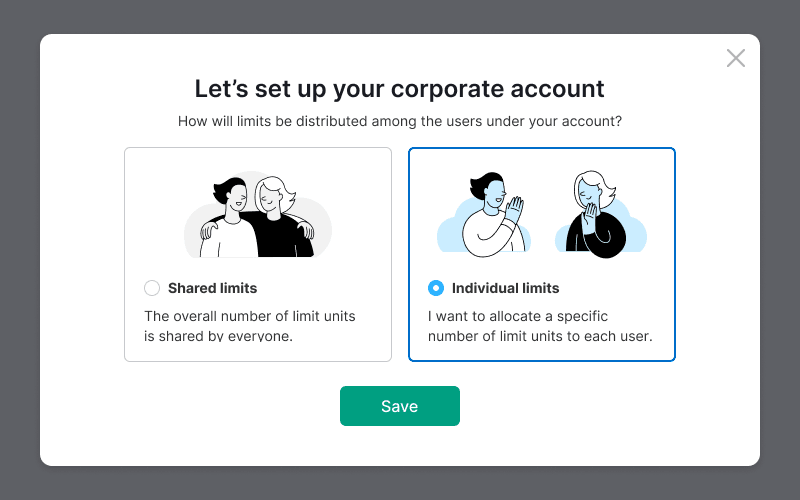
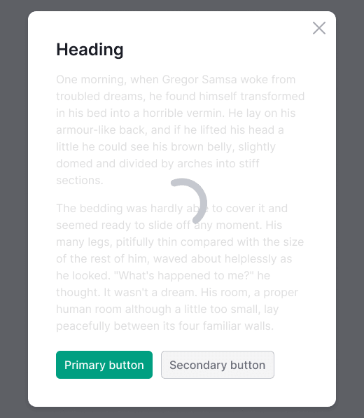
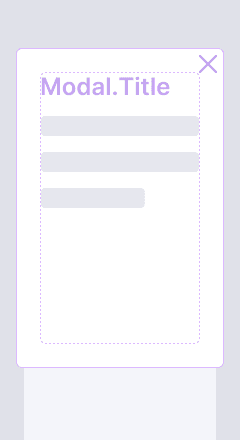
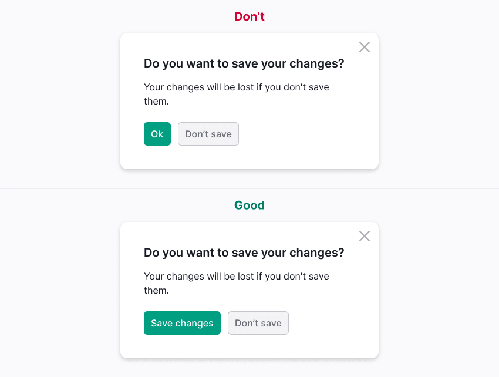

> For General recommendations on modal window content styles, see [Content in modal window](/patterns/modal-content/).

@## Description

**Modal window** is a component that appears on top of the page to show the important information or request a response from the user. It blocks all functions of the parent window. The modal window remains on the screen until the user performs the required action or closes the window.

> 🐈 A modal dialog is like my cat, Emma — who meows at 7am every morning to prompt me to feed her. I might be trying to sleep or get ready for the day, but my cat will place herself in front of me, then meow louder and incessantly until I look at her. I have to stop what I am doing to address the cat immediately if I ever hope to finish my task.
>
> Article at [NNGroup](https://www.nngroup.com/articles/modal-nonmodal-dialog/)

### Use the modal window

- To demonstrate secondary data that is not always required (especially if there are a lot of them). Their absence simplifies the interface. Moreover, they don't apply to other pages/reports. _For example, settings, small forms to fill out, step-by-step actions, detailed information about any data._
- To draw attention to a specific task. _For example, confirming an operation, adding data._
- To focus on critical information that requires the user's attention. _For example, local news, limiting, deleting an element, or losing information._
- To view enlarged images or videos.

### Don't use modal window

- To notify of an error.
- For content required for the user to complete the main task in the interface.

> 💡 If you want to hide a lot of information in the modal window, this component is not the best solution. Consider using [FullscreenModal](/components/fullscreen-modal/) or even a separate page.

Do not open windows without prior action by the user. **Limit modal windows are the exception in this case.**

> 💡 For general recommendations for content styles in modal windows see [Modal content styles](/patterns/modal-content/).

@## Component composition

The modal window consists of:

- container;
- content;
- closing icons (optional);
- overlay.

@## Types of modal windows

We have several modal window types:

- normal (one- and two-zone);
- gallery (slider);
- fullscreen (fullscreen [modal window 👑](/components/fullscreen-modal/), can also be one- or two-zone).

@## Basic styles for modal windows

### Container

| Styles                                              | Example                                 |
| --------------------------------------------------- | --------------------------------------- |
| `border-radius: 6px; padding: 24px 32px 32px 32px;` |  |

### Close button (optional)

| Styles                                                                                     | Example                                                       |
| ------------------------------------------------------------------------------------------ | ------------------------------------------------------------- |
| CloseS icon, color `$stone`. [Hover is 12% darker](http://i.semrush.com/style/variables/). |            |
| Indent from top and right to the `Close` icon is 12px.                                     |                 |
| The cross clickable area is 40px \* 40px.                                                  |  |

### Overlay

| Styles                                                                                                    | Example                                     |
| --------------------------------------------------------------------------------------------------------- | ------------------------------------------- |
| `opacity: 0.6; background: #000;`                                                                         |   |
| Overlay style when opening a modal window inside another modal window – `opacity: 0.4; background: #000;` |  |

> 💡 Use a modal window inside another modal window (Xzibit triggers 😁) only when necessary – if nothing at all fits. Look through an [amazing Manifesto](https://modalzmodalzmodalz.com/) against the ubiquitous use of modal windows. Meditate.

@## Window size

The modal window must be at least 320px for the desktop version.

You can also set the maximum width for the window. This width is optional and depends on the task, it is determined by the designer. The maximum window width can be used to avoid stretching the content and making it harder to read data.

@## Interaction

### Opening a window

> 💡 **Important**. When you open the window, `keyboard focus` should automatically go to the content of the modal window.

If the modal window contains input fields, the focus must go to the first field.

### Opening a window in a window

When opening a modal window in another modal window, never close the modal windows below. This confuses navigation and makes you feel that you can't go back to the previous window.

### Closing the window

You can close the modal window by:

- clicking on `Close` button;
- clicking on `CTA` or `Cancel` button;
- clicking outside the container area;
- `ESC` button;
- click `Back` in the browser (nothing changes on the parent page).

> 💡 When the modal window is closed, the focus should return to the trigger.

**If the weight of the error of the accidental closing of the window is too high, then warn the user about the loss of information.**

For example, data entered or changed without AutoSave in:

- in the project settings pag;
- in the form (payment, subscription, profile editing, etc.).

> 💡 **Important**. It is recommended to save the information entered by the user when closing and re-opening the modal window.
>
> If this cannot be done, do not allow the user to close the modal window by clicking outside the window area.

### Loading

When loading or reloading content inside the modal window, [Spin](/components/spin/) appears on top of the content.

- The size of the spinner inside the modal window is `XXL` (72px).
- The spinner must be centered relative to the closed content.
- The spinner text is optional.

@## Positioning

The modal window is centered vertically and horizontally relative to the browser window.

If the modal window requires a large size for the content, then it is positioned with 40px margins on all sides.

If the modal window changes the size when the user interacts with it, it is recommended to nail it to the upper border with a margin of 40px.

@## Changing the browser size

### Vertically

- When the screen height increases, the modal window is not scaled, but centered.
- When reducing the height of the screen, the window continues to be centered as long as it fits the visible area. After reaching the minimum indents from the upper and lower edges of the browser, the window "goes" beyond the lower border. Scroll appears.

### Horizontally

Now, when the browser width is reduced to 320px, the modal window is proportionally reduced, keeping the indents as a percentage. At the same time, the window occupies a larger area of the viewport, proportionally shrinking to the size of the device screen.

See [examples](/components/modal/modal-code/) of resizing a modal window to fit the screen.

> 💡 It is recommended to avoid using modal windows on mobile devices. However, if you use modal windows on mobile devices, leave a link to the parent page. If scrolling in modal window appears due to the amount of content, then it is recommend placing the window close button both at the top and at the end of such window, or fixing it in the header when scrolling.
>
> [10 guidelines to consider when using overlays/modals](http://www.uxforthemasses.com/overlays/)

@## Scroll

When the modal window height does not fit the browser window, it shall be positioned with a 40px indent from the upper border.

> 💡 The content under the overlay should not be scrolled.

### Content scroll in the window

Individual elements inside the window can be scrolled. For example, tables. The scroll is described in [ScrollArea](/components/scroll-area/).

### Fixed areas when scrolling

If necessary, you can freeze the area inside the modal window. For example, buttons inside a window with a large amount of content that needs to be scrolled.

@## Window title

If the modal window is used to cause a specific action by the user, make a brief and clear title of the window. **No more than 3-4 words**.

If the modal window is used for confirmation, the title shall contain a question, and the action buttons shall clearly answer this question.

@## Buttons

Centering the buttons shall be the same as the centering of the title.

It is not recommended to use more than two main buttons inside the modal window.

**Avoid calling the main button `Ok`**. The user will need more time to understand what they need to do if there are no clear designation of buttons and their functions.

@page modal-a11y
@page modal-api
@page modal-code
@page modal-changelog
