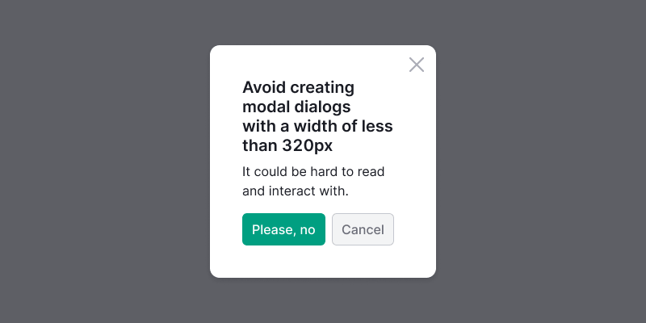
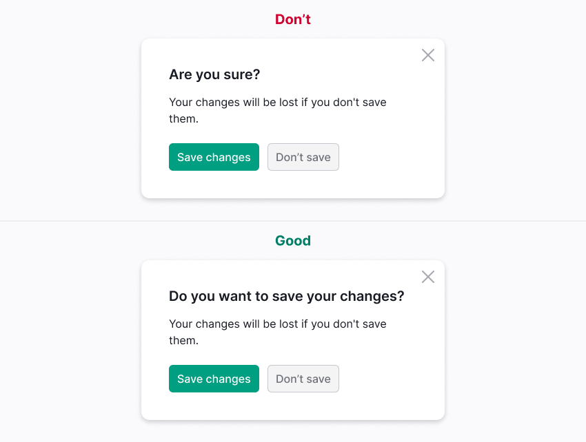

::: tip
For general recommendations on modal content styles, refer to [Content in modal window](/patterns/modal-content/modal-content).
:::

## Description

**Modal** is a dialog that appears on top of the page, and shows an important information or request a response from the user.

It always disables user interaction with the main page content but keeps it visible. The modal dialog remains on the screen until the user performs the required action or closes the dialog.

::: info
_🐈 A modal dialog is like my cat, Emma – who meows at 7am every morning to prompt me to feed <!-- vale DevDocs.Gender = NO -->her<!-- vale DevDocs.Gender = NO -->. I might be trying to sleep or get ready for the day, but my cat will place herself in front of me, then meow louder and incessantly until I look at <!-- vale DevDocs.Gender = NO -->her<!-- vale DevDocs.Gender = NO -->. I have to stop what I am doing to address the cat immediately if I ever hope to finish my task._

Article at [NNGroup](https://www.nngroup.com/articles/modal-nonmodal-dialog/)
:::

### Usage recommendations

**Use modal:**

- To show secondary data. _For example, settings, small forms to fill out, step-by-step actions, detailed information about any data._
- To draw attention to a specific request or task. _For example, confirming an operation, adding data._
- To focus on critical information that requires the user's attention. _For example, local news, limiting, deleting an element, or losing information._
- To view enlarged image or video.

**Don't use modal:**

- To notify of an error in the interface or system.
- To show content that is required for the user to complete the main task in the interface.

::: tip
If you want to display a lot of information in a modal, this component may not be the best solution. Consider using [FullscreenModal](/components/fullscreen-modal/fullscreen-modal) or even a separate page.
:::

Don't show modals before the user has interacted with the interface, **except for showing information about limits.**

## Component composition

The Modal of the following:

- `Modal.Window`.
- `Modal.Title`.
- Content.
- `Modal.Close`.
- `Modal.Overlay`.

## Modal types

We have several modal dialog types in the design system:

- default (it can be one- and two-zoned);
- [Carousel](/components/carousel/carousel);
- [FullscreenModal](/components/fullscreen-modal/fullscreen-modal), can also be one- or two-zoned.

## Modal width

The modal must have `min-width` of 320px for the desktop version.

## Interaction

### Opening modal

When user opens the modal, keyboard focus should automatically go to the content of the modal. If the modal contains a form, the focus must go to the first input or interactive element.

### Opening modal over another modal

::: tip
Display a modal over another modal only if no other solution fits your case. Refer to the [amazing Manifesto](https://modalzmodalzmodalz.com/) against the ubiquitous use of modal dialogs.
:::

When opening a second modal on top of another modal:

- It's important not to close the parent modal. Doing so can confuse users and create a sense that they can't navigate back to the previous modal.
- Add an additional `--overlay-secondary` overlay covering the parent modal to make the modals hierarchy clear.

Table: Overlay styles for Modal

| Tokens                                                                                                       | Appearance example            |
| ------------------------------------------------------------------------------------------------------------ | ----------------------------- |
| Default overlay background color is `--overlay-primary`.                                                     |  |
| Second overlay appears when opening a modal on top of another modal, using `--overlay-secondary` background. |   |

### Closing modal

User closes the modal by using the following options:

- **Close** button;
- CTA or **Cancel** button;
- `Esc` key;
- **Back** button in the browser (nothing changes on the parent page in this case);
- clicking outside the modal (clicking on the overlay).

::: tip
After the modal is closed, the focus should always return to the trigger.
:::

If the potential consequences of accidentally closing the modal are significant, alert the user about the potential loss of information.

It's recommended to save the information entered by the user when closing and reopening the modal. If it isn’t possible to do so, inform users that their entered data will be lost upon closing the modal.

### Loading

When loading or reloading content in the modal, display the [SpinContainer](/components/spin-container/spin-container) component over the content.

Spin styles for this scenario:

- Use the largest size for the spinner: `XXL`.
- Center the spinner in relation to the content.
- Optionally, add text to the spinner.

## Positioning

The modal is centered vertically and horizontally by default relative to the browser window.

If the content of the modal requires a large size, the modal is positioned with 40px margins on all sides.

If the size of the modal changes when the user interacts with it, it is recommended to anchor it to the top border with a 40px margin.

## Changing browser size

### Vertically

- When the height of the screen increases, the modal remains unscaled and stays centered.
- When reducing the screen height, the modal continues to be centered as long as it fits in the visible area. Once it reaches the minimum distance from the upper and lower edges of the browser, the modal extends beyond the lower border, and scrolling becomes necessary.

### Horizontally

Currently, when the browser width is reduced to 320px, the Modal width is proportionally scaled down while maintaining the margins to the 12px. Simultaneously, the modal occupies a larger portion of the viewport, shrinking proportionally to match the size of the device screen.

Refer to the [examples](/components/modal/modal-code) to see how the Modal changes to fit the screen.

::: tip
Avoid using modal dialogs on mobile devices. However, if you use modals on mobile devices, display a link to the parent page. If the modal requires scrolling due to the amount of content, then place the **Close** button both at the top and at the buttom of the modal, or fix it with the header when scrolling.

[10 guidelines to consider when using overlays/modals](http://www.uxforthemasses.com/overlays/)
:::

## Scrolling modal

If the height of the modal exceeds the height of the browser window, it should be positioned with a 40px margin from the top border.

**The content underneath the overlay shouldn't be scrollable.**

### Scrolling content in modal

Individual elements inside the modal, such as tables, can be scrolled. The scrolling functionality is described in [ScrollArea](/components/scroll-area/scroll-area).

### Fixed areas during scrolling

If necessary, certain areas of the modal, such as action buttons, can be fixed on the screen.

## Modal title

When the modal is intended to prompt a specific user action, provide a concise and clear title for the modal, preferably consisting of no more than 3-4 words.

If the modal is used for confirmation, the title should pose a question, and the action buttons should clearly answer that question.

## Button usage in modal

The alignment of the buttons should be consistent with the title.

It is advisable to limit the usage of main buttons within the modal to a maximum of two.

**Avoid labeling the main button with generic words such as "OK" or "Yes".** Users may require additional time to comprehend the required action if the buttons and their functions are not clearly designated.

