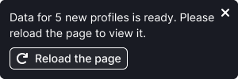
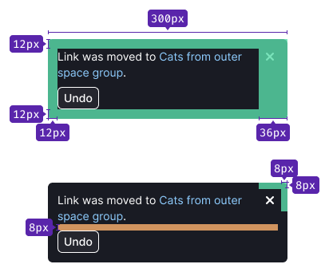
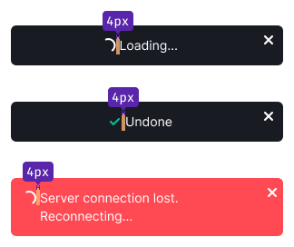

## Description

**NoticeBubble (Alert)** is a notification component that informs users about completed actions, the beginning or ending of a process.

Let's compare NoticeBubble with [Notice](/components/notice/notice) and [NoticeGlobal](/components/notice-global/notice-global) based on the following criteria:

Table: Comparison table of criteria for Notice, NoticeBubble and NoticeGlobal

| Criteria         | Notice | NoticeBubble | NoticeGlobal |
| ---------------- | ------ | ------------ | ------------ |
| Refers to the entire website      | ❌     | ✅ ❌        | ✅           |
| **Global**: Refers to pages, blocks, or large components rather than specific elements | ✅     | ✅ ❌        | ✅           |
| **Important**: Missing the notice may result in missed opportunities or loss of data | ✅     | ❌           | ✅           |
| **Temporary**: Appears and disappears under certain conditions, not a default block element         | ✅     | ✅           | ✅           |

**This component includes:**

- Text (we recommend keeping the message within 2 lines, maximum – 4 lines).
- An optional `Close` icon to dismiss the alert (use the `Close` icon with M size).
- An optional single button or two buttons.

**It cannot contain:**

- Images (holiday alerts are an exception).
- More than two buttons.

### When to use NoticeBubble

- To notify about the beginning or completion of a process that remains hidden from the user.
- For indicating changes to content in other parts of the report that are not currently being viewed._For example, starting or completing a campaign collection, or saving an event in drafts (where the changes are not visible to the user at the moment, as the event card remains unchanged on the screen), and more._
- To notify about an action that causes changes to the content on the page. _For example, using the "Undo" button to delete an item._
- To notify about moving an item and removing it from its current position to other reports, lists, or tables (also applicable to content changes).

### When to avoid using NoticeBubble

- Avoid using it to display a loading process with a [Spin](/components/spin/spin) or [ProgressBar](/components/progress-bar/progress-bar), except in the case of a no-network condition.
- Avoid using it for visible instant interface changes, such as adding a tag to an item (where the tag appears instantly) or adding an item to favorites (resulting in an immediate change to the icon color).

## Types

Table: NoticeBubble types

| Type     | Description | Appearance example |
| -------- | ----------- | ------------------ |
| **Info** | This type is used to inform the user about the beginning or completion of a process that remains hidden from the user in the interface. |  |
| **Warning** | This type is used to alert users when a connection is lost. |  |

### Use cases for NoticeBubble types

Table: Use cases for NoticeBubble types

| Use case | Description | Appearance example |
| -------- | ----------- | ------------------ |
| **Basic** | This type of notification is used to inform the user about the beginning or completion of a process that remains hidden from the user in the interface. It can also be used to notify about changes to content in other parts of the report that are not currently being viewed. |  |
| **Undo action** | This notification is used for completed actions with an option to cancel them. It is ideal for scenarios involving moving or deleting items. Use the button with `use="secondary"`, `theme="invert"`, and with M size for this purpose. |  |
| **Reload action** | The button name may change based on the context. | |
| **Loading state** | If the undo process takes time, display an intermediate loading state where the user cannot take any action. Use [Spin](/components/spin/spin) with size XS. However, refrain from using this state to display any other processes in the interface; instead, opt for the [ProgressBar](/components/progress-bar/progress-bar) in such cases. |  |
| **Completion state** | Upon successful completion, show a notification that confirms the undo action (use an icon with M size). The height of the notification should be the same as the previous state. Refer to the animation description below for recommendations on animation and timing. |  |
| **Success** | This type of notification is suitable for conveying the success of user actions within the interface. It includes an additional colored icon to quickly convey the response of the interface to the user's actions without relying on reading the text. |  |
| **Failure** | This type of notification is suitable for conveying the failure of user actions within the interface. |  |
| **No connection** | For systems capable of monitoring the network connection on their own, use a notice without a button. |  |
| **No connection with action** | For interfaces unable to monitor the network connection and requiring a page refresh, utilize a notice with the "Reload the page" button. |  |
| **Special event notification** | This notification is specifically designed for various events, holidays, and similar occasions. You can animate elements inside this notification to add visual appeal and engagement. |  |

## Styles

- The notice appears in the upper-right corner of the report, below the main website menu, with 12px margins at the top and right.
- When scrolling, it remains fixed in the upper-right corner with the same 12px margins.

- The alert has a fixed width of 300px.
- Container has paddings `12px 28px 12px 12px`.
- There is an 8px margin between the button and the text.
- If there is a spinner preceding the text, then the margin between the spinner and the text is 4px (use [Spin](/components/spin/spin) with XS size).
- In the loading and success states, the margin between the spinner/icon and the text is also 4px.
- For the loading state, use [Spin](/components/spin/spin) with XS size.
- For the success state, use an icon with M size.

## Animation

The notification slides in from the right edge of the viewport and closes with a `fade` effect.

## Usage in UX/UI

::: tip
Minimize the number of notifications to prevent banner blindness and irritation among users.
:::

### Appearance duration and closing

- Users can close the notice by clicking on the **Close** button in the upper-right corner.
- If there are *no* interactive elements in the notice beside the **Close** button, hide the notice automatically after 4–10 seconds, depending on the amount of text inside.
- If there are interactive elements in the notice beside the **Close** button, don't hide the notice until it becomes irrelevant, or the user closes it or interacts with one of its interactive elements.
- If the notice is closed automatically by a timer, hovering the mouse over it (`onMouseEnter`) will reset the timer, and the countdown will start again after moving the mouse away from the notice.

### Several notices at a time

::: tip
You can show several notices at a time if necessary, but use this option thoughtfully.
:::

- It is recommended to display only one notification at a time for two primary reasons. Firstly, having multiple messages can hide valuable screen workspace, and secondly, they may scatter user's focus of attention. If multiple messages are shown simultaneously, it's likely they won't be read.
- If several actions are performed simultaneously by the system, they overlap each other in the same way as user actions, so only the last message will be visible.

### "Undo" notice

- The "Undo" button allows users to cancel a completed action. Upon clicking it, an "Undone" message will briefly appear in the notification. This state remains active for 2 seconds.
- If the undoing process takes time, display an intermediate state with a spinner (within the same notice) and the corresponding text. Once the process is successfully completed, confirm it with the "Undone" message. Don't show the "Undone" message if the user closed the notice while it was in the loading state.

### "Lost connection" notice

- This type of notification appears as soon as the network connection is lost. It is commonly used in products that allow users to continue working with content even without network access.
- This notification acts as a separate alert and has the highest priority. Therefore, when it appears, all other user and system notifications appear below it. Each subsequent notification will overlap the previous one.
- The notice automatically closes when the connection is restored.
- There are two options for this notice type:
    1. For interfaces that can monitor the network connection themselves, use a notification without a button.
    2. For interfaces that cannot monitor the network connection themselves and require a page refresh, use an alert notification with the "Reload the page" button.

