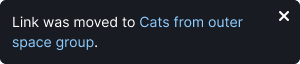
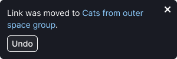
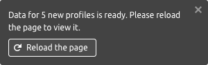
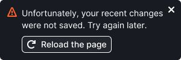
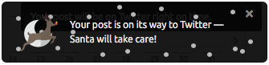
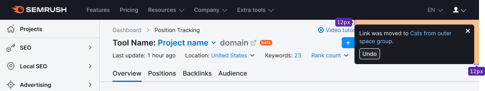
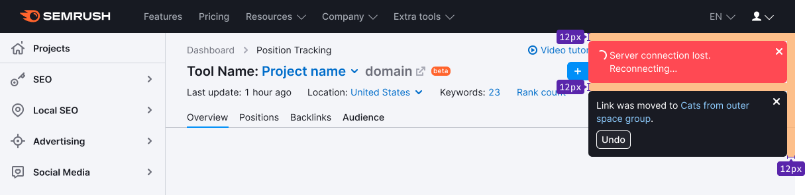
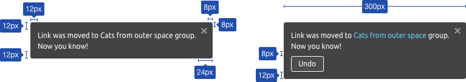
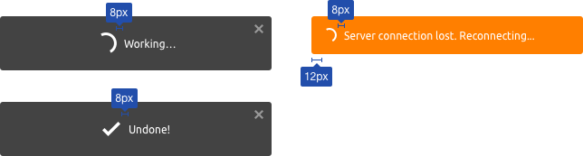

@## Description

**NoticeBubble (Alert)** is a notification on completed action, beginning or ending of a process.

Let's see the differencies with [Notice](/components/notice/).

| Criteria                                                                                             | Notice | NoticeBubble |
| ---------------------------------------------------------------------------------------------------- | ------ | ------------ |
| **Global**. Refers to pages/blocks/large components, not specific elements.                          | ✅     | ✅ ❌        |
| **Important**. If the users do not read the notice, they will miss an opportunity or lose something. | ✅     | ❌           |
| **Temporary**. Not a default block element. Appears and disappears under certain conditions.         | ✅     | ✅           |

@## Possible cases

- Notification of the beginning or completion of a process that is hidden from the user.
- Changes to content in other parts of the report that are not currently being viewed. _For example, starting a campaign collection, completing a campaign collection, or saving an event in drafts (this is a list that is invisible to the user. This means that a part of the content was changed, but not in front of the user's eyes when it remains unchanged on the open event card), etc._
- Notification about an action which causes changes to the content on the page. _For example, deleting an item using `Undo` button._
- Notification about moving an item and removing it from its current position to other reports, lists, and tables (also applies to content changes).

@## Prohibited cases

- Displaying a process with spinner or progress bar. The exception is the no-network condition. If you need to display the process, use the [progress bar](/components/progress-bar/).
- If there are any visible instant interface changes. _For example, adding a tag to an item — the tag appears, adding an item to favorites — changing the icon color, adding an item to a table/list._

@## Component composition

- Text (we recommend placing the message in 2 lines, maximum — 4 lines).
- Icon that closes the alert (optional, use the `CloseXS` icon).
- Button or two buttons (optional).

### It can't contain

- Text formatting
- Images (holiday alerts are the exception)
- More than two buttons
- More than four text lines

@## Types

### Text message

Notification about the beginning or ending of a process hidden from the user in the interface. Or changes to content in other parts of the report that are not currently being viewed.

### Cancel action

Notification about a completed action with the possibility to cancel it. Good for use when moving/deleting items. Use the `secondary invert` button with size M.

The button name may change depending on the context.

If the `Undo` process takes time, then display an intermediate loading state when nothing can be done by the user. Use [Spin](/components/spin/) with size M (24 x 24px). Don't use this state to display any other processes in the interface. Instead, use the [progress bar](/components/progress-bar/).

If everything is done , show notification that confirms the `Undo` action (use M size icon). The notification height is equal to the previous state. For recommendations on animation and timing, see the animation description below.

### Notification of success/failure

Use this notification types for successful/unsuccessful user actions with products.

They have an additional colored icon. It's helpful for quickly understanding, without reading the text, how the interface responded to user's actions.

### No connection

Notice without a button for those systems which monitor the network connection themselves.

For those interfaces which can't monitor the network connection themselves and need to refresh the page, there is a notice with the **Reload the page button**.

### Holiday notification

A notification that is designed for various events, holidays, etc. It is possible to animate elements inside such notification.

@## Sizes, margins and paddings

- It appears in the upper-right corner of the report under the main site menu with 12px margins on the top and right.
- When scrolling, it remains hanging in the upper-right corner with the same margins.

- The alert has fixed width — `300px`.
- Container paddings — `12px 24px 12px 12px`.
- Margin between the button and the text is 8px.
- If there is a spinner in front of the text, then the margin between the spinner and the text is 8px (in this case the XS spinner 16px \* 16px).
- In the `loading` and `success` states, the margin between the spinner/icon and the text is 8px.
- For the `loading` state use size M spinner (24 x 24px).
- For the `success` state use the M icon (22 x 22px).

@## Animation

- The notification slides from the right edge to the left and closes via `fade`.
- The alert closes on a timer after 5 seconds. The delay value can be changed depending on the amount of text in the alert.
- Optionally, some notifications can be left until the user closes them.

@## Use in UX/UI

### General

- Minimize the number of notifications, since frequent alerts lead to "bubble blindness" and irritates users.
- A click on the cross icon in the upper-right corner hides the notification.
- If the notification is closed by a timer, the timer is reset by `onMouseEnter`. `OnMouseLeave` again starts counting down to the closing.
- The `Undo` button cancels the completed action. To confirm this, a message with the text **Undone!** appears in the notification. This state is active for 2 seconds.
- If the `Undone` process takes time, display the intermediate state with the spinner (in the same notice) and the corresponding text, and then confirm the success with the message **Undone!**. When the `Working` state is closed, the `Undone` notice shall be considered closed as well. In other words, it will not appear additionally.

### Several notices at a time

- We recommend you to show one notification at a time, firstly, because extra messages hides the useful screen workspace. Secondly, they confuse the focus of attention. If multiple messages are displayed at the same time, it is likely that they will not be read.
- If several actions are performed simultaneously by the system, they overlap each other in the same way as the user's actions, so in fact we will only see the last message.

> Note that you can show several notices at a time if necessary. Use this option thoughtfully.

### Notice about lost connection

- This notice type appears as soon as the network connection losts. It's used in tools with the ability to continue working with content with no network access.
- This type of notification is triggered as a separate dedicated alert channel. It has the priority. That is, when it appears, all other user and system notifications appear below it (in the second channel). Each subsequent notification overlaps the previous one.
- It closes automatically when the connection is restored. It cannot be closed by the user.
- There can be two options: for the interfaces that can monitor the network connection themselves use a notification without a button; for the interfaces that can't monitor the network connection themselves and require page refresh use an alert notification with the **Reload the page** button.

@page notice-bubble-api
@page notice-bubble-example
@page notice-bubble-changelog
