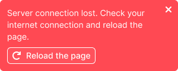

@## Description

**NoticeBubble (Alert)** is one of the types of notifications on completed action, beginning or end of a process.

@## Possible cases

- Notification of the beginning or completion of a process that is hidden from the user.
- Changes to content in other parts of the report that are not currently being viewed. _For example, starting a campaign collection, completing a campaign collection, or saving an event in drafts (this is a list that is invisible to the user. This means that a part of the content was changed, but not in front of the user's eyes when it remains unchanged on the open event card), etc._
- Notification about an action which causes changes to the content on the page. _For example, deleting an item using `Undo` button._
- Notification about moving an item and removing it from its current position to other reports, lists, and tables (also applies to content changes).

@## Prohibited cases

- Displaying execution of a process using spinners or a progress bar. The exception is the no-network condition. If you need to display the process, use the [progress bar](/components/progress-bar/).
- If there are any visible instant interface changes. For example, adding a tag to an item — the tag appears, adding an item to favorites — changing the icon color, adding an item to a table/list.

@## Component consists of

- Text (we recommend placing the message in 2 lines, maximum — 4 lines).
- Icon that closes the alert (using the `CloseXS` icon).
- Button (optional, in some cases there may be two buttons).

### It can't contain

- text formatting
- images (holiday alerts are the exception)
- more than two buttons
- more than four text lines

@## Types

### Text message

Notification of the beginning or end of a process hidden from the user in the interface. Or changes to content in other parts of the report that are not currently being viewed.

### Cancel action

Notification of a completed action with the possibility to cancel it. Good for use when moving/deleting items. The size M `secondary invert` button is used.

The button name may change depending on the context.

If the `Undo` process takes time, then we display an intermediate loading state when nothing can be done by the user. [Size M spin (24 x 24px)](/components/spin/) is used. Do not use this state to display the execution of any other processes. Instead, use the [progress bar](/components/progress-bar/).

Notification confirming the `Undo` action. The notification height is equal to the previous state. M-sized icon is used. For recommendations on animation and timing, see the animation description below.

### Notification of success / failure

Notification of actions when working with tools.

They can be successful or unsuccessful. They have an additional visual marking in the form of a colored icon. This is necessary so that the user can quickly understand, without reading the text, how the interface responds to their actions.

### No connection

Notice without a button for those who monitor the network connection themselves.

For those who can't monitor and need to refresh the page, there is a notice with the **Reload the page button**.

### Holiday notification

A notification that is designed for various events, holidays, etc. It is possible to animate elements inside such notification.

@## Dimensions and indents

- It appears in the upper-right corner of the report under the main site menu with 12px margins on the top and right.
- When scrolling, it remains hanging in the upper-right corner with the same margins.

- The alert width is fixed — 300px.
- Container paddings — 12px 24px 12px 12px.
- If there is a button after the text, the distance from the text to the button shall be 8px.
- If there is a spinner in front of the text, then the distance from the text to the spinner is 8px (in this case the XS spinner 16 x 16px).
- In the `loading` and `success` states, the distance between the spinner/icon and the text is 8px.
- In the `loading` state, size M spinner (24 x 24px) is used.
- The `success` state uses the M icon (22 x 22px).

@## Animation

- The notification slides from the right edge to the left and closes via `fade`.
- The alert closes on a timer after 5 seconds. The delay value can be changed depending on the amount of text in the alert.
- Optionally, some notifications can be left until the user closes them.

@## Use in UX/UI

### General

- Minimize the number of notifications, since frequent alerts lead to "bubble blindness" and irritates users.
- Appears in the upper-right corner of the report under the main site menu. When scrolling, it remains in the upper-right corner with the 12px indents.
- Only one notification can appear at a time. If several actions are performed in a row that trigger notifications, each subsequent notification shall close the previous one (see the Animation section above). It was decided to display one notification at a time because, firstly, extra messages 'clog' the workspace. Secondly, they confuse the focus of attention. If multiple messages are displayed at the same time, it is likely that they will not be read.
- A click on the cross icon in the upper-right corner hides the notification.
- If the notification is closed by a timer, the timer is reset by `onMouseEnter`. `OnMouseLeave` again starts counting down to the closing.
- The Undo button cancels the completed action. To confirm this, a message with the text **Undone!** in the notification appears. This state is active for 2 seconds.
- If the `Undone` process takes time, then we display the intermediate state with the Working spinner (in the same bubble) and the corresponding text, and then let's consolidate the success with the message **Undone!**. When the `Working` bubble is closed, the `Undone` bubble shall be considered closed as well. In other words, it will not appear additionally.
- If several actions are performed simultaneously by the system, they overlap each other in the same way as the user's actions, so in fact we will only see the last message.

### Notice that there is no connection

- Appears as soon as the network connection fails. It is used in tools with the ability to continue working with content with no network access.
- This type of notification is triggered as a separate dedicated alert channel. It takes priority. That is, when it appears, all other user and system notifications appear below it (in the second channel). The principle of their operation corresponds to the description above: each subsequent notification overlaps the previous one.
- It closes automatically when the connection is restored. It cannot be closed by the user.
- There can be two options: for commands that can monitor the network connection themselves — a notification without a button; for commands that can't monitor and require page refresh — an alert with the **Reload the page** button.
- It was decided to display this notification at the same time as the usual black notification, because the user should see the interface's response to their actions.

@page notice-bubble-api
@page notice-bubble-example
@page notice-bubble-changelog
