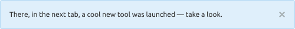
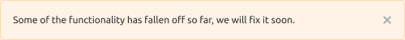
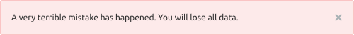
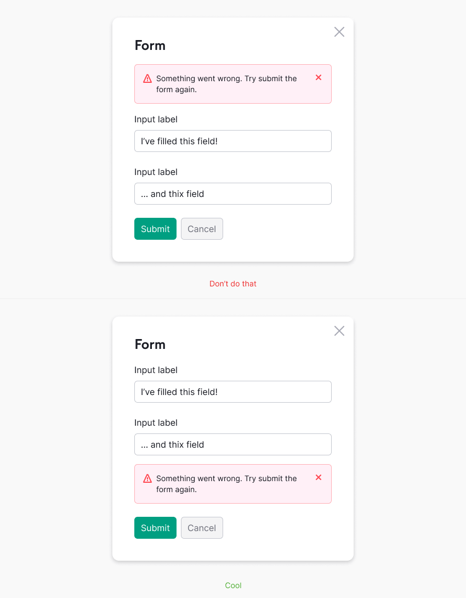

@import playground

@## Description

**Notice-Global** is a component for messages about events related to the user's work in the products and on the
website.

The notice shall meet three criteria. If it doesn't respond to at least one, it's not a notice. Let's see the differencies with [NoticeBubble](/components/notice-bubble/).

| Criteria                                                                                             | Notice | NoticeBubble |
| ---------------------------------------------------------------------------------------------------- | ------ | ------------ |
| **Global**. Refers to pages/blocks/large components, not specific elements.                          | ✅     | ✅ ❌        |
| **Important**. If the users do not read the notice, they will miss an opportunity or lose something. | ✅     | ❌           |
| **Temporary**. Not a default block element. Appears and disappears under certain conditions.         | ✅     | ✅           |

**The notice message can be:**

- It's a message that relates to the work on the whole website.

**Use global notice to tell about:**

- a special mode of viewing a page, tool, site (about admin or other rights on the page);
- an outdated browser version;
- messages relates to the work of the whole site (downgrade, technical work, etc.).

> 💡 Global notice has different from the contextual notice styles and placement.

### Global notice

@## Dimensions and indents

**Paddings**

**Margins**

@## Notice themes

### Contextual notice

#### Info

Neutral message, information, collecting feedback. To announce a new feature or other tool, use this notice with a large image (we usually call these [advertising notices](/components/notice/#a47391)).

#### Success

- Any trigger for buying/taking a trial.
- Success status (successful completion of the form, for example).

#### Warning

Important but not critical errors/warnings: service report, unavailable functionality, temporary failure.

#### Danger

A serious error/problem/action that does not allow the user to continue working or leads to data loss.

@## Interaction

### Contextual notice

#### Appearance

When global notice appears, it moves the entire page down.

#### Lifespan

Since the notice is a temporary notification, it should have a preset "lifespan".

The "lifespan" can be set by the following rules:

- number of days (for example, during the experiment);
- number of user sessions;
- event (completion of works, correcting bugs, moving features out of the beta);
- user action as a trigger (installed something, looked at it, fixed an error).

#### Hiding

When you hide the notice, the entire page pulls up to the height of the closed component.

- Clicking on the close icon.
- Clicking on the link that causes the re-opening condition. _For example, **Ask me later**, **Never show again**, etc._
- If there is no close icon or hide link, the user can't hide such notice. It will be hidden according to the conditions set by the service (after a certain time, certain number of sessions, after clicking on the trigger, etc.).

#### Animation

By clicking on the closing icon/closing link, the notice shall close smoothly with `fade-out of 250ms`. The page content is pulled to the notice place within 250ms.

@## Placement in the interface

### Global notice

- Place this notice always above the main Semrush header.
- Stretch it to the full width of the screen.

### Warning and error notice

Show notice with an error message in the form as near as possibble to the place where user made an interaction. For example if there is an error occured after user submitted the form, then show notice directly above the buttons.

@## Custom notice

These are the notices that "live" by their own rules and their styles differ from regular notices.

### Global notice

The default color of this notice is `--gray-400`.

If necessary, you can give it a different color. For example, `--violet-400`, `--blue-400` or other from [our palette](/style/palette/).

### Global notice with illustration

In special cases, you can add a thematic illustration to the global message. _For example, if technical work is expected on holidays, etc._

Keep in mind, however, that the extra accent notice on the page adds visual noise. Therefore, do not abuse the opportunity to add an illustration to this kind of message.

@## Edge cases

### Two notices per page

Don't show more than one global message at a time. Below you can see an example of how you SHOULD NOT do.

In cases where a user on the site has two or more global messages to display, prioritize them.

- Higher priority for messages that require a response from the user or contain controls to close or exit a special mode.
- Messages without controls inside have lower priority. Show them after a user has interacted with a higher priority message.

@## Use in UX/UI

### General

- You can notify about the following events: tools and reports announcement, collecting feedback, quick help for additional features, system status (error, failure, end of works, new feature).
- In some cases, notices with the same text may have different colors because they may have a different meaning.
- In regular cases, one notice is replaced by another in order of priority: red > yellow > green > blue > gray. If you need to place notices in a row, think it over with the UX team. There may be another way to deliver your important message.
- Be concise – don't supersede other widgets and other report functionality. Try to convey the meaning of your message to users in two lines. For the notices inside blocks / other components — four lines.

@page notice-global-a11y
@page notice-global-api
@page notice-global-code
@page notice-global-changelog
