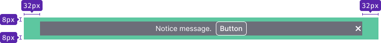
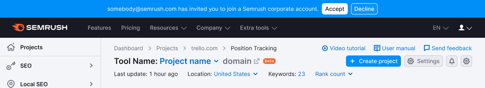
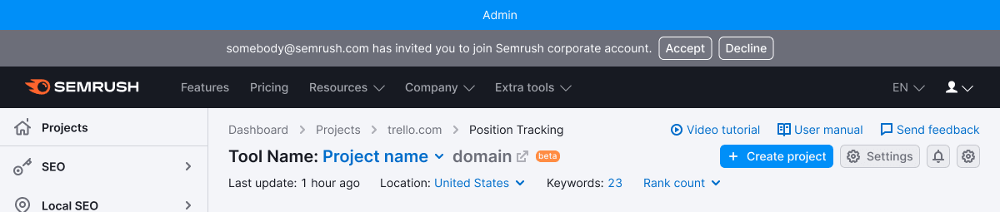

@import playground

@## Description

**NoticeGlobal** is a component for messages about events related to the work of the whole website.

The notice shall meet four criteria. If it doesn't respond to at least one, it's not a notice. Let's see the differencies with [Notice](/components/notice/) and [NoticeBubble](/components/notice-bubble/).

| Criteria                                                                                             | Notice | NoticeBubble | NoticeGlobal |
| ---------------------------------------------------------------------------------------------------- | ------ | ------------ | ------------ |
| Refers to the whole website.                                                                         | ❌     | ✅ ❌        | ✅           |
| **Global**. Refers to pages/blocks/large components, not specific elements.                          | ✅     | ✅ ❌        | ✅           |
| **Important**. If the users do not read the notice, they will miss an opportunity or lose something. | ✅     | ❌           | ✅           |
| **Temporary**. Not a default block element. Appears and disappears under certain conditions.         | ✅     | ✅           | ✅           |

**Use global notice to tell about:**

- a special mode of viewing a page, tool, site (about admin or other rights on the page);
- an outdated browser version;
- messages relates to the work of the whole site (downgrade, technical work, etc.).

@## Appearance

### Paddings

### Margins

@## Notice themes

### Neutral

Use it for neutral messages about the whole website. Notice has `background-color: var(--gray-500);`.

### Info

Use it for collecting feedback for the whole website. Notice has `background-color: var(--blue-400);`.

### Success

Use it for success message concerning the whole website. Notice has `background-color: var(--green-400);`.

### Warning

Use it for important but not critical errors/warnings concerning the whole website. Notice has `background-color: var(--orange-400);`.

### Danger

Use it for a serious error/problem message concerning the whole website. Notice has `background-color: var(--red-400);`.

@## Placement in the interface

- Place this notice always above the main Semrush header.
- Stretch it to the full width of the screen.

@## Interaction

### Appearance

When global notice appears, it moves the entire page down.

### Lifespan

Since the notice is a temporary message, it should have a preset "lifespan". The "lifespan" can be set by the following rules:

- number of days (for example, during the experiment);
- number of user sessions;
- event (completion of works, correcting bugs, moving features out of the beta);
- user action as a trigger (installed something, looked at it, fixed an error).

### Hiding

When you hide the notice, the entire page pulls up to the height of the closed component.

- Clicking on the close icon.
- Clicking on the link that causes the re-opening condition. _For example, "Ask me later", "Never show again", etc._
- If there is no close icon or hide link, the user can't hide such notice. It will be hidden according to the conditions set by the service (after a certain time, certain number of sessions, after clicking on the trigger, etc.).

### Animation

By clicking on the closing icon/closing link, the notice shall close smoothly with `fade-out of 250ms`. The page content is pulled to the notice place within 250ms.

@## Custom notice

These are the notices that have their own rules and their styles differ from preset themes.

### Notice with illustration

In special cases, you can add a thematic illustration to the message. _For example, if technical work is expected on holidays, etc._

Keep in mind, however, that the extra accent notice on the page adds visual noise. Therefore, do not abuse the opportunity to add an illustration to this kind of message.

@## Edge cases

### Two notices per page

Don't show more than one global message at a time. Below you can see an example of how you SHOULD NOT do.

In cases where a user on the site has two or more global messages to display, prioritize them.

- Higher priority for messages that require a response from the user or contain controls to close or exit a special mode.
- Messages without controls inside have lower priority. Show them after a user has interacted with a higher priority message.

@## Use in UX/UI

- You can notify about the following: website mode (e.g., admin), system status (error, failure, end of works).
- Be concise – don't supersede other widgets and other report functionality. Try to convey the meaning of your message to users in one line.

@page notice-global-a11y
@page notice-global-api
@page notice-global-code
@page notice-global-changelog
