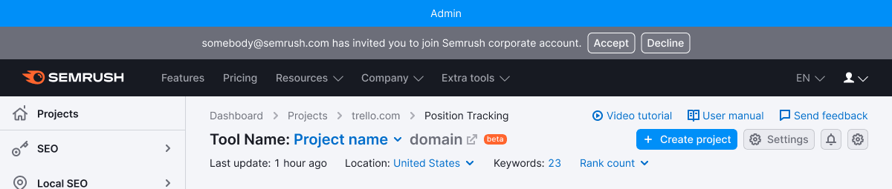

::: react-view

:::

## Description

**NoticeGlobal** is a component designed for conveying messages about events related to the entire website's operations.

To be considered a notice, it must meet four specific criteria. If it fails to meet at least one of these criteria, it cannot be classified as a notice. Let's explore the distinctions between NoticeGlobal and [Notice](/components/notice/notice) as well as [NoticeBubble](/components/notice-bubble/notice-bubble).

Table: Comparison table of criteria for Notice, NoticeBubble and NoticeGlobal

| Criteria         | Notice | NoticeBubble | NoticeGlobal |
| ---------------- | ------ | ------------ | ------------ |
| Refers to the entire website      | ❌     | ✅ ❌        | ✅           |
| **Global**: Refers to pages, blocks, or large components rather than specific elements | ✅     | ✅ ❌        | ✅           |
| **Important**: Missing the notice may result in missed opportunities or loss of data | ✅     | ❌           | ✅           |
| **Temporary**: Appears and disappears under certain conditions, not a default block element         | ✅     | ✅           | ✅           |

**Use the global notice to communicate the following:**

- Special viewing modes of a page, product, or site (for example, pertaining to admin or other rights on the page).
- Notifications about outdated browser versions.
- Messages related to the entire site's operations, such as downgrades, technical work, and other similar events.

## Component composition

Component consists of the following:

1. `NoticeGlobal.Content`;
2. `NoticeGlobal.CloseIcon` (optional).

## Themes

### Neutral

This theme is suitable for neutral messages about the entire website.The Notice background color uses `--bg-primary-muted` token.

### Info

Use this theme when collecting feedback for the entire website. The Notice background color uses `--bg-primary-info` token.

### Success

Opt for this theme for success messages related to the entire website. The Notice background color uses `--bg-primary-success` token.

### Warning

This theme is ideal for displaying important but not critical errors or warnings pertaining to the entire website. The Notice background color uses `--bg-primary-warning` token.

### Danger

Use this theme to convey serious error or problem messages concerning the entire website. The Notice background color uses `--bg-primary-critical` token.

## Appearance

There's an `8px` (`--spacing-2x`) margin between the text and any buttons that follow it. The margin between additional actions on the right-hand side is `16px` (`--spacing-4x`).

## Placement

- Always position this notice above the main website header.
- Stretch the notice to cover the full width of the screen.

## Interaction

### Displaying

When the global notice appears, it shifts the entire page down.

### Lifespan

As the notice is a temporary message, it should have a preset "lifespan." The "lifespan" can be determined by the following rules:

- Number of days (for example, during an experiment).
- Number of user sessions.
- Events (for example, completion of works, bug fixes, moving features out of beta).
- User actions as triggers (for example, installing something, viewing specific content, fixing an error).

### Hiding

When user hides the notice, the entire page moves up to the height of the closed component.

NoticeGlobal can be hidden by:

- Activating the **Close** button.
- Activating the link that triggers the re-opening condition (for example, "Ask me later," "Never show again," etc.).
- If there is no **Close** button or hide link, the user can't manually hide such notice. It will be hidden according to the conditions set by the service (after a certain time, a certain number of sessions, after clicking on the trigger, etc.).

### Animation

When hiding, the notice shall smoothly close with a `fade-out` effect lasting `250ms`. The page content moves up to the notice's position within `250ms`.

## Custom notice

These are special notices that have their own unique rules and styles, distinct from default themes.

### Notice with illustration

In exceptional cases, you have the option to include a thematic illustration with the message. _For example, if technical work is scheduled during holidays, etc._

However, it is crucial to consider that an excessive use of visual elements in notices can add unnecessary visual noise to the page. Therefore, exercise restraint when adding illustrations to this type of message.

## Edge cases

### Two notices per page

Avoid displaying more than one global message at a time. Below is an example of what you SHOULD NOT do:

In situations where a user on the site has two or more global messages to display, prioritize them accordingly.

- Give higher priority to messages that require a response from the user or contain controls to close or exit a special mode.
- Messages without controls inside should have lower priority. Display them after a user has interacted with a higher priority message.

## Usage in UX/UI

- You can use global notices to notify about the following: website mode (for example, admin), system status (error, failure, end of works).
- Keep the messages concise, so they don't obscure other widgets or report functionality. Try to convey the message's meaning to users in just one line.

