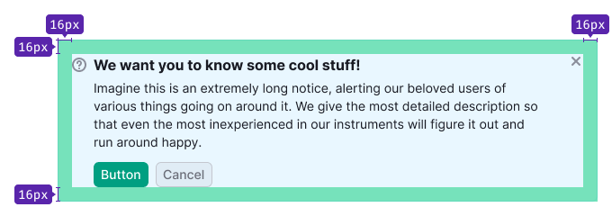

@import playground

> In the last update instead of using `use=primary/secondary` component was divided into two - Notice and [NoticeGlobal](/components/notice-global/). This was done to make it easier to use.

@## Description

**Notice** is a component for messages about events related to the user's work in the products and on the website.

The notice shall meet four criteria. If it doesn't respond to at least one, it's not a notice. Let's see the differencies with [NoticeBubble](/components/notice-bubble/) and [NoticeGlobal](/components/notice-global/).

| Criteria                                                                                             | Notice | NoticeBubble | NoticeGlobal |
| ---------------------------------------------------------------------------------------------------- | ------ | ------------ | ------------ |
| Refers to the whole website.                                                                         | ❌     | ✅ ❌        | ✅           |
| **Global**. Refers to pages/blocks/large components, not specific elements.                          | ✅     | ✅ ❌        | ✅           |
| **Important**. If the users do not read the notice, they will miss an opportunity or lose something. | ✅     | ❌           | ✅           |
| **Temporary**. Not a default block element. Appears and disappears under certain conditions.         | ✅     | ✅           | ✅           |

**The notice message can be:**

- **Contextual**. It's a message on the product page, inside the widgets and cards.
- **Global**. It's a message that relates to the work of the whole product.

### Notice consists of

- title (optional);
- text;
- an element before the text – an [icon](/style/icon/), [badge](/components/badge/) or illustration that accompanies the message (optional);
- close icon (optional);
- button or groups of buttons (optional).

### Mini notice

### Maxi notice

@## Sizes, paddings and margins

You can use the notice as a self-contained component, or include it inside other components. _For example, it can be used inside dropdowns and modal windows._

Notice internal paddings repeat the internal paddings of the component the notice is nested in.

@## Maximum text width

Do not stretch the text to the full width of the notice, especially if the notice extends to the entire width of the screen. In this form, the text is inconvenient to read.

> 💡 The maximum width of the text in the notice shall be no more than 650-800px.

@## Notice themes

### Info

Use it for neutral message, information, collecting feedback. To announce a new feature or other tool, use this notice with a large image (we usually call these [advertising notices](/components/notice/#a47391)).

### Success

Use it for:

- Any trigger for buying/taking a trial.
- Success status (successful completion of the form, for example).

### Warning

Use it for important but not critical errors/warnings: service report, unavailable functionality, temporary failure.

### Danger

Use it for a serious error/problem/action that does not allow the user to continue working or leads to data loss.

@## Placement in the interface

### On page

If the notice applies to the entire product, place it in the report header (under the breadcrumbs) and inherits the width of the content section. For more information about paddings and margins, see the [ProductHead](/components/product-head/).

**Do not place multiple notices on the page at once**.

If the message refers only to the content of a specific tab inside the product, then place notice under the [TabLine](/components/tab-line/).

### Inside the widget

If the notice belongs to a widget, place it inside inside the widget. The exact place depends on the context. As a rule, in such cases, the notice inherits the width of the content section of the widget.

### Inside the component

If the notice refers only to the component, place it at the bottom or top of the component and inherit the width of the component.

@## Interaction

### Opening

The notice appears without delay or visual effects. Display it immediately when the page/component is loaded.

### Lifespan

Since the notice is a temporary notification, it should have a preset "lifespan". The "lifespan" can be set by the following rules:

- number of days (for example, during the experiment);
- number of user sessions;
- event (completion of works, correcting bugs, moving features out of the beta);
- user action as a trigger (installed something, looked at it, fixed an error).

### Hiding

- Clicking on the close icon.
- Clicking on the link that causes the re-opening condition. _For example, "Ask me later", "Never show again", etc._
- If there is no close icon or hide link, the user can't hide such notice. It will be hidden according to the conditions set by the service (after a certain time, certain number of sessions, after clicking on the trigger, etc.).

### Animation

By clicking on the closing icon/closing link, the notice shall close smoothly with `fade-out of 250ms`. The page content is pulled to the notice place within 250ms.

@## Custom notice

These are the notices that have their own rules and their styles differ from preset themes.

### Feedback notice

It differs from the regular one – it is attached to the header and stretched to the full width of the report's content section. It has no indents at the top, right, or left. You can see an example in the [FeedbackYesNo](/components/feedback-yes-no) guide.

### Advertising

The advertising notice shall attract user's attention more than a regular notice. Use it when you need to announce a feature, updated version, move, limit promo action, and so on. If your product doesn't need to focus the user's attention on these things, use notice with info theme.

The advertising notice differs from the regular one by advertising illustrations and the possibility to insert controls such as input and select to quickly engage the user.

> 💡 Do not use an advertising notice for an "empty" state on a page or inside a component.

@## Use in UX/UI

### General

- You can notify about the following events: tools and reports announcement, collecting feedback, quick help for additional features, system status (error, failure, end of works, new feature).
- In some cases, notices with the same text may have different colors because they may have a different meaning.
- In regular cases, one notice is replaced by another in order of priority: red > yellow > green > blue > gray. If you need to place notices in a row, think it over with the UX team. There may be another way to deliver your important message.
- Be concise – don't supersede other widgets and other report functionality. Try to convey the meaning of your message to users in two lines. For the notices inside blocks / other components — four lines.

### Incorrect use

A notice should not be confused with the other components:

- **NoticeBubble/Alert**. This is the component used to respond to a user action; it's a local component. Notice is a global component and is most often not associated with user actions.
- **Tooltip**. These are hints or descriptions of functionality, they are permanent and called by hover. A notice is a temporary component displayed, as a rule, immediately after the user action.
- **Notes, hints**. This is additional information to the functionality. It is permanent. But the notice is temporary. Hints explain how to use something. Notice does not explain the functionality itself. Maximum – it can tell you how to solve the problem that it reports or perform the action that it calls for.

### Examples of incorrect usage

A permanent message that is an informational part of the form pretends to be a notice. Avoid this.

An error related to a temporary failure. There should be an orange warning notice.

A notice that appears on top of the interface and notifies you of the end of the hidden process. Avoid this. Use [NoticeBubble](/components/notice-bubble) in such case.

@page notice-a11y
@page notice-api
@page notice-code
@page notice-changelog
