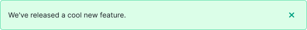
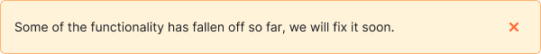
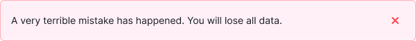
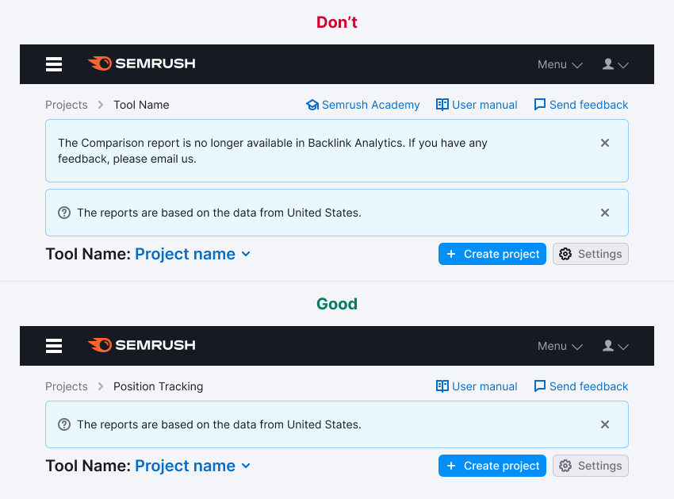
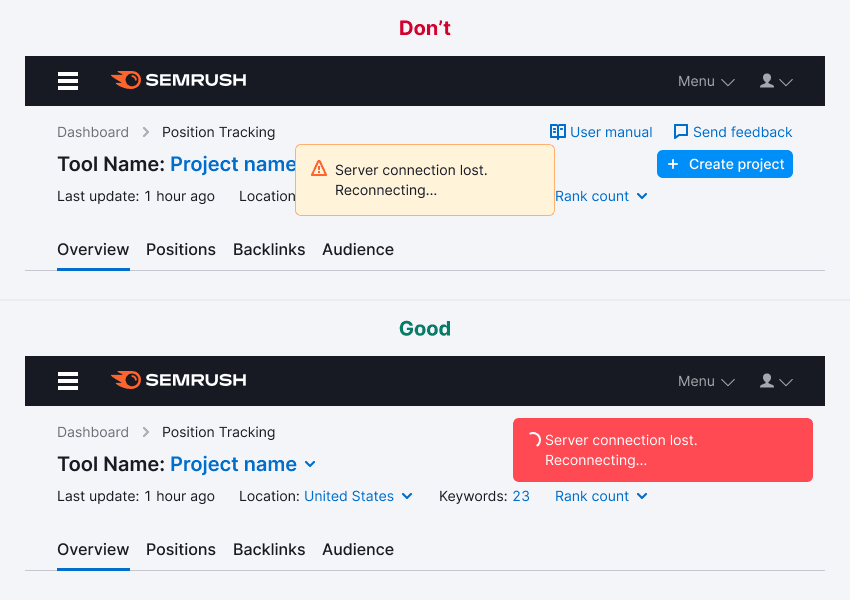

@import playground

@## Description

**Notice** is a component for messages about events related to the user's work in the products and on the website.

The notice shall meet three criteria. If it doesn't respond to at least one, it's not a notice. Let's see the differencies with [NoticeBubble](/components/notice-bubble/).

| Criteria                                                                                             | Notice | NoticeBubble |
| ---------------------------------------------------------------------------------------------------- | ------ | ------------ |
| **Global**. Refers to pages/blocks/large components, not specific elements.                          | ✅     | ✅ ❌        |
| **Important**. If the users do not read the notice, they will miss an opportunity or lose something. | ✅     | ❌           |
| **Temporary**. Not a default block element. Appears and disappears under certain conditions.         | ✅     | ✅           |

**The notice message can be:**

- **Contextual**. It's a message on the product page, inside the widgets and blocks.
- **Global**. It's a message that relates to the work on the whole website.

**Use global notice to tell about:**

- a special mode of viewing a page, tool, site (about admin or other rights on the page);
- an outdated browser version;
- messages relates to the work of the whole site (downgrade, technical work, etc.).

> 💡 Global notice has different from the contextual notice styles and placement.

### Components consists of

- heading (optional);
- paragraph;
- element in front of the text – an [icon](/style/icon/), [badge](/components/badge/) or illustration that accompanies the message (optional);
- close icon (optional);
- buttons and/or groups of buttons (optional);
- container;

The notice mandatory elements are a paragraph, container, and close icon. All other elements can be added and combined if necessary.

### Mini notice

### Maxi notice

### One-line maxi notice

> 💡 As an exception, you can also use this layout of elements if you need to save the space in the interface.

### Global notice

@## Dimensions and indents

### Contextual notice

You can use the notice as a self-contained component, or include it inside other components. _For example, it can be used inside dropdowns and modal windows._

Notice inside component. The notice internal paddings repeat the internal paddings of the component the notice is nested in.

### Global notice

**Paddings**

**Margins**

@## Maximum text width in the notice

Do not stretch the text to the full width of the notice, especially if the notice extends to the entire width of the screen. In this form, the text is inconvenient to read.

> 💡 The maximum width of the text in the notice shall be no more than 650-800px.

@## Notice themes

### Contextual notice

#### Info

Neutral message, information, collecting feedback. To announce a new feature or other tool, use this notice with a large image (we usually call these [advertising notices](https://i.semrush.com/components/notice/#a61937)).

#### Success

- Any trigger for buying/taking a trial.
- Success status (successful completion of the form, for example).

#### Warning

Important but not critical errors/warnings: service report, unavailable functionality, temporary failure.

#### Danger

A serious error/problem/action that does not allow the user to continue working or leads to data loss.

@## Interaction

### Contextual notice

#### Opening

The notice appears without delay or visual effects. It is displayed immediately when the page/component is loaded.

#### Lifespan

Since the notice is a temporary notification, it should have a preset "lifespan".

The "lifespan" can be set by the following rules:

- number of days (for example, during the experiment);
- number of user sessions;
- event (completion of works, correcting bugs, moving features out of the beta);
- user action as a trigger (installed something, looked at it, fixed an error).

#### Hiding

- Clicking on the close icon.
- Clicking on the link that causes the re-opening condition. _For example, **Ask me later**, **Never show again**, etc._
- If there is no close icon or hide link, the user can't hide such notice. It will be hidden according to the conditions set by the service (after a certain time, certain number of sessions, after clicking on the trigger, etc.).

#### Animation

By clicking on the closing icon/closing link, the notice shall close smoothly with `fade-out of 250ms`. The page content is pulled to the notice place within 250ms.

### Global notice

#### Appearance

When global notice appears, it moves the entire page down.

#### Hiding

When you hide the notice, the entire page pulls up to the height of the closed component.

#### Animation

For the smooth appearance and disappearance of the component, be sure to add animation: `transition: all 0.35s;`.

@## Placement in the interface

### Contextual notice

#### On page

If the notice applies to the entire tool, it is placed in the report header (under the breadcrumbs) and inherits the width of the content section. For more information about indents, see the [ProductHead](https://i.semrush.com/components/product-head/#a4fd53)component.

**Do not place multiple notices on the page at once**.

If the notification refers only to the content of a specific tab inside the tool, then it can be placed under the [TabPanel](http://i.semrush.com/components/tab-panel/).

#### Inside the widget or block

If the notice belongs to a block, it is placed inside the block. The exact place depends on the context. As a rule, in such cases, the notification inherits the width of the content section of the block.

#### Inside the component

If the notice applies to the entire component, it is placed at the bottom or top and inherits the width of the component.

### Global notice

- Place this notice always above the main Semrush header.
- Stretch it to the full width of the screen.

@## Custom notice

These are the notices that "live" by their own rules and their styles differ from regular notices.

### Feedback

It differs from the regular one – it is attached to the header and stretched to the full width of the report's content section. It has no indents at the top, right, or left. You can see an example in the [Code tab](/components/notice/notice-code).

### Global notice

The default color of this notice is `--wall`.

If necessary, you can give it a different color. For example, `--violet`, `--light-blue` or other from [our palette](/style/palette/).

### Advertising

The advertising notice shall attract user's attention more than a regular notice. It should be used when you need to announce a feature, updated version, move, limit promo action, and so on. If your tool doesn't need to focus the user's attention on these things, use a regular informational notice.

The advertising notice differs from the regular one by advertising illustrations and the possibility to insert controls such as input and select to quickly engage the user.

> 💡 Do not use an advertising notice for an "empty" state on a page or inside a component.

### Global notice with illustration

In special cases, you can add a thematic illustration to the global message. _For example, if technical work is expected on holidays, etc._

Keep in mind, however, that the extra accent notice on the page adds visual noise. Therefore, do not abuse the opportunity to add an illustration to this kind of message.

@## Edge cases

### Two notices per page

Don't show more than one global message at a time. Below you can see an example of how you SHOULD NOT do.

In cases where a user on the site has two or more global messages to display, prioritize them.

- Higher priority for messages that require a response from the user or contain controls to close or exit a special mode.
- Messages without controls inside have lower priority. Show them after a user has interacted with a higher priority message.

@## Use in UX/UI

### General

- You can notify about the following events: tools and reports announcement, collecting feedback, quick help for additional features, system status (error, failure, end of works, new feature).
- In some cases, notices with the same text may have different colors because they may have a different meaning.
- In regular cases, one notice is replaced by another in order of priority: red > yellow > green > blue > gray. If you need to place notices in a row, think it over with the UX team. There may be another way to deliver your important message.
- Be concise – don't supersede other widgets and other report functionality. Try to convey the meaning of your message to users in two lines. For the notices inside blocks / other components — four lines.

### Incorrect use

A notice should not be confused with the other components:

- **NoticeBubble/Alert**. This is the component used to respond to a user action; it's a local component. Notice is a global component and is most often not associated with user actions.
- **Tooltip**. These are hints or descriptions of functionality, they are permanent and called by hover. A notice is a temporary component displayed, as a rule, immediately after the user action.
- **Notes, hints**. This is additional information to the functionality. It is permanent. But the notice is temporary. Hints explain how to use something. Notice does not explain the functionality itself. Maximum – it can tell you how to solve the problem that it reports or perform the action that it calls for.

### Examples of incorrect usage

A permanent message that is an informational part of the block pretends to be a notice. Avoid this.

An error related to a temporary failure. There should be an orange warning notice.

A notice that appears on top of the interface and notifies you of the end of the hidden process. Avoid this. In this case, it should be [NoticeBubble](/components/notice-bubble).

@page notice-a11y
@page notice-api
@page notice-code
@page notice-changelog
