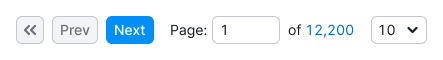
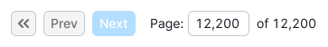
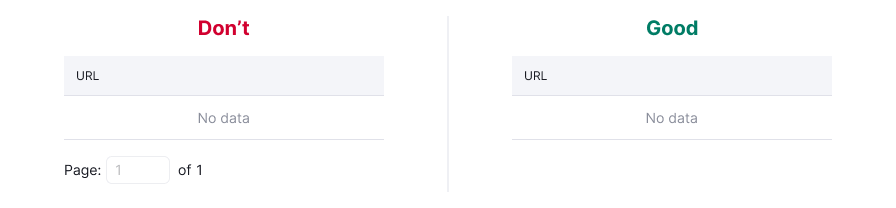
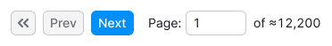

::: react-view

:::

## Description

**Pagination** is a component that provides a set of controls to navigate through long lists of data.

Using pagination is highly recommended for tables and long lists of data that users prefer to browse page by page.

## Component composition

Component consists of the following:

1. `Pagination.FirstPage`
2. `Pagination.NextPage`
3. `Pagination.PageInput`
4. `Pagination.PageInput.Value`
5. `Pagination.PrevPage`
6. `Pagination.TotalPages`

## Sizes

This component has only two sizes: `M` and `L`. The M size uses components with `M` size, while the `L` size uses L-sized components accordingly.

Table: Pagination sizes

| `size` | Appearance example     |
| ------ | ---------------------- |
| `M`    |  |
| `L`    |  |

## Appearance

### Margin between table and pagination

Recommended margin between table and pagination is `--spacing-4x`.

### Layout behavior

In case there is no space in the interface to place pagination in a row, the component layout changes from `row` to `column`.

## Number of rows

We provide some recommendations for the table size:

- Use a minimum of two user screens (± 2000 px) for the table.
- Display a maximum of 100 lines (if the lines occupy two lines, then 50 lines, etc.).

### Selecting number of rows

After the user changes the value in the select, the page should be refreshed, and the value of the table rows from the select should be applied.

We recommend using these values for the select: 10, 20, 50, 100.

## Interaction

- The table should scroll to the beginning when the user moves between pages.
- After sorting and filtering, the pagination always returns the user to the first page.

| Appearance example                 | Action                                                                                                           |
| ---------------------------------- | ---------------------------------------------------------------------------------------------------------------- |
|    | Opens the first page                                                                                             |
|  | Opens the previous page                                                                                          |
|      | Opens the next page                                                                                              |
|               | Page input allows the user to enter a specific page, and after the user presses `Enter`, the entered page opens. |

The current page should always be displayed in the input:

- When the input is unfocused, show the current page, even if the user has changed this value but hasn’t pressed `Enter` or clicked the icon inside the input.
- If the input is empty (for example, the user cleared it) or "0" is entered, then the user will move to the first page by clicking the icon inside the input or pressing `Enter`.
- This input restricts the entry of any symbols except numerical characters.

The link at the end of the pagination shows the total number of pages. The user moves to the last page by clicking it.

## Edge cases

### First page

In this case, the "First page" button and the "Previous" button are `disabled`.

### Last page

The "Next page" button becomes `disabled`, and the link to the last page appears as plain text.

### Value exceeding number of pages

In this case, there should be no error shown; instead, the user should be moved to the last page.

### One page only

Use this state only when there is some data, and there might be more data.

::: tip
If there is no data or the filter is applied, pagination shouldn't be displayed. Instead, the table should contain a message indicating that there is no data.
:::

### Page loading

Avoid displaying pagination while loading the table or other related data.

### Impossible to calculate exact number of pages

In this case, add the `tilde (≈)` to the number of pages and change the link displaying the number of all pages to plain text.

